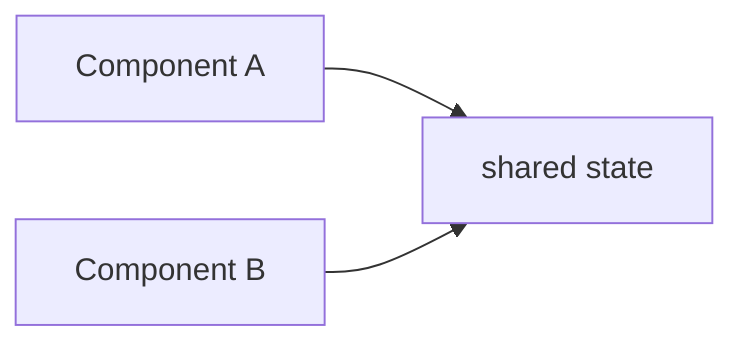

# Examples

## Пример 1. Фаза 1: сбор фактуры

```markdown
# collected/brief.md

## Тема
Как composables влияют на архитектуру Vue-приложения

## Аудитория
- Vue-разработчики middle/senior
- знают Composition API
- не всегда различают utility / composable / shared state

## Главный takeaway
Composable - это не "любая функция с ref", а способ локализовать реактивную ответственность и API вокруг сценария.

## Обещание доклада
Показать критерии, когда composable помогает, а когда создаёт ложную абстракцию.

## Тёмные пятна
- Нужен ли отдельный блок про SSR?
- Будет ли живое демо или только код?
```

```markdown
# collected/plan.md

## Части
1. Контекст и ожидания - 3 мин
2. Что считать composable - 5 мин
3. Базовые паттерны API - 8 мин
4. Сложные случаи и анти-паттерны - 10 мин
5. Итоги - 2 мин

## Риски темпа
- Блок 3 может разрастись
- Блок 4 легко перегрузить edge-case'ами
```

## Пример 2. Фаза 2: wireframe-слайды

```md
---
layout: center
---

# <СЛАЙД О КОНТЕКСТЕ ДОКЛАДА>

<!--
Цель: выровнять ожидания <- о чем слайд
Контент: <- что увидит слушатель
- Ограничения темы
- Что обсуждаем / что нет
Спикер: <- что скажет спикер
- Мы не разбираем "как писать composables с нуля"
- Мы обсуждаем критерии качества и границы применимости
- Дальше — рабочее определение composable
Время: ~30–40 сек <- ориентир темпа
Статус: wireframe
-->

---

# <СЛАЙД О РАБОЧЕМ ОПРЕДЕЛЕНИИ COMPOSABLE>

<!--
Цель: дать определение, которое выдержит доклад дальше
Контент:
- Короткий тезис
- Контрпример
- Обещание уточнить через кейсы
Спикер:
- Проговорить тезис и контрпример
Время: ~1 мин
Статус: реализация <- этот слайд можно материализовать, не дожидаясь фазы 3 на весь доклад
-->
```

Послайдово: `Статус: реализация` → заменить заглушку на контент; правка `Контент`/`Спикер` у уже реализованного слайда → синхронизировать тело.


## Пример 3. Фаза 2.1: design brief

```markdown
# collected/design.md

## Тон
Инженерный, спокойный, без кислотного визуального шума.

## Приёмы
- тёмный фон + яркие акценты только на ключевых тезисах
- code-centric слайды как основной носитель смысла
- схемы для отношений между сущностями
- редкие "пустые" слайды для смены ритма

## Не делать
- не анимировать каждую мысль
- не смешивать на одном слайде и код, и схему, и 5 тезисов
- не делать magic-move там, где лучше два обычных слайда
```

## Пример 4. Фаза 3: markdown-слайды

```md
---
layout: default
---

# Что делает composable "composable"

- Инкапсулирует реактивное состояние вокруг одного сценария
- Даёт API, которое можно читать как контракт
- Управляет lifecycle там, где это важно

> TODO: позже заменить на схему "state / actions / ownership"

<!--
Важно не скатиться в определение "любая функция с ref".
После этого слайда перейти к короткому контрпримеру.
-->

---

# Shared state != автоматически shared composable



> TODO: позже заменить на кастомную диаграмму с ownership и SSR boundary
```

## Пример 5. Фаза 4: материализация

```markdown
Перед материализацией:
- narrative уже проверен
- терминология стабилизирована
- все сильные утверждения прошли fact-check

Во время материализации:
- каждый интерактивный шаг должен отвечать на вопрос "зачем он помогает мысли?"
- если клик ничего не добавляет, его не должно быть
- если диаграмма красивее, но менее понятна, приоритет у понятности
```

## Пример 6. Выбор фазы по ситуации

Если пользователь говорит:
- "У меня только идея доклада" -> фаза 1
- "Хочу понять структуру слайдов" -> фаза 2
- "Давай без дизайна, просто соберём контент" -> фаза 3
- "Теперь преврати это в нормальный Slidev" -> фаза 4
- ставит `Статус: реализация` на слайде -> материализуй **только** этот слайд
- правит `Контент`/`Спикер` у реализованного слайда -> синхронизируй материализованное тело
