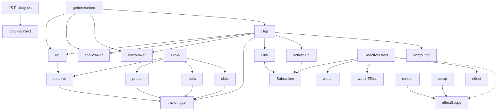

<div class="mb-[50px] flex flex-row">
  <div class="w-[80px] h-[80px] rd-full of-hidden">
    
  </div>
  <div class="w-[80px] h-[80px] rd-full ml-[15px]">
    <zede-icon class="w-full h-full" />
  </div>
</div>
<div class="text-4xl mb-[50px]">Денис Чернов</div>
<p><file-icons-telegram /> @zede_code</p>
<p><ion-logo-twitch /> @izede</p>
<p><ion-logo-github /> @Sdju</p>

<QrCodeIntro class="w-[200px] h-[200px] absolute top-[200px] right-[80px]" />

---
layout: center
---

<h1 v-drag="[237,251,551,46]"> Шестеренки реактивности Vue </h1>

<ion-cog-sharp v-drag="[729,-220,496,450]" class="animate-[spin_70s_linear_infinite] opacity-20" />

<ion-cog-sharp v-drag="[-222,307,496,450]" class="animate-[spin_70s_linear_infinite] opacity-10" />

---

<div class="animate-spin" />

<material-symbols-settings-outline v-drag="[388,145,223,202]" class="animate-[spin_20s_linear_infinite]" />
<logos-vue v-drag="[476,229,46,42]" />

<Gear v-click v-drag="[727,84,103,131]" name="ref" />

<Gear v-click v-drag="[720,330,141,118]" name="computed" />

<Gear v-click v-drag="[348,413,134,105]" name="watch" />

<Gear v-click v-drag="[150,258,142,119]" name="watchEffect" />

<Gear v-click v-drag="[216,69,104,95]" name="reactive" />

<!--
разгоняем за что мы любим Vue

мало кто знает а что за ними скрыто

поэтому мы посмотрим на каждую шестеренку по отдельности. Чтоб получить чуть более глубокое понимание.
-->

---
layout: cover
---


<div class="absolute top-0 left-0 w-full h-full backdrop-blur-[30px]" />


---
layout: center
---

<div class="text-[1.5em]">Чем отличается computed от watch?</div>

<!--
Представим ситуацию из собеса

простые вопросы отвечается легко

- можно ли заменить computed на watch
- а можно ли заменить watch на computed

- визуализировать дополнительные вопросы
-->

---


<div class="absolute top-0 left-0 w-full h-full backdrop-blur-[30px]" />


<!--
Если вы начинаете чустсвовать себя неуверенно, то это доклад для вас.
-->

---
variant: second
clicks: 8
---

<script setup>
const heights = [
  59,
  59,
  116,
  185,
  246,
  308,
  363,
  422,
  472,
]
</script>

<div class="center w-[340px] overflow-hidden transition-all duration-400" :style="{ maxHeight: `${heights[$clicks]}px` }" >

</div>
<div class="absolute top-0 left-0 w-full h-full backdrop-blur-[30px]" />
<div class="center w-[340px] overflow-hidden transition-all duration-400" :style="{ maxHeight: `${heights[$clicks]}px` }" >

</div>

<div
  class="center overflow-hidden transition-all duration-400"
  :style="{ maxHeight: `${heights[$clicks]}px` }"
>
  <div class="text-shadow-xl w-[340px] h-[472px] flex flex-col items-stretch p-r-[60px] text-center relative">
    <div class="text-shadow-lg mt-[10px] mb-[20px]">азы реактивности</div>
    <div class="text-shadow-lg mb-[32px]" v-click>основной функционал</div>
    <div class="text-shadow-lg text-size-[0.75em] mb-[32px]" v-click>продвинутая реактивность</div>
    <div class="text-shadow-lg mb-[28px]" v-click>@vue/reactivity</div>
    <div class="text-shadow-lg mb-[25px]" v-click>@vue/runtime-core</div>
    <div class="text-shadow-lg mb-[23px]" v-click>Закрытый API</div>
    <div class="text-shadow-lg text-size-[0.75em] mb-[14px]" v-click>Контрибьютить во Vue</div>
    <div class="text-shadow-lg text-size-[0.75em]" v-click>написать свою реактивность для Vapor Vue</div>
    
  </div>
</div>

<div absolute top-0 left-0 v-click="[1,2]">
  <Gear :pos="[835,54,103,141]" name="ref" />
  <Gear :pos="[71,45,103,151]" name="computed" />
  <Gear :pos="[186,339,103,151]" name="reactive" />
  <Gear :pos="[782,266,103,151]" name="props" />
</div>
<div absolute top-0 left-0 v-click="[2,3]">
  <Gear :pos="[672,24,103,141]" name="watch" />
  <Gear :pos="[705,320,103,151]" name="watchEffect" />
  <Gear :pos="[82,294,103,151]" name="vModel" />
</div>
<div absolute top-0 left-0 v-click="[3,4]">

<Gear v-drag="[788,101,103,151]" name="effectScope" />
<Gear v-drag="[75,342,125,107]" name="customRef" />

</div>

<!--
- вначале вам хватает простых ref computed и reactive
- затем познаете watch и watchEffect
- сложные случаи вынуждают познакомиться с effectScope, customRef

- показывать что прячется за каждым уровнем (визуально)
- прописать четкий сценарий развития и переходов
-->

---
variant: purple
---

<h1 absolute transition-all duration-400 text-center w-full left-0 :style="{ top: $clicks < 2 ? '27px' : '90px' }"> Реактивность </h1>


<div v-click="'+0'" class="italic bg-[#00000048] p-4 rd-[8px] mb-4"> Способность системы автоматически реагировать на раздражители </div>

<div v-click="3">

```ts {*|*|1-3|5|6}
let oranges = ref(5)
let apples = ref(10)
let total = computed(() => oranges.value + apples.value)
console.log(total.value) // 15
apples.value = 7 
console.log(total.value) // 12
```

</div>

<!--
- тут точно можно сэкономить по времени. оставить основную суть
-->

---

<h1 v-drag="[365,32,244,46]"> Реактивность </h1>

<VueGraph v-click v-drag="[456,258,84,NaN]" label="Model" />
<Arrow v-click v-drag="[525,212,69,20,-58]" x1="0" y1="50%" x2="100%" y2="50%" />
<VueGraph v-click="'+0'" v-drag="[535,156,118,NaN]" label="Subscribers" />
<Arrow v-click v-drag="[470,317,69,20,270]" x1="0" y1="50%" x2="100%" y2="50%" />
<VueGraph v-click="'+0'" v-drag="[456,366,100,NaN]" label="Action" />
<Arrow v-click v-drag="[471,160,59,20,180]" x1="0" y1="50%" x2="100%" y2="50%" />
<VueGraph v-click="'+0'" v-drag="[319,152,141,NaN]" label="Scheduler" />
<Arrow v-click v-drag="[365,215,106,20,41]" x1="0" y1="50%" x2="100%" y2="50%" />

<!--
- продумать сценарий объяснения
- Date -> Model

- поясним а на кой планировщик
- вуй из коробки накапливает изменение и ищет место для коллбеков

- проговорить про планировщик
-->

---

<logos-vue v-drag="[445,40,119,108]" />

<div v-click v-drag="[108,161,379,168]" class="text-[1em] bg-blue-5/30 rounded-2xl p-4" > 
  @vue/reactivity 

  <div class="text-size-[0.75em] flex flex-col">
    <Gear inline name="ref" />
    <Gear inline name="reactive" />
    <Gear inline name="computed" />
    <Gear inline name="watchers" />
  </div>
</div>

<div v-click v-drag="[523,164,398,167]" class="text-[1em] bg-cyan-5/30 rounded-2xl p-2" > 
  @vue/runtime-core

  <div class="text-size-[0.75em] flex flex-col">
    <Gear inline name="effect" />
    <Gear inline name="scheduler" />
    <Gear inline name="nextTick" />
    <Gear inline name="components" />
  </div>
</div>

<!--
визулизацию

что в нем лежит

- почему 2 пакета
- почему обрезан @vue/reactivity
- почему нет счедуллер
-->

---

# Карта реактивности



<div hidden v-drag="[120,392,757,182]" class="text-red text-[6em] text-shadow-lg"> ЗАМЕНИТЬ </div>

<!--
порешить этого слайда (переместить)

- обдумать идею глобальной карты и реактивности и доклада, максимально подробную при разгоне шестерни зумить часть карты (часть за которую отвечает эта шестерня)
-->
