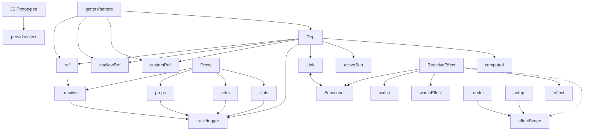

<div class="mb-[50px] flex flex-row">
  <div class="w-[80px] h-[80px] rd-full of-hidden">
    
  </div>
  <div class="w-[80px] h-[80px] rd-full ml-[15px]">
    <zede-icon class="w-full h-full" />
  </div>
</div>
<div class="text-4xl mb-[50px]">Денис Чернов</div>
<div class="grid grid-cols-[36px_1fr] gap-2 items-center">
  <file-icons-telegram /> @zede_code
  <ion-logo-twitch /> @izede
  <ion-logo-github /> @Sdju
</div>

<QrCodeIntro class="w-[200px] h-[200px] absolute top-[200px] right-[80px]" />

---
layout: center
---

<h1 v-drag="[237,251,551,46]"> Шестеренки реактивности Vue </h1>

<ion-cog-sharp v-drag="[729,-220,496,450]" class="animate-[spin_70s_linear_infinite] opacity-20" />

<ion-cog-sharp v-drag="[-222,307,496,450]" class="animate-[spin_70s_linear_infinite] opacity-10" />

---
clicks: 6
variant: green
---

<Timeline :steps="[{
  logo: 'left-[50%] top-[50%] w-[176px] h-[176px]',
  vueGear: 'left-[50%] top-[50%] -popup-hidden',
  ref: 'left-[50%] top-[50%] -popup-hidden',
  computed: 'left-[50%] top-[50%] -popup-hidden',
  watch: 'left-[50%] top-[50%] -popup-hidden',
  watchEffect: 'left-[50%] top-[50%] -popup-hidden',
  reactive: 'left-[50%] top-[50%] -popup-hidden',
}, {
  logo: 'left-[50%] top-[51%] w-[46px] h-[46px]',
  vueGear: 'left-[50%] top-[50%]',
}, {
  ref: 'left-[727px] top-[84px]',
}, {
  computed: 'left-[720px] top-[330px]',
}, {
  watch: 'left-[348px] top-[413px]',
}, {
  watchEffect: 'left-[150px] top-[258px]',
}, {
  reactive: 'left-[216px] top-[69px]',
}]" v-slot="t">

<div class="figure w-[223px] h-[202px] fx" :class="t.vueGear">
  <material-symbols-settings-outline class="animate-[spin_20s_linear_infinite] w-full h-full" />
</div>

<logos-vue
  class="figure"
  :class="t.logo"
/>

<Gear class="figure fx w-[103px] h-[131px]" :class="t.ref" name="ref" />

<Gear class="figure fx w-[141px] h-[118px]" :class="t.computed" name="computed" />

<Gear class="figure fx w-[134px] h-[105px]" :class="t.watch" name="watch" />

<Gear class="figure fx w-[142px] h-[119px]" :class="t.watchEffect" name="watchEffect" />

<Gear class="figure fx w-[104px] h-[95px]" :class="t.reactive" name="reactive" />

</Timeline>

<!--
разгоняем за что мы любим Vue

мало кто знает а что за ними скрыто

поэтому мы посмотрим на каждую шестеренку по отдельности. Чтоб получить чуть более глубокое понимание.
-->

---
layout: cover
---


---
layout: center
---

<div class="text-[1.5em]">Чем отличается computed от watch?</div>

<!--
Представим ситуацию из собеса

простые вопросы отвечается легко

- можно ли заменить computed на watch
- а можно ли заменить watch на computed

- визуализировать дополнительные вопросы
-->

---


<!--
Если вы начинаете чустсвовать себя неуверенно, то это доклад для вас.
-->

---
variant: second
clicks: 7
---

<Timeline :steps="[{
  height: '59px',
  ref: 'left-[50%] top-[50%] -popup-hidden',
  computed: 'left-[50%] top-[50%] -popup-hidden',
  watch: 'left-[50%] top-[50%] -popup-hidden',
  watchEffect: 'left-[50%] top-[50%] -popup-hidden',
  reactive: 'left-[50%] top-[50%] -popup-hidden',
}, {
  height: '116px'
}, {
  height: '185px'
}, {
  height: '246px'
}, {
  height: '308px'
}, {
  height: '363px'
}, {
  height: '422px'
}, {
  height: '472px'
}]" v-slot="t">

<div class="center w-[340px] overflow-hidden transition-all duration-400" :style="{ maxHeight: t.height }" >

</div>
<div class="absolute top-0 left-0 w-full h-full backdrop-blur-[30px]" />
<div class="center w-[340px] overflow-hidden transition-all duration-400" :style="{ maxHeight: t.height }" >

</div>

<div
  class="center overflow-hidden transition-all duration-400"
  :style="{ maxHeight: t.height }"
>
  <div class="text-shadow-xl w-[340px] h-[472px] flex flex-col items-stretch p-r-[60px] text-center relative">
    <div class="mt-[10px] mb-[20px]">азы реактивности</div>
    <div class="mb-[32px]">основной функционал</div>
    <div class="text-size-[0.75em] mb-[32px]">продвинутая реактивность</div>
    <div class="mb-[28px]">@vue/reactivity</div>
    <div class="mb-[25px]">@vue/runtime-core</div>
    <div class="mb-[23px]">Закрытый API</div>
    <div class="text-size-[0.75em] mb-[14px]">Контрибьютить во Vue</div>
    <div class="text-size-[0.75em]">написать свою реактивность для Vapor Vue</div>
    
  </div>
</div>

<div absolute top-0 left-0 v-click="[1,2]">
  <Gear :pos="[835,54,103,141]" name="ref" />
  <Gear :pos="[71,45,103,151]" name="computed" />
  <Gear :pos="[186,339,103,151]" name="reactive" />
  <Gear :pos="[782,266,103,151]" name="props" />
</div>
<div absolute top-0 left-0 v-click="[2,3]">
  <Gear :pos="[672,24,103,141]" name="watch" />
  <Gear :pos="[705,320,103,151]" name="watchEffect" />
  <Gear :pos="[82,294,103,151]" name="vModel" />
</div>
<div absolute top-0 left-0 v-click="[3,4]">

<Gear v-drag="[788,101,103,151]" name="effectScope" />
<Gear v-drag="[75,342,125,107]" name="customRef" />

</div>

</Timeline>

<!--
- вначале вам хватает простых ref computed и reactive
- затем познаете watch и watchEffect
- сложные случаи вынуждают познакомиться с effectScope, customRef

- показывать что прячется за каждым уровнем (визуально)
- прописать четкий сценарий развития и переходов
-->

---
variant: purple
---

<h1 absolute transition-all duration-400 text-center w-full left-0 :style="{ top: $clicks < 2 ? '27px' : '90px' }"> Реактивность </h1>


<div v-click="'+0'" class="italic bg-[#00000048] p-4 rd-[8px] mb-4"> Способность системы автоматически реагировать на раздражители </div>

<div v-click="3">

```ts {*|*|1-3|5|6}
let oranges = ref(5)
let apples = ref(10)
let total = computed(() => oranges.value + apples.value)
console.log(total.value) // 15
apples.value = 7 
console.log(total.value) // 12
```

</div>

<!--
- тут точно можно сэкономить по времени. оставить основную суть
-->

---
clicks: 10
---

<Timeline :steps="[{
  title: 'top-[50%] left-[50%]',
  model: 'left-[50%] top-[50%] -popup-hidden',
  subscriber: 'left-[50%] top-[156px] -popup-hidden',
  action: 'left-[50%] top-[366px] -popup-hidden',
  scheduler: 'left-[300px] top-[50%] -popup-hidden',
  arrow1: {
    coords: '49%:245 49%:188',
    class: 'fx duration-500 opacity-0'
  },
  arrow2: {
    coords: '49%:245 49%:188',
    class: 'fx duration-500 opacity-0'
  },
  arrow3: {
    coords: '49%:245 49%:188',
    class: 'fx duration-500 opacity-0'
  },
  arrow4: {
    coords: '49%:245 49%:188',
    class: 'fx duration-500 opacity-0'
  },
  arrow5: {
    coords: '49%:245 49%:188',
    class: 'fx duration-500 opacity-0'
  },
}, {
  title: 'top-[10%] left-[50%]',
  model: 'left-[50%] top-[50%]',
}, {
  subscriber: 'left-[50%] top-[156px]',
  arrow1: {
    coords: '49%:245 49%:188',
    class: 'fx duration-500 animate'
  },
  arrow2: {
    coords: '51%:188 51%:245',
    class: 'fx duration-500 animate'
  },
}, {
  action: 'left-[50%] top-[400px]',
  arrow3: {
    coords: '50%:372 50%:306',
    class: 'fx duration-500 animate'
  },
}, {
  scheduler: 'left-[319px] top-[50%]',
  arrow4: {
    coords: '409:156 319:245',
    class: 'fx duration-500 animate'
  },
}, {
  arrow5: {
    coords: '319:306 434:400',
    class: 'fx duration-500 animate'
  },
}]" v-slot="t">

<h1 class="figure fx text-center" :class="t.title"> Реактивность </h1>

<Node :class="t.model">Model</Node>
<Node :class="t.subscriber">Subscribers</Node>
<Node :class="t.action" color="red">Action</Node>
<Node :class="t.scheduler">Scheduler</Node>

<SvgLayer>
  <SvgArrow :class="t.arrow1.class" :coords="t.arrow1.coords" :power="0.1" />
  <SvgArrow :class="t.arrow2.class" :coords="t.arrow2.coords" :power="0.1" />
  <SvgArrow :class="t.arrow3.class" :coords="t.arrow3.coords" :power="0.1" />
  <SvgArrow :class="t.arrow4.class" :coords="t.arrow4.coords" :power="-0.5" />
  <SvgArrow :class="t.arrow5.class" :coords="t.arrow5.coords" :power="-0.5" />
</SvgLayer>

</Timeline>

<!--
- продумать сценарий объяснения
- Date -> Model

- поясним а на кой планировщик
- вуй из коробки накапливает изменение и ищет место для коллбеков

- проговорить про планировщик
-->

---

<logos-vue v-drag="[445,40,119,108]" />

<div v-click v-drag="[108,161,379,188]" class="text-[1em] bg-blue-5/30 rounded-2xl px-4 py-2" > 
  <div class="text-center"> @vue/reactivity </div>

  <div class="text-size-[0.75em] flex flex-col mt-4">
    <Gear inline name="ref" />
    <Gear inline name="reactive" />
    <Gear inline name="computed" />
    <Gear inline name="watchers" />
  </div>
</div>

<div v-click v-drag="[523,161,398,188]" class="text-[1em] bg-cyan-5/30 rounded-2xl px-4 py-2" > 
  <div class="text-center"> @vue/runtime-core </div>

  <div class="text-size-[0.75em] flex flex-col mt-4">
    <Gear inline name="effect" />
    <Gear inline name="scheduler" />
    <Gear inline name="nextTick" />
    <Gear inline name="components" />
  </div>
</div>

<!--
визулизацию

что в нем лежит

- почему 2 пакета
- почему обрезан @vue/reactivity
- почему нет счедуллер
-->

---

# Карта реактивности



<div hidden v-drag="[120,392,757,182]" class="text-red text-[6em] text-shadow-lg"> ЗАМЕНИТЬ </div>

<!--
порешить этого слайда (переместить)

- обдумать идею глобальной карты и реактивности и доклада, максимально подробную при разгоне шестерни зумить часть карты (часть за которую отвечает эта шестерня)
-->
