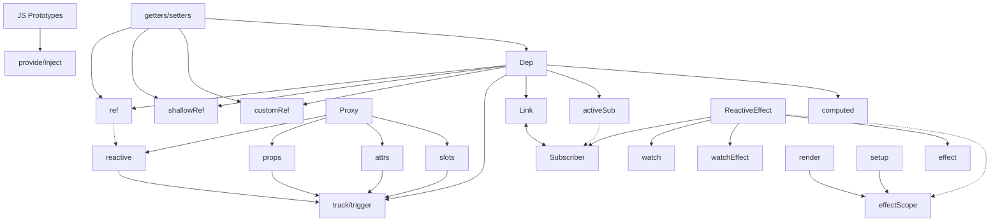

<div class="mb-50px flex flex-row">
  <div class="size-80 rd-full of-hidden">
    
  </div>
  <div class="size-80 rd-full ml-15px">
    <ZedeIcon class="size-full" />
  </div>
</div>
<div class="text-4xl mb-50px">Денис Чернов</div>
<div class="grid grid-cols-[36px_1fr] gap-2 items-center">
  <FileIconsTelegram /> @zede_code
  <IonLogoTwitch /> @izede
  <IonLogoGithub /> @Sdju
</div>

<QrCodeIntro class="sp-r80_200_200_200 absolute" />

---
layout: center
---

<h1 center> Шестеренки реактивности Vue </h1>

<IonCogSharp v-drag="[729,-220,496,450]" class="animate-[spin_70s_linear_infinite] opacity-20" />

<IonCogSharp v-drag="[-222,307,496,450]" class="animate-[spin_70s_linear_infinite] opacity-10" />

<!--
> продать цель доклада / продумать спич 2 и 3 слайда
> гораздо больше иллюстраций
> продумать переходы, продажа шестеренок
-->

---
clicks: 6
variant: green
---

<Timeline :steps="[{
  logo: 'pos-center size-176_176',
  vueGear: 'pos-center -popup-hidden',
  ref: 'pos-center -popup-hidden',
  computed: 'pos-center -popup-hidden',
  watch: 'pos-center -popup-hidden',
  watchEffect: 'pos-center -popup-hidden',
  reactive: 'pos-center -popup-hidden',
}, {
  logo: 'pos-center size-46_46',
  vueGear: 'pos-center ',
}, {
  ref: 'pos-727_84 ',
}, {
  computed: 'pos-781_356 ',
}, {
  watch: 'pos-472_474 ',
}, {
  watchEffect: 'pos-165_356 ',
}, {
  reactive: 'pos-216_69 ',
}]" v-slot="t">

<div class="figure size-223_202 fx" :class="t.vueGear">
  <MaterialSymbolsSettingsOutline class="animate-[spin_20s_linear_infinite] w-full h-full" />
</div>

<LogosVue class="figure" :class="t.logo" />

<Gear class="figure fx w-[103px] h-[131px]" :class="t.ref" name="ref" />

<Gear class="figure fx w-[141px] h-[118px]" :class="t.computed" name="computed" />

<Gear class="figure fx w-[134px] h-[105px]" :class="t.watch" name="watch" />

<Gear class="figure fx w-[142px] h-[119px]" :class="t.watchEffect" name="watchEffect" />

<Gear class="figure fx w-[104px] h-[95px]" :class="t.reactive" name="reactive" />

</Timeline>

<!--
Если спросить за что вы любите Vue, то чаще всего будет хороший DX и классная реактивность. Но что же скрыто за этой реактивностью?

Поэтому сегодня мы с вами рассмотрим по отдельности каждую шестерёнку реактивности Vue по отдельности.

Чтоб получить более глубокое понимание того что происходит в нашем любимом фреймворке.

> объяснить почему тебя надо слушать. привыкли к простоте. попытаться вдолхновить уже тут
-->

---
layout: cover
---


---
layout: center
---

<div class="text-[1.5em]">Чем отличается computed от watch?</div>

<!--
Представим ситуацию на собеседовании. Вам задают вопросы по Vue и в целом вы отвечаете хорошо.

Но вот начинаются вопросы по реактивности.

- можно ли заменить computed на watch
- а можно ли заменить watch на computed
- а как насчёт watchEffect?

- > показать как пример с которым справятся, но потом тебя спрашивают "жесть"
придумать второй вопрос "сложный но интересный", чтоб мотиватор
-->

---


<!--
И если такие вопросы вас ставят в замешательство, то этот доклад для вас.
-->

---
variant: blue
clicks: 8
---

<Timeline :steps="[{
  height: '59px',
  ref: '-popup-hidden',
  computed: '-popup-hidden',
  reactive: '-popup-hidden',
  props: '-popup-hidden',
  watch: '-popup-hidden',
  watchEffect: '-popup-hidden',
  vModel: '-popup-hidden',
  effectScope: '-popup-hidden',
  customRef: '-popup-hidden',
  effect: '-popup-hidden',
  scheduler: '-popup-hidden',
}, {
  ref: '',
  computed: '',
  reactive: '',
  props: '',
}, {
  height: '117px',
  ref: 'opacity-50 scale-50',
  computed: 'opacity-50 scale-50 blur-2',
  reactive: 'opacity-50 scale-50 blur-2',
  props: 'opacity-50 scale-50 blur-2',
  watch: '',
  watchEffect: '',
  vModel: '',
}, {
  height: '184px',
  ref: 'opacity-25 scale-25 blur-4',
  computed: 'opacity-25 scale-25 blur-4',
  reactive: 'opacity-25 scale-25 blur-4',
  props: 'opacity-25 scale-25 blur-4',
  watch: 'opacity-50 scale-50 blur-2',
  watchEffect: 'opacity-50 scale-50 blur-2',
  vModel: 'opacity-50 scale-50 blur-2',
  effectScope: '',
  customRef: '',
  render: '',
}, {
  height: '245px',
  ref: 'opacity-12 scale-12 blur-6',
  computed: 'opacity-12 scale-12 blur-6',
  reactive: 'opacity-12 scale-12 blur-6',
  props: 'opacity-12 scale-12 blur-6',
  watch: 'opacity-25 scale-25 blur-4',
  watchEffect: 'opacity-25 scale-25 blur-4',
  vModel: 'opacity-25 scale-25 blur-4',
  effectScope: 'opacity-50 scale-50 blur-2',
  customRef: 'opacity-50 scale-50 blur-2',
  render: 'opacity-50 scale-50 blur-2',
}, {
  height: '306px',
  ref: 'opacity-0 scale-0',
  computed: 'opacity-0 scale-0',
  reactive: 'opacity-0 scale-0',
  props: 'opacity-0 scale-0',
  watch: 'opacity-12 scale-12',
  watchEffect: 'opacity-12 scale-12',
  vModel: 'opacity-12 scale-12',
  effectScope: 'opacity-25 scale-25',
  customRef: 'opacity-25 scale-25',
  render: 'opacity-25 scale-25',
}, {
  height: '360px',
  watch: 'opacity-0 scale-0',
  watchEffect: 'opacity-0 scale-0',
  vModel: 'opacity-0 scale-0',
  effectScope: 'opacity-12 scale-12',
  customRef: 'opacity-12 scale-12',
  render: 'opacity-12 scale-12',
}, {
  height: '419px',
  effectScope: 'opacity-0 scale-0',
  customRef: 'opacity-0 scale-0',
  render: 'opacity-0 scale-0',
}, {
  height: '479px'
}]" v-slot="t">

<div class="center w-[340px] overflow-hidden transition-all duration-400 framed" :style="{ maxHeight: t.height }" >
  
</div>

<div
  class="center overflow-hidden transition-all duration-400"
  :style="{ maxHeight: t.height }"
>
  <div class="text-shadow-xl w-[338px] h-[475px] flex flex-col items-stretch p-r-[60px] text-center relative overflow-hidden rounded-[10px]">
    <div class="mt-[10px] mb-[20px]">азы реактивности</div>
    <div class="mb-[32px]">основной функционал</div>
    <div class="text-size-[0.75em] mb-[32px]">продвинутая реактивность</div>
    <div class="mb-[28px]">@vue/reactivity</div>
    <div class="mb-[25px]">@vue/runtime-core</div>
    <div class="mb-[23px]">Закрытый API</div>
    <div class="text-size-[0.75em] mb-[14px]">Контрибьютить во Vue</div>
    <div class="text-size-[0.75em]">написать свою реактивность для Vapor Vue</div>
    
  </div>
</div>


<Gear class="figure sp-742_449_103_151" :class="t.ref" name="ref" />
<Gear class="figure sp-118_115_103_135" :class="t.computed" name="computed" />

<!-- width height top left -> left top width height  -->
<Gear class="figure sp-135_439_103_135" :class="t.reactive" name="reactive" />
<Gear class="figure sp-812_124_103_141" :class="t.props" name="props" />

<Gear class="figure sp-96_273_103_151" :class="t.watch" name="watch" />
<Gear class="figure sp-869_321_103_151" :class="t.watchEffect" name="watchEffect" />
<Gear class="figure sp-692_89_103_141" :class="t.vModel" name="vModel" />

<Gear class="figure sp-788_101_103_151" :class="t.effectScope" name="effectScope" />
<Gear class="figure sp-342_75_125_107" :class="t.customRef" name="customRef" />

</Timeline>

<!--
Но что вообще скрывается во тьме воды?

Вначале вы берете Vue и вы изучаете самые базовые примитивы реактивности.

Постепенно задачи становятся сложнее и вам приходится столкнуться с новыми примитивами.

Идет время и вам попадаются нетривиальные задачи которые уже с трудом покрываются документацией. Там вы знакомитесь с концептами кастомных рефов и эффект скоупов.

Теперь пришло время изучать исходники Vue и вы берете основной пакет реактивности Vue @vue/reactivity.
Знакомитесь с концепциями реактивных эффектов и Deps/Link.

Однако нужно еще понять как все это дело работает внутри компонентов Vue. И вы начинаете изучать реактивность из @vue/runtime-core. Там вы знакомитесь с концептами render, setup, планировщика.

Вас уже не остановить, вы погружаетесь в изучение всего чтобы можно использовать в вашем коде, чтобы выжать максимум из возможностей реактивности.

Теперь ваших знаний вполне хватает, чтобы начать контрибьютить в сам Vue. Возможно у вас уже есть идеи как сделать реактивность еще лучше.

Но не забывайте что где-то там, всегда есть тот кто нарушит все правила игры и сделает кратно лучше.

И нет, мы с вами не будем сейчас аккуратно погружаться в глубину. Вместо этого мы будем наоборот всплывать на поверхность из глубин.

> сторитейлинг / персонаж
-->

---
variant: purple
---

<Timeline :steps="[{
  title: 'top-50% ',
}, {
  title: 'top-27px ',
}]" v-slot="t">

<h1 class="absolute transition-all duration-400 text-center w-full left-0" :class="t.title"> Реактивность </h1>


<div v-click="'+0'" class="italic bg-[#00000048] p-4 rd-[8px] mb-4"> Способность системы автоматически реагировать на раздражители </div>

<div v-click="3">

```ts {*|*|1-3|5|6}
let oranges = ref(5)
let apples = ref(10)
let total = computed(() => oranges.value + apples.value)
console.log(total.value) // 15
apples.value = 7 
console.log(total.value) // 12
```

</div>

</Timeline>

<!--
Но для начала. Что же такое реактивность?

Наверное самый простой и вполне обоснованный ответ: магия

Однако нам, инженерам, довольствоваться магией будет не интересно. К сожалению точного определения реактивного подхода я не нашел и вряд ли оно существует. Каждый находит в нем что-то свое. Так и у меня есть краткое определение:

Способность системы автоматически реагировать на раздражители

Давайте рассмотрим пример:

Здесь у нас есть две переменные: oranges и apples. И есть вычисляемая переменная total, которая зависит от значений oranges и apples. Это и есть правила работы системы, которые нельзя нарушать.

В качестве раздражителя здесь выступает изменение значения apples. Однако система автоматически пересчитает значение total без нашего вмешательства.
-->

---
clicks: 8
---

<Timeline :steps="[{
  title: 'top-[50%] left-[50%]',
  model: 'left-[50%] top-[50%] -popup-hidden',
  subscriber: 'left-[50%] top-[156px] -popup-hidden',
  action: 'left-[50%] top-[366px] -popup-hidden',
  effect: 'left-[660px] top-[50%] -popup-hidden',
  scheduler: 'left-[660px] top-[366px] -popup-hidden',
  arrow1: {
    coords: '51%:245 51%:188',
    class: 'fx duration-500 opacity-0'
  },
  arrow2: {
    coords: '569:156 660:245',
    class: 'fx duration-500 opacity-0'
  },
  arrow3: {
    coords: '51%:372 51%:306',
    class: 'fx duration-500 opacity-0'
  },
  arrow4: {
    coords: '660:306 660:372',
    class: 'fx duration-500 opacity-0'
  },
  arrow5: {
    coords: '588:400 543:400',
    class: 'fx duration-500 opacity-0'
  },
  arrow6: {
    coords: '660:50% 542:366',
    class: 'fx duration-500 opacity-0'
  },
}, {
  title: 'top-[10%] left-[50%]',
  model: 'left-[50%] top-[50%]',
}, {
  subscriber: 'left-[50%] top-[156px]',
  arrow1: {
    coords: '51%:245 51%:188',
    class: 'fx duration-500 animate'
  },
}, {
  effect: 'left-[660px] top-[50%]',
  arrow2: {
    coords: '569:156 660:245',
    class: 'fx duration-500 animate'
  },
}, {
  action: 'left-[50%] top-[400px]',
  arrow3: {
    coords: '51%:372 51%:306',
    class: 'fx duration-500 animate'
  },
}, {
  arrow6: {
    coords: '660:306 544:400',
    class: 'fx duration-500 animate'
  },
}, {
  arrow6: {
    coords: '660:306 544:400',
    class: 'fx duration-500 opacity-0'
  },
  arrow4: {
    coords: '660:306 660:372',
    class: 'fx duration-500 animate'
  },
  scheduler: 'left-[660px] top-[400px]',
}, {
  arrow5: {
    coords: '588:400 543:400',
    class: 'fx duration-500 animate'
  },
}]" v-slot="t">

<h1 class="figure fx text-center" :class="t.title"> Реактивность </h1>

<Node :class="t.model">Model</Node>
<Node :class="t.subscriber">Subscribers</Node>
<Node :class="t.effect">Effect</Node>
<Node :class="t.action" color="red" form="circle">Action</Node>
<Node :class="t.scheduler">Scheduler</Node>

<SvgLayer>
  <SvgArrow :class="t.arrow1.class" :coords="t.arrow1.coords" :power="0.1" />
  <SvgArrow :class="t.arrow2.class" :coords="t.arrow2.coords" :power="0.5" />
  <SvgArrow :class="t.arrow3.class" :coords="t.arrow3.coords" :power="0.1" />
  <SvgArrow :class="t.arrow4.class" :coords="t.arrow4.coords" :power="0.1" />
  <SvgArrow :class="t.arrow5.class" :coords="t.arrow5.coords" :power="-0.1" />
  <SvgArrow :class="t.arrow6.class" :coords="t.arrow6.coords" :power="0.5" />
</SvgLayer>

</Timeline>

<!--
Таким образом я бы хотел выделить следующую схему реактивности, которая будет нам полезна для понимания того как работает реактивность во Vue:

У нас есть модель данных, которая хранит в себе все наши данные.

У модели есть подписчики, которые получают уведомления о любых изменениях.

В ответ на изменения модели подписчики могут запускать различные эффекты.

Далее мы привносим раздражитель в нашу систему.

И система автоматически пересчитывает значения зависимостей и запускает соответствующие эффекты. Которые могут повлечь новые изменения модели.

Если все это происходит синхронно, то множественные эффекты могут начать мешать друг другу или вообще сломать систему. Поэтому системе нужно как-то регулировать порядок и моменты запуска эффектов.

Для этого и нужен планировщик. Он берет на себя бремя управления порядком и моментами запуска эффектов. Что позволяет убирать ненужные эффекты и запускать нужные в точные моменты.

> показать хаос эффектов (продать шедуллер полностью) - к нему вернемся позже
-->

---
clicks: 10
---

<Timeline :steps="[{
  vueReactivity: '-popup-hidden',
  vueRuntimeCore: '-popup-hidden',
  runtimeList: '-blur-hidden',
  vue: '',
}, {
  vueReactivity: '',
}, {
  vueRuntimeCore: '',
}, {
}, {
}, {
}, {
  runtimeList: '',
}]" v-slot="t">

<logos-vue :class="t.vue" class="figure sp-482_118_119_108" />

<div class="figure sp-251_274_379_210 text-[1em] bg-blue-5/30 rounded-2xl px-4 py-2" :class="t.vueReactivity" > 
  <div class="text-center"> @vue/reactivity </div>

  <div class="text-size-[0.75em] flex flex-col mt-4 w-full">
    <Gear inline name="ref" />
    <Gear inline name="reactive" />
    <Gear inline w-min v-mark.red.strike-through="{at: 3}" name="computed" />
    <Gear inline w-min v-mark.red.strike-through="{at: 4}" name="watchers" />
    <Gear v-click="4" inline w-min v-mark.red.cross="{at: 5}" name="scheduler" />
  </div>
</div>

<div class="figure sp-719_272_398_210 text-[1em] bg-cyan-5/30 rounded-2xl px-4 py-2" :class="t.vueRuntimeCore" > 
  <div class="text-center"> @vue/runtime-core </div>

  <div class="text-size-[0.75em] flex flex-col mt-4 w-full fx duration-[0.2s]" :class="t.runtimeList">
    <Gear inline name="watchers" />
    <Gear inline name="scheduler" />
    <Gear inline name="nextTick" />
    <Gear inline name="components" />
  </div>
</div>

</Timeline>

<!--
Вернемся непосредственно ко Vue. Сама реактивность Vue разделена на два пакета: @vue/reactivity и @vue/runtime-core. Во vue reactivity можно ожидать различные реактивные примитивы... Но на деле там лежит далеко не все что вы ожидаете там увидеть.

Там нет в привычном понимании computed, watchers а вот планировщика нет вовсе. Почему так произошло? @vue/reactivity это самостоятельная и независимая библиотека реактивности. Вы можете ее взять и использовать далеко за пределами проектов на Vue. А в самом Vue необходимо взаимодействовать с DOM и многие аспекты опираются именно на это. Поэтому планировщик и элементы завязанные на планировщик реализованы в @vue/runtime-core.

Мы начнем изучение с @vue/reactivity, а затем перейдем к @vue/runtime-core.
-->

---

# Карта реактивности



<!--
Но ведь можно попробовать представить карту реактивности Vue. И она выглядит примерно следующим образом:

не пугайтесь, сейчас она большая и запутанная, но разобрав каждый элемент карты по отдельности мы сможем в ней ориентироваться.

> найти в какой момент ее можно показывать/ продумать что на ней можно говорить (это артефакт доклада/где ее достать/успокоить)

> проработать переходы между слайдами (начало-конец и перебор либо плавность переходов)
-->

---
layout: center
---


