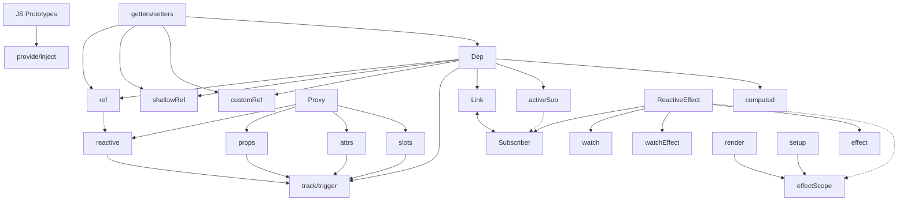

---
topTitle: Components
---

# Setup-функция

<v-clicks>

- Обернут в `effectScope`

</v-clicks>

---
topTitle: Components
---

# Render-функция

<v-clicks>

- Обернут в `ReactiveEffect`

</v-clicks>

---
topTitle: Components
---

  <NodeGraph class="py-4 bg-[#4ade804d]">Component</NodeGraph>
  

    <NodeGraph v-click class="col-span-4 bg-[#3c5cff4d]">Proxy</NodeGraph>
    <NodeGraph v-click class="col-span-1 bg-[#ff4d4d4d]">JS Prototypes</NodeGraph>
  

  

    <NodeGraph v-click class="bg-[#3c5cff4d]">Props</NodeGraph>
    <NodeGraph v-click="'+0'" class="bg-[#3c5cff4d]">Slots</NodeGraph>
    <NodeGraph v-click="'+0'" class="bg-[#3c5cff4d]">Attrs</NodeGraph>
    <NodeGraph v-click="'+0'" class="bg-[#3c5cff4d]">Refs</NodeGraph>
    <NodeGraph v-click class="bg-[#ff4d4d4d]">Provide/Inject</NodeGraph>
  

---
clicks: 1
variant: blue
---

<Timeline :steps="[{
  parent: 'top-[200px] left-[50%]',
  child1: 'left-[414px] top-[289px]',
  child2: 'left-[570px] top-[289px]',
  child3: 'left-[344px] top-[379px]',
  child4: 'left-[484px] top-[379px]',
  arrowParentChild1: {
    coords: '487:228 413:261',
    class: 'fx duration-500 animate'
  },
  arrowParentChild2: {
    coords: '490:228 570:261',
    class: 'fx duration-500 animate'
  },
  arrowChild1Child3: {
    coords: '413:317 344:350',
    class: 'fx duration-500 animate'
  },
  arrowChild1Child4: {
    coords: '416:317 484:350',
    class: 'fx duration-500 animate'
  },
}]" v-slot="t">

<Node :class="t.parent">Parent</Node>
<Node :class="t.child1">Child 1</Node>
<Node :class="t.child2">Child 2</Node>
<Node :class="t.child3">Child 3</Node>
<Node :class="t.child4">Child 4</Node>

<SvgLayer>
  <SvgArrow :class="t.arrowParentChild1.class" :coords="t.arrowParentChild1.coords" :power="-0.2" />
  <SvgArrow :class="t.arrowParentChild2.class" :coords="t.arrowParentChild2.coords" :power="0.2" />
  <SvgArrow :class="t.arrowChild1Child3.class" :coords="t.arrowChild1Child3.coords" :power="-0.2" />
  <SvgArrow :class="t.arrowChild1Child4.class" :coords="t.arrowChild1Child4.coords" :power="0.2" />
</SvgLayer>

</Timeline>

---

<h1 class="text-center">Provide / Inject</h1>

  

    

      <UilBox/>
    

    

      Работает на основе прототипного наследования
    

  

  

    

      <UilBox/>
    

    

      Не обладает "прямой" реактивностью
    

  

  

    

      <UisSchedule/>
    

    

      Почти бесплатный
    

  

  

    

      <UilBox/>
    

    

      Используйте реактивные примитивы
    

  

---

# Карта реактивности

---

---
layout: intro
name: 'Задавайте вопросы'
twitch: '@izede'
discord: '@izede'
telegram: '@zede1697'
variant: first
---
