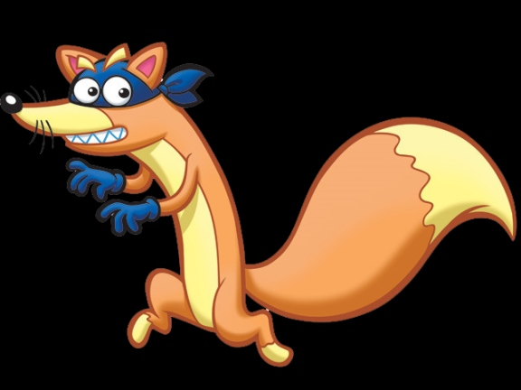
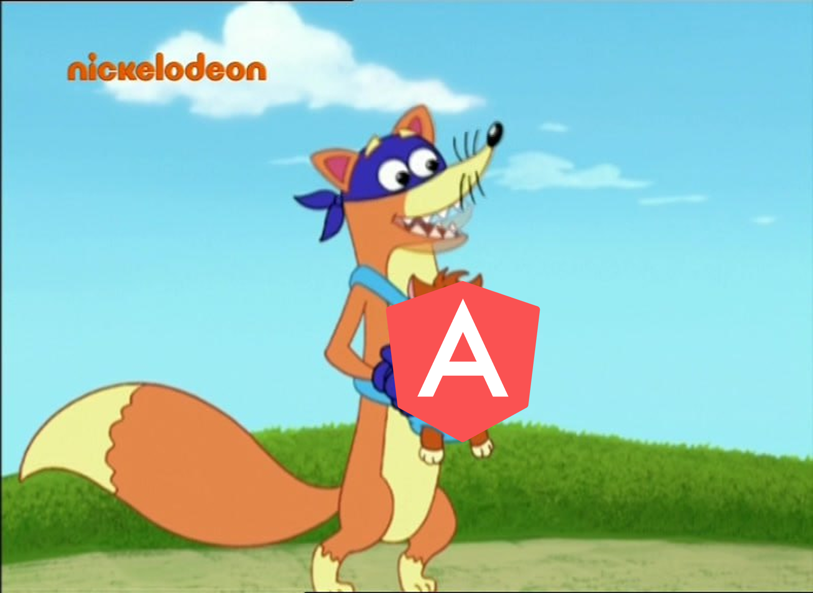
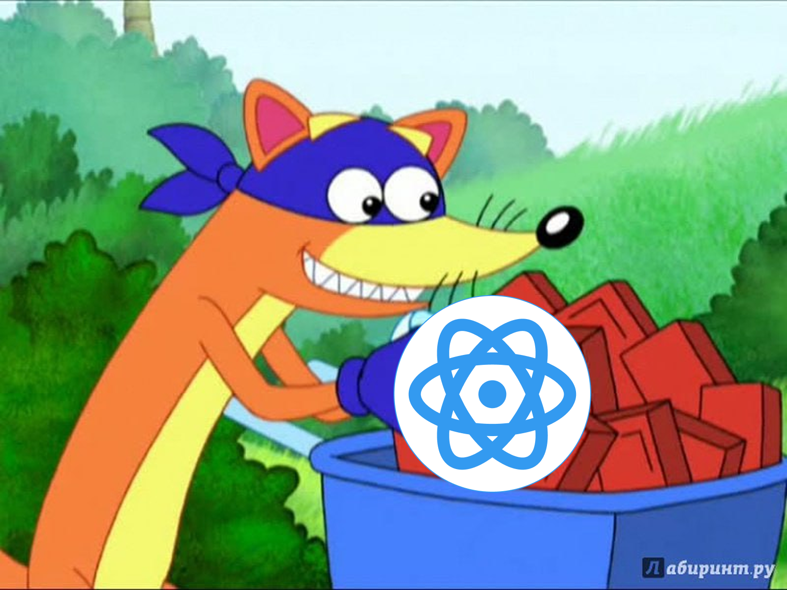
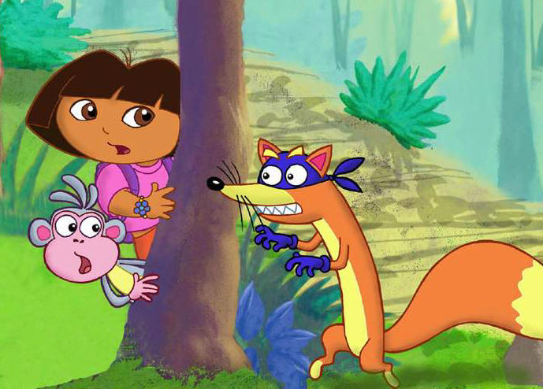
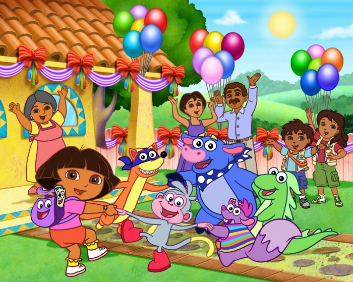

---
layout: center
---



---
layout: center
---


---
layout: center
slideClass: cs-green
---

<div class="flex flex-row gap-60">
<LogosVue v-click class="size-256" />
<LogosVitejs v-click class="size-256 relative -top-3" />
</div>

---
layout: center
slideClass: cs-red
---



---
layout: center
slideClass: cs-red
---

<LogosAngularIcon class="size-256" />

<v-clicks>

- Директивы: `v-if` / `ngIf`, `v-model` / `ngModel` 
- HTML-first подход
- Filters (Vue2)
- Мутабельность
- Модификации аттриубты с целями: `:attr` / `[attr]`, `@event` / `(event)` 

</v-clicks>

---
layout: center
slideClass: cs-blue
---



---
layout: center
slideClass: cs-blue
---

<LogosReact class="size-256" />

# `React`

<v-clicks>

- `Virtual DOM`
- Композаблы / хуки (`useX`)
- Однонаправленный поток данных
- Работа с `ref` аттрибутом
- Работа с `key` тегом 

</v-clicks>

---
layout: center
slideClass: cs-blue
---

<LogosReact class="size-256" />

# `React`

<v-clicks>

- `JSX`
- `Redux` -> `Vuex` -> `Pinia`
- `useId` и прочее API
- `Suspense`

</v-clicks>

---
layout: center
---



---
layout: center
slideClass: cs-orange
---

<DeviconSvelte class="size-256" />

<v-clicks>

- `script setup`
- Сокращенный синтаксис аттрибутов `:attribute` / `{attribute}`
- Экспериментальный `Reactivity Transform`
- `Props destructuring`

</v-clicks>

---
layout: center
slideClass: cs-blue
---

<DeviconSolidjs class="size-256" />

<v-clicks>

- огромное влияние на `Vue Vapor`
- Ленивые пропсы

</v-clicks>

---
layout: center
---


---
layout: center
slideClass: cs-purple
---

<VscodeIconsFileTypePreact class="size-256" />

<v-clicks>

- Двусвязанные списки для оптимизации реактивности

</v-clicks>

---
layout: center
slideClass: cs-blue
---


<v-clicks>

- Концепция Single File Component

</v-clicks>

---
slideClass: cs-blue
---

```html
<!-- Define the markup for this component. -->
<h1>{{ title }}</h1>

<!-- Use imported foo component -->
<p>This is an imported 'foo' component: <foo/></p>

<!-- Define the styles for this component. -->
<style>
  p { color: red; }
</style>

<!-- Define the behavior for this component. -->
<script>
const $ = require( 'jquery' );

component.exports = {
  onrender: function () {
    $('<p />').text('component rendered').insertAfter($this.find('p'));
  },
  data: {
    title: 'Hello World!'
  }
};
</script>
```

---
slideClass: cs-green
layout: center
---

<LogosVue v-click class="size-256" />

---



---

