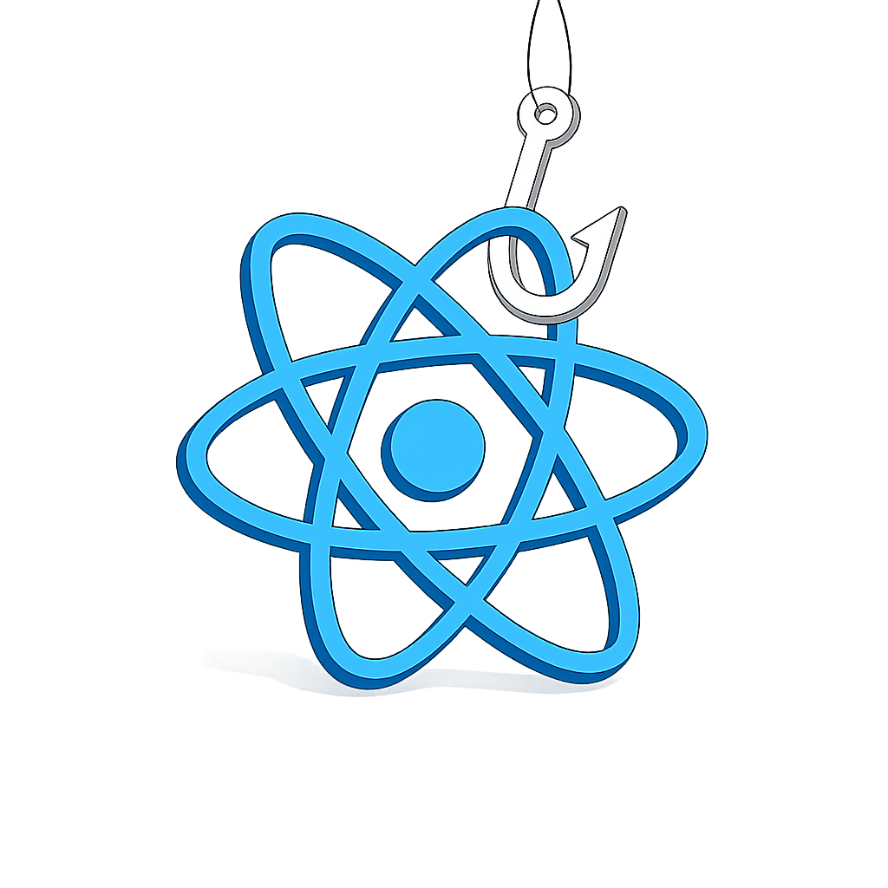

<h1 class="text-[4em] w-max $obj pos-center title-bg">А зачем композаблы?</h1>

---
shading: true
timeline:
  - optionsAPI: 'pos-50%_50%'
    compositionAPI: 'pos-50%_50% -popup-hidden'
  - {}
  - optionsAPI: 'pos-30%_50%'
    compositionAPI: 'pos-70%_50%'
  - {}
---

<div class="fx text-left $obj" :class="t.optionsAPI">
<h2 class="mb-4 text-center block w-full! title-bg">Options API</h2>

```js  {*|2,5,9,15|*}
export default {
  data() {
    return { lupa: 0, pupa: 0 }
  },
  computed: {
    salaryLupa() { ... },
    salaryPupa() { ... },
  },
  methods: {
    giveSalary() {
      this.lupa += this.salaryPupa
      this.pupa += this.salaryLupa
    }
  },
  mounted() {
    this.giveSalary()
  }
}
```

</div>

<div class="fx text-left $obj" :class="t.compositionAPI">
<h2 class="mb-4 text-center block w-full! title-bg">Composition API</h2>

```js
const lupa = ref(0)
const pupa = ref(0)
const salaryLupa = computed( ... )
const salaryPupa = computed( ... )

function giveSalary() {
  lupa.value += salaryPupa.value
  pupa.value += salaryLupa.value
}

onMounted(() => {
  giveSalary()
})
```

</div>

---
layout: default
---

<h1 class="title-bg">От миксинов к композаблам</h1>

````md magic-move
```js {*|2,5,9,15|*}
export default {
  data() {
    return { lupa: 0, pupa: 0 }
  },
  computed: {
    salaryLupa() { ... },
    salaryPupa() { ... },
  },
  methods: {
    giveSalary() {
      this.lupa += this.salaryPupa
      this.pupa += this.salaryLupa
    }
  },
  mounted() {
    this.giveSalary()
  }
}


⠀
```

```js {*|2,5,9,15|20-24}
export const accountingMixin = {
  data() {
    return { lupa: 0, pupa: 0 }
  },
  computed: {
    salaryLupa() { ... },
    salaryPupa() { ... },
  },
  methods: {
    giveSalary() {
      this.lupa += this.salaryPupa
      this.pupa += this.salaryLupa
    }
  },
  mounted() {
    this.giveSalary()
  }
}

export default {
  name: 'HornsAndHooves',
  mixins: [accountingMixin],
  // ...
}
```

```js {*|1,20|3,6,9-10,14}
export const employeeMixin = (name) => {
  data() {
    return { [name]: 0 }
  },
  computed: {
    [`salary${name}`]() { ... },
  },
  methods: {
    [`giveSalary${name}`]() {
      this[name] += this[`salary${name}`]
    }
  },
  mounted() {
    this[`giveSalary${name}`]()
  }
}

export default {
  name: 'HornsAndHooves',
  mixins: [employeeMixin('lupa'), employeeMixin('pupa')],
  // ...
}

⠀
```

```js {*|1-8|10-12}
export const useEmployee = () => {
  const employee = ref(0)
  const salary = computed(() => { /* ... */ })
  onMounted(() => {
    giveSalary()
  }
  return { employee, salary }
}

// HornsAndHooves
const lupa = useEmployee()
const pupa = useEmployee()


⠀
```
````

---
layout: default
---

<h1 class="title-bg">Что такое композабл?</h1>

<p class="title-bg">
  <strong>Композаблы</strong> — объединяют отдельные реактивные сущности в осмысленные единицы подобно тому, как <strong>созвездия</strong> объединяют <strong>звезды</strong> в единое целое.
</p>

---
timeline:
  - point1: 'active'
    point2: 'hidden'
    point3: 'hidden'
    point4: 'hidden'
    example: 'pos-0 fx duration-500 cs-red'
  - point1: ''
    point2: 'active'
    example: 'cs-blue'
  - point2: ''
    point3: 'active'
    example: 'cs-green'
  - point3: ''
    point4: 'active'
    example: 'cs-purple'
---

<h1 class="text-center title-bg">Композабл:</h1>

<Points>
  <Point icon="i-lineicons-bricks" :attrs="t.point1" class="cs-red">
    Функция, для инкапсуляции и переиспользования логики
  </Point>
  <Point icon="i-lineicons-bricks" :attrs="t.point2" class="cs-blue">
    Использует <strong>Composition API</strong>
  </Point>
  <Point icon="i-lineicons-bricks" :attrs="t.point3" class="cs-green">
    Следует соглашению именования <strong>use*</strong>
  </Point>
  <Point icon="i-lineicons-bricks" :attrs="t.point4" class="cs-purple">
    Работает с <strong>реактивными данными</strong> или хуками
  </Point>
  <Point full :class="t.example">
    <Example>

````md magic-move {lines: false}
```ts
function useCounter() {
  const count = ref(0)
  const increment = () => count.value++
  return { count, increment }
}
```
```ts
function useCounter() {}
function useI18n() {}
function useFetch() {}
```
```ts
const [
  advanced, 
  setAdvanced
] = useLearnComposable({
  basics: 'learn'
})
setAdvanced(true)
```
```ts
function useHello() {
  onMounted(() => {
    alert('Hello Vue!')
  })
  onUnmounted(() => {
    alert('Goodbye Vue!')
  })
}
```
````

</Example>
</Point>
</Points>

---
layout: center
timeline:
  - animation: react-swinging
  - animation: react-poshel-拿回
---



<style>
.react {
  position: relative;
  left: -10%;
  transform-origin: 70% 0;
  transform: rotate(-27deg);
}

.react-swinging {
  animation: react-swinging 2s linear infinite;
}

.react-poshel-拿回 {
  transform-origin: 70% 20%;
  animation: react-poshel-拿回 2s linear forwards;
}

@keyframes react-poshel-拿回 {
  0% {
    transform: rotate(0deg) scale(1) translateY(0);
  }
  100% {
    transform: rotate(1120deg) scale(0) translateY(100%);
  }
}

@keyframes react-swinging {
  0% {
    transform: rotate(-27deg);
  }
  25% {
    transform: rotate(18deg);
  }
  50% {
    transform: rotate(-27deg);
  }
  75% {
    transform: rotate(-72deg);
  }
  100% {
    transform: rotate(-27deg);
  }
}
</style>

---
layout: default
---

<h1 class="title-bg">Что НЕ является композаблом?</h1>

````md magic-move
```ts
// ❌ Обычная утилита
export function formatDate(date) {
  return new Date(date).toLocaleDateString()
}
```
```ts
// ❌ Обычная утилита
export function formatDate(date) {
  return new Date(date).toLocaleDateString()
}

// ❌ Тоже утилита, хоть и с реактивными данными
export function getValue(value: Ref<number>) {
  return value.value
}
```
````

---


---
shading: true
timeline:
  - point1: 'active'
    point2: 'hidden'
    point3: 'hidden'
    point4: 'hidden'
    example: 'pos-0 fx duration-500 cs-red'
  - point1: ''
    point2: 'active'
    example: 'cs-blue'
  - point2: ''
    point3: 'active'
    example: 'cs-green'
  - point3: ''
    point4: 'active'
    example: 'cs-purple'
---

<Points>
  <Point icon="i-material-symbols-cycle" :attrs="t.point1" class="cs-red">
    Следует соглашению именования <strong>use*</strong>
  </Point>
  <Point icon="i-mingcute-baby-fill" :attrs="t.point2" class="cs-blue">
    Расширяет возможности компонента/композабла
  </Point>
  <Point icon="i-ri-graduation-cap-fill" :attrs="t.point3" class="cs-green">
    Следует правилам использования композаблов
  </Point>
  <Point icon="i-game-icons-trophy-cup" :attrs="t.point4" class="cs-purple">
    Это и есть композабл
  </Point>
  <Point full :class="t.example">
    <Example>

````md magic-move {lines: false}
```ts
export function useCurrencyFormat() {
}
⠀
```
```ts
export function useCurrencyFormat() {
  const f = new Intl.NumberFormat(/**/)

  const format = (value) => {
    return f.format(value);
  };

  return {
    format,
  };
}
```
```vue
<script setup lang="ts">
const { format } = useCurrencyFormat()
</script>

<template>
  <div>{{ format(1000) }}</div>
</template>
```
```ts
useCurrencyFormat()

```
````

</Example>
</Point>
</Points>