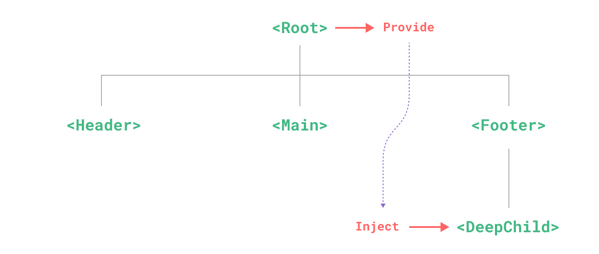

<script setup>
import shader from '../shaders/vue.glsl?raw'
import InjectConsImg from '../img/inject-cons.png'
</script>

<GlslImageEffect
  class="pos-50%_50% $obj absolute size-full"
  :image="InjectConsImg"
  :stages="[{
    fragmentShader: shader
  }]"
/>

<h1 :class="className" class="text-center text-4xl pos-50% $obj title-bg"> Provide / Inject </h1>

---



---
layout: default
---

````md magic-move
```js
const colorTheme = inject('colorTheme')


⠀
```

```js
const colorTheme = inject('colorTheme')
// ❌ Вероятность конфликта ключей


⠀
```

```js
const colorTheme = inject(Symbol('colorTheme'))
// ✅ Вероятность конфликта ключей
// ❌ Нет типизации


⠀
```

```js
const colorThemeKey: InjectionKey<string> = Symbol('colorTheme')
const colorTheme = inject(colorThemeKey)
// ✅ Вероятность конфликта ключей
// ✅ Типизация


⠀
```

```js
const colorThemeKey: InjectionKey<string> = Symbol('colorTheme')
const colorTheme = inject(colorThemeKey)
// ✅ Вероятность конфликта ключей
// ✅ Типизация
// ❌ Может не быть ключа
// ❌ Нужно экспортировать ключ


⠀
```

```js {*|1-2|4-6|8-15|17}
const colorThemeKey: InjectionKey<MaybeRefOrGetter<string>> =
  Symbol('colorTheme')

const useColorThemeProvider = (theme: MaybeRefOrGetter<string>) => {
  provide(colorThemeKey, theme)
}

const useColorTheme = () => {
  const colorThemeRaw = inject(colorThemeKey)
  if (!colorThemeRaw) {
    throw new Error('Color theme is not provided')
  }
  const colorTheme = computed(() => toValue(colorThemeRaw))
  return { colorTheme }
}

const { colorTheme } = useColorTheme()
```
````

---
timeline:
  - point1: 'active'
    point2: 'hidden'
    point3: 'hidden'
    point4: 'hidden'
    example: 'pos-0 fx duration-500 cs-red'
    exampleId: 1
  - point1: ''
    point2: 'active'
    example: 'cs-blue'
  - point2: ''
    point3: 'active'
    example: 'cs-green'
  - point3: ''
    point4: 'active'
    exampleId: 2
    example: 'cs-purple'
---

<h1 class="text-center title-bg">provide / inject:</h1>

<Points>
  <Point icon="i-material-symbols-key-outline" :attrs="t.point1" class="cs-red">
    Используйте <strong>Symbol</strong> как ключ
  </Point>
  <Point icon="i-majesticons-restricted-line" :attrs="t.point2" class="cs-blue">
    Не экспортируйте ключ!
  </Point>
  <Point icon="i-bi-bricks" :attrs="t.point3" class="cs-green">
    Всегда уносите в композабл
  </Point>
  <Point icon="i-material-symbols-stateful" :attrs="t.point4" class="cs-purple">
    Не используйте <strong>provide/inject</strong> вместо стейт менеджера
  </Point>
  <Point full :class="t.example">
    <Example v-if="t.exampleId === 1">

````md magic-move {lines: false}
```ts
const colorThemeKey: 
  InjectionKey<number> =
  Symbol('colorTheme')
```
```ts
const colorThemeKey = Symbol('');
export const useColorTheme;
export const useColorThemeProvider;
```
```ts {*|*}
export const useColorTheme = () => {
  const colorTheme = 
    inject(colotThemeKey)
  if (!colorTheme) {
    throw new Error(
      'Color theme is not provided'
    )
  }
  return { colorTheme }
}
```
````

</Example>
<ImgExample v-if="t.exampleId === 2" src="./img/sun.png" class="w-full h-full object-contain" />

</Point></Points>

---
layout: center
---

<script setup>
import shader from '../shaders/vue.glsl?raw'
import ResConsImg from '../img/res-cons.png'
</script>

<GlslImageEffect
  class="pos-50%_50% $obj absolute size-full"
  :image="ResConsImg"
  :stages="[{
    fragmentShader: shader.replaceAll('u_texture0_0', 'u_texture1_0')
  }]"
/>

<h1 :class="className" class="text-center text-4xl pos-50% $obj title-bg"> Ресурсы </h1>

---
layout: default
---

<p class="title-bg"><strong>Ресурсы</strong> — это асинхронные реактивные данные</p>

---
layout: default
---

````md magic-move
```js {*|1,4|5,7|6|*}
const user = ref(null)
const loading = ref(false)

watch(() => props.userId, async (newUserId) => {
  loading.value = true
  user.value = await fetch(`/api/users/${newUserId}`).then(r => r.json())
  loading.value = false
}, { immediate: true })
```

```js
import { useFetch } from '@vueuse/core'

const { data: user, isFetching } = useFetch(() => `/api/users/${props.userId}`)


⠀
```

```js
import { useAsyncState } from '@vueuse/core'

const { state: user, isLoading } = useAsyncState(
  (args) => axios.get(`/api/users/${props.userId}`).then(r => r.data),
  {
    userId: () => props.userId,
  }
)
```

```js
import { useQuery } from '@tanstack/vue-query'

const { isPending, isError, data: user } = useQuery({
  queryKey: ['user', props.userId],
  queryFn: () => axios.get(`/api/users/${props.userId}`).then(r => r.data),
})

⠀
```
````

<LogosVueuse v-click="[5,7]" class="$obj pos-779_125 size-150" />


---
timeline:
  - point1: 'active'
    point2: 'hidden'
    point3: 'hidden'
    point4: 'hidden'
    example: 'pos-0 fx duration-500 cs-red'
    exampleId: 1
  - point1: ''
    point2: 'active'
    example: 'cs-blue'
  - point2: ''
    point3: 'active'
    exampleId: 2
    example: 'cs-green'
  - point3: ''
    point4: 'active'
    exampleId: 3
    example: 'cs-purple'
---

<script setup>
import ItalyImg from '../img/italy.png'
</script>

<h1 class="text-center">Ресурсы:</h1>

<Points>
  <Point icon="i-mdi-atom-variant" :attrs="t.point1" class="cs-red">
    Асинхронные реактивные данные
  </Point>
  <Point icon="i-ri-sparkling-2-line" :attrs="t.point2" class="cs-blue">
      Реализованные возможности
  </Point>
  <Point icon="i-material-symbols-warning-rounded" :attrs="t.point3" class="cs-green">
    Возможно усложнение понимания кода
  </Point>
  <Point icon="i-ic-baseline-auto-fix-high" :attrs="t.point4" class="cs-purple">
    Становится стандартом в реактивных системах
  </Point>
  <Point full :class="t.example">
    <Example v-if="t.exampleId === 1">

````md magic-move {lines: false}
```ts
const colorThemeKey: 
  InjectionKey<number> =
  Symbol('colorTheme')
```
```md
1. Кеширование
2. Редупликация запросов
3. Параллельные запросы
4. Отложенные запросы
5. Оптимистичные апдейты
6. ...
```
````

</Example>
<ImgExample v-if="t.exampleId === 2" :src="ItalyImg" />
<Example v-if="t.exampleId === 3">
  <LogosAngularIcon class="$obj pos-303_154 size-100" />
  <DeviconSolidjs class="$obj pos-96_138 size-100" />
  <LogosSvelteIcon class="$obj pos-210_54 size-100" />
</Example>
</Point></Points>

---
layout: center
---

<script setup>
import shader from '../shaders/vue.glsl?raw'
import DirConsImg from '../img/dir-cons.png'
</script>

<GlslImageEffect
  class="pos-50%_50% $obj absolute size-full"
  :image="DirConsImg"
  :stages="[{
    fragmentShader: shader
  }]"
/>

<h1 :class="className" class="text-center text-4xl pos-50% $obj title-bg"> Директива vs Композабл </h1>

---
layout: default
---

<h2 class="title-bg">Директива:</h2>

```js
const vFocus = {
  mounted: (el) => el.focus()
}

// Использование
<input v-focus />
```

---
timeline:
  - point1: 'active'
    point2: 'hidden'
    point3: 'hidden'
    point4: 'hidden'
    example: 'pos-0 fx duration-500 cs-red'
    exampleId: 1
  - point1: ''
    point2: 'active'
    example: 'cs-blue'
  - {}
  - point2: ''
    point3: 'active'
    example: 'cs-green'
    exampleId: 2
  - point3: ''
    point4: 'active'
    exampleId: 3
    example: 'cs-purple'
---

<h1 class="text-center title-bg">Директива</h1>

<Points>
  <Point icon="i-mdi-chat-question-outline" :attrs="t.point1" class="cs-red">
    Спорное API
  </Point>
  <Point icon="i-material-symbols-weight-outline" :attrs="t.point2" class="cs-blue">
    Низкая гибкость
  </Point>
  <Point icon="i-mdi-light-switch-off" :attrs="t.point3" class="cs-green">
    Нельзя снимать/добавлять в рантайме
  </Point>
  <Point icon="i-streamline-ultimate-reward-stars-2" :attrs="t.point4" class="cs-purple">
    Декларативны
  </Point>
  <Point full :class="t.example">
    <Example>

````md magic-move {lines: false}
```js
const vFocus = {
  created(el, binding, vnode) {},
  beforeMount() {},
  mounted() {},
  beforeUpdate() {},
  updated() {},
  beforeUnmount() {},
  unmounted() {},
}
```
```vue
<template>
  <input v-input-mask.number="value" />
</template>

```
```vue
<script setup>
const input = useTemplateRef('input')
const { value } = useInputMask(
  input, 
  { mask: '### ### ### ## ##' }
)
</script>
```
```vue
<template>
  <input v-focus />
</template>
```
```vue
<template>
  <input v-mark.red.bold="{ at: 'Hello' }" />
</template>
```
````

</Example>
</Point>
</Points>

---

<h2 class="title-bg">Композабл:</h2>

```vue {*|2,3|4-6|8-10,13|17,18|17,22}
<script setup lang="ts">
export function useFocus(el: MaybeRefOrGetter<HTMLElement>) {
  const target = computed(() => toValue(el))
  watch(target, (newEl) => {
    focus(newEl)
  })
  
  function focus() {
    target.value?.focus()
  }
  
  return {
    focus
  }
}

const element = useTemplateRef('element')
const { focus } = useFocus(element)
</script>

<template>
  <input ref="element" />
</template>
```

---
timeline:
  - point1: 'active'
    point2: 'hidden'
    point3: 'hidden'
    point4: 'hidden'
    example: 'pos-0 fx duration-500 cs-red'
    exampleId: 1
  - point1: ''
    point2: 'active'
    example: 'cs-blue'
  - point2: ''
    point3: 'active'
    example: 'cs-green'
    exampleId: 2
  - point3: ''
    point4: 'active'
    exampleId: 3
    example: 'cs-purple'
---

<h1 class="text-center title-bg">Директива или композабл?</h1>

<Points>
  <Point icon="i-streamline-rock-and-roll-hand" :attrs="t.point1" class="cs-red">
    Гибкость
  </Point>
  <Point icon="i-material-symbols-delivery-truck-speed-rounded" :attrs="t.point2" class="cs-blue">
    Управление в рантайме
  </Point>
  <Point icon="i-ph-eyes-bold" :attrs="t.point3" class="cs-green">
    Могут лучше отслеживать изменения
  </Point>
  <Point icon="i-mdi-chat-question-outline" :attrs="t.point4" class="cs-purple">
    Удобное написание
  </Point>
  <Point full :class="t.example">
    <Example>

````md magic-move {lines: false}
```vue
<script setup>
const input = useTemplateRef('input')
const { value } = useInputMask(
  input, 
  { mask: '### ### ### ## ##' }
)
</script>
```
```vue
<script setup>
const input = useTemplateRef('input')
consr mask = ref('### ### ### ## ##')
const { value } = useInputMask(
  input, 
  { mask }
)
</script>
```
```vue
<template>
  <input v-mark.red.bold="{ at: 'Hello' }" />
</template>
```
```vue
<script setup>
const maskNumber = useInputMask()
const maskName = useInputMask()
const maskPostcode = useInputMask()
</script>
```
````

</Example>
</Point>
</Points>

---
layout: center
---

<script setup>
import shader from '../shaders/vue.glsl?raw'
import SameConsImg from '../img/same-cons.png'
</script>

<GlslImageEffect
  class="pos-50%_50% $obj absolute size-full"
  :image="SameConsImg"
  :stages="[{
    fragmentShader: shader
  }]"
/>

<h1 :class="className" class="text-center text-4xl pos-50% $obj title-bg"> onUnmounted vs onScopeDispose </h1>

---
layout: default
---

<h1 class="title-bg">onUnmounted vs onScopeDispose</h1>

````md magic-move
```js
export function useWebsocket(url: string) {
  const ws = new WebSocket(url)

  // ...

  onUnmounted(() => {
    ws.close()
  })
}
```

```js
export function useWebsocket(url: string) {
  const ws = new WebSocket(url)

  // ...

  onScopeDispose(() => {
    ws.close()
  })
}
```
````

---

````md magic-move
```js
router.beforeEach(async () => {
  // не завершится
  const { ws } = useWebsocket('ws://localhost:8080')

  // ...
})


⠀
```

```js
router.beforeEach(async () => {
  // завершится
  const scope = effectScope()
  scope.run(() => {
    const { ws } = useWebsocket('ws://localhost:8080')
  })

  // ...
  scope.stop()
})
```
````

---
layout: center
---

<script setup>
import shader from '../shaders/vue.glsl?raw'
import WeightConsImg from '../img/weight-cons.png'
</script>

<GlslImageEffect
  class="pos-50%_50% $obj absolute size-full"
  :image="WeightConsImg"
  :stages="[{
    fragmentShader: shader
  }]"
/>

<h1 :class="className" class="text-center text-4xl pos-50% $obj title-bg"> Неизменяемые значения </h1>

---
layout: default
---

````md magic-move
```js {*|2,7,13,14}
const useCounter = () => {
  const count = ref(0)
  const increment = () => count.value++
  const decrement = () => count.value--

  return {
    count,
    increment,
    decrement
  }
}

const { count, increment, decrement } = useCounter()
count.value++ // ❌ Нежелатльная мутация 
```

```js {7,14}
const useCounter = () => {
  const count = ref(0)
  const increment = () => count.value++
  const decrement = () => count.value--

  return {
    count: computed(() => count.value),
    increment,
    decrement
  }
}

const { count, increment, decrement } = useCounter()
count.value++ // ✅ ошибка в рантайме и в TS
```

```js {7,14}
const useCounter = () => {
  const count = ref(0)
  const increment = () => count.value++
  const decrement = () => count.value--

  return {
    count: shallowReadonly(count), // 🤔 имеет цену за работу через Proxy
    increment,
    decrement
  }
}

const { count, increment, decrement } = useCounter()
count.value++ // ✅ Ошибка в рантайме
```

```js {7,14}
const useCounter = () => {
  const count = ref(0)
  const increment = () => count.value++
  const decrement = () => count.value--

  return {
    count: count as Readonly<typeof count>,
    increment,
    decrement
  }
}

const { count, increment, decrement } = useCounter()
count.value++ // ✅ Ошибка TS
```
````
