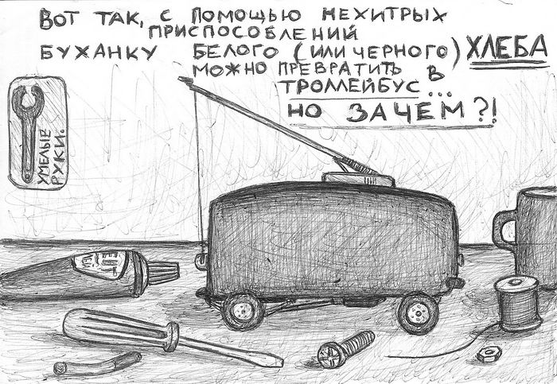
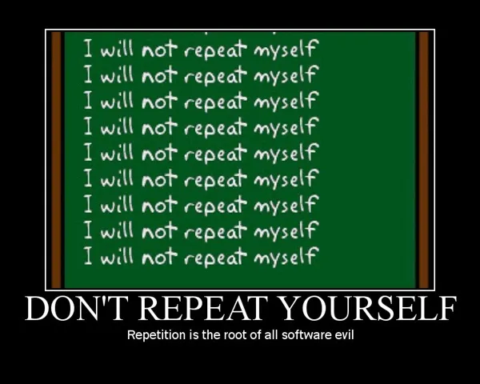

# Базовая работа с композаблами

---
layout: default
---

# Где можно использовать:

````md magic-move
```js
// В компонентах
export default {
  setup() {
    const { params } = useRoute()
    const { isAuthenticated } = useAuth()
    return { params, isAuthenticated }
  }
}
```

```js
// В сторе
export const useAdminPanel = defineStore('admin-panel', () => {
    const { params } = useRoute()
    const { isAuthenticated } = useAuth()
    
    // ...
})
```

```js
// В хуках роутера
router.beforeEach(async (to) => {
    const { params } = useRoute()
    const { isAuthenticated } = useAuth()

    // ...
})
```

```js
// В других композаблах
export function useAdminPanel() {
    const { params } = useRoute()
    const { isAuthenticated } = useAuth()

    // ...
}
```
````

---
layout: default
---

# Использование внутри функций

## 🤔 Сомнительно

````md magic-move
```js
function onClick() {
  const { user } = useUser()
  // ...
}
```

```js
function onClick() {
  const { user } = useUser()
  // watcher-ы не будут уничтожены!
}
```

```js
function onClick() {
  const { user } = useUser()
  // watcher-ы не будут уничтожены!
  // утечка памяти!
}
```

```js
function onClick() {
  const scope = effectScope()
  scope.run(() => {
    const { user } = useUser()
    // ...
  })
  scope.stop()
}
```
````

---
layout: default
---

# Использование в условиях

## 🤔 Сомнительно:

````md magic-move
```ts
const props = defineProps<{
  hasTooltip?: boolean
}>()

// ...

if (props.hasTooltip) {
  const { ... } = useTooltip({
    target: props.target,
  })
}
```

```ts
const props = defineProps<{
  hasTooltip?: boolean
}>()

// ...

const { ... } = useTooltip({
  target: () => hasTooltip ? props.target : null,
})
```
````

---
layout: default
---

# Composable hell

````md magic-move
```ts
const useTooltip = () => { ... }
```

```ts
const useTooltip = () => { ... }
const useStoreTooltip = () => { ... }
```

```ts
const useTooltip = () => { ... }
const useStoreTooltip = () => { ... }
const useMainTooltip = () => { ... }
```

```ts
const useTooltip = () => { ... }
const useStoreTooltip = () => { ... }
const useMainTooltip = () => { ... }
const useSiteTooltip = () => { ... }
```
````

---
timeline:
  - point1: 'outline outline-2 outline-[#CCCCCC88]'
    point2: '-blur-hidden outline-[#00000088]'
    point3: '-blur-hidden outline-[#00000088]'
    point4: '-blur-hidden outline-[#00000088]'
    example1: 'pos-0 fx duration-500'
    example2: '-blur-hidden w-[calc(100%-24px)] h-[calc(100%-24px)] absolute fx duration-500'
    example3: '-blur-hidden w-[calc(100%-24px)] h-[calc(100%-24px)] absolute fx duration-500'
  - point1: 'outline-[#00000088]'
    point2: 'outline outline-2 h-full  outline-[#CCCCCC88]'
  - point2: 'outline-[#00000088]'
    point3: 'outline outline-2 outline-[#CCCCCC88]'
    example1: '-blur-hidden w-full pos-0 fx duration-500'
    example2: 'absolute w-[calc(100%-24px)] h-[calc(100%-24px)] fx duration-500'
  - point3: 'outline-[#00000088]'
    point4: 'outline outline-2 outline-[#CCCCCC88]'
    example2: '-blur-hidden w-[calc(100%-24px)] h-[calc(100%-24px)] absolute fx duration-500'
    example3: 'absolute w-[calc(100%-24px)] h-[calc(100%-24px)] fx duration-500'
---

<h1 class="text-center">Композаблы здорового человека:</h1>

<div class="items-grid">
  <div class="item fx duration-400" :class="t.point1">
    <div class="item-icon">
      <MaterialSymbolsAssignmentAdd/>
    </div>
    <div>
      Не создают абстракцию ради абстракции
    </div>
  </div>
  <div class="item fx duration-400" :class="t.point2">
    <div class="item-icon">
      <PajamasHook/>
    </div>
    <div>
      Минимально полагаются на хуки жизненного цикла
    </div>
  </div>
  <div class="item fx duration-400" :class="t.point3">
    <div class="item-icon">
      <MaterialSymbolsClearDayRounded/>
    </div>
    <div>
      Не делают неявных действий
    </div>
  </div>
  <div class="item fx duration-400" :class="t.point4">
    <div class="item-icon">
      <CarbonFoundationModel/>
    </div>
    <div>
      Практики хорошего кода как SOLID работают и в композаблах
    </div>
  </div>
  <div class="item-example fx example row-span-4 relative" :class="t.example">

<div :class="t.example1">

````md magic-move {lines: false}
```ts
const useTooltip = () => { ... }
const useStoreTooltip = () => { ... }
const useMainTooltip = () => { ... }
const useSiteTooltip = () => { ... }
```
```ts
function useCounter() {
  const count = ref(0)
  
  onMounted(() => {
    count.value++
  })
  // ...
}
```
````

</div>
<div :class="t.example2">
  
</div>
<div :class="t.example3">
  
</div>

  </div>
</div>

---
layout: default
---

# Прием аргументов

````md magic-move
```ts
const useFetch = (url: string) => {
  // ...
  fetch(url)
  // ...
}

useFetch('https://api.example.com/data')
```

```ts
const useFetch = (url: string) => {
    // ...
  fetch(url)
  // ...
}

useFetch('https://api.example.com/data')
const url = ref('https://api.example.com/data')
useFetch(url.value) // не реактивно 
```

```ts
const useFetch = (url: MaybeRef<string>) => {
  watch(() => unref(url), (newUrl) => {
    fetch(newUrl)
    // ...
  })
  // ...
}

useFetch('https://api.example.com/data')
const url = ref('https://api.example.com/data')
useFetch(url) // все работает
```

```ts
const useFetch = (url: MaybeRef<string>) => {
  watch(() => unref(url), (newUrl) => {
    fetch(newUrl)
    // ...
  })
  // ...
}

useFetch('https://api.example.com/data')
const url = ref('https://api.example.com/data')
useFetch(url) // все работает
const userUrl = computed(() => url.value + '/user')
useFetch(userUrl) // громоздко
```

```ts
const useFetch = (url: MaybeRefOrGetter<string>) => {
  watch(() => toValue(url), (newUrl) => {
    fetch(newUrl)
    // ...
  })
  // ...
}

useFetch('https://api.example.com/data')
const url = ref('https://api.example.com/data')
useFetch(url) // все работает
useFetch(() => url.value + '/user') // все работает
```

```ts
interface UseFetchOptions {
  url: MaybeRefOrGetter<string>,
  method: MaybeRefOrGetter<'GET' | 'POST' | 'PUT' | 'DELETE'>
}

const useFetch = (options: UseFetchOptions) => {
  const { 
    url, 
    method = 'GET',
  } = options

  watch(
    () => [toValue(url), toValue(method)], 
    ([newUrl, newMethod]) => {
    fetch(newUrl, { method: newMethod })
    // ...
  })
  // ...
}
```
````

---

# Возвращаемые значения

````md magic-move
```ts
export function useCounter() {
  const count = ref(0)
  const increment = () => count.value++
  
  return {
    count,
    increment
  }
}

const { count, increment } = useCounter()
```

```ts
export function useCounter() {
  const count = ref(0)
  const increment = () => count.value++
  
  return [
    count, 
    increment
  ]
}

const [count, increment] = useCounter()
```

```ts
export function useCounter() {
  const count = ref(0)
  const increment = () => count.value++
  
  return [
    count, 
    increment
  ]
}

const [clicks, incrementClicks] = useCounter()
const [keys, incrementKeys] = useCounter()
```

```ts
export function useCounter() {
  const count = ref(0)
  const increment = () => count.value++
  
  return { 
    count,
    increment
  }
}

const { count: clicks, increment: incrementClicks } = useCounter()
const { count: keys, increment: incrementKeys } = useCounter()
```

```ts
export function useCounter() {
  const count = ref(0)
  const increment = () => count.value++
  
  return {
    count,
    increment
  }
}

const clicks = useCounter()
const keys = useCounter()

clicks.increment()
```

```vue
<script setup lang="ts">
export function useCounter() {
  const count = ref(0)
  const increment = () => count.value++
  
  return { count, increment }
}

const clicks = useCounter()
const keys = useCounter()
</script>

<template>
  <button @click="clicks.increment">
    {{ clicks.count.value }}
  </button>
  <button @click="clicks.count.value--">
    {{ clicks.count.value }}
  </button>
</template>
```
````

---
timeline:
  - point1: 'outline outline-2 outline-[#CCCCCC88]'
    point2: '-blur-hidden outline-[#00000088]'
    point3: '-blur-hidden outline-[#00000088]'
    point4: '-blur-hidden outline-[#00000088]'
    example: 'pos-0 fx duration-500'
  - point1: 'outline-[#00000088]'
    point2: 'outline outline-2 outline-[#CCCCCC88]'
  - point2: 'outline-[#00000088]'
    point3: 'outline outline-2 outline-[#CCCCCC88]'
  - point3: 'outline-[#00000088]'
    point4: 'outline outline-2 outline-[#CCCCCC88]'
---

<h1 class="text-center">Как писать композаблы:</h1>

<div class="items-grid">
  <div class="item fx duration-400" :class="t.point1">
    <div class="item-icon">
      <MdiBrain/>
    </div>
    <div>
      Принимайте решения осознанно
    </div>
  </div>
  <div class="item fx duration-400" :class="t.point2">
    <div class="item-icon">
      <LineiconsBricks/>
    </div>
    <div>
      Используйте встроенные хелперы
    </div>
  </div>
  <div class="item fx duration-400" :class="t.point3">
    <div class="item-icon">
      <MaterialSymbolsServiceToolboxOutline/>
    </div>
    <div>
      Используйте объекты как входные параметры
    </div>
  </div>
  <div class="item fx duration-400" :class="t.point4">
    <div class="item-icon">
      <MaterialSymbolsDataObject/>
    </div>
    <div>
      Старайтесь возвращать обычные объекты
    </div>
  </div>
  <div class="item-example fx example row-span-4 no-bg" :class="t.example">

<div :class="t.example1">

````md magic-move {lines: false}
```ts
const [count, increment] = useCounter()
const [data, loading] = useFetch()
```
```ts
computed(() => toValue(url))
computed(() => unref(method))
const mutableUrl = toRef(urlValue)
const param = isReadonly(urlValue)
// ...
```
```ts
useSmokersFetch(url, method, headers)
useHealthFetch({ url, method, headers })
useNiceFetch(url, { method, headers })
// ...
```
```ts
function useFetch() {
  // ...

  return {
    data,
    isLoading,
    // ...
  }
}
// ...
```
````

</div>

  </div>
</div>