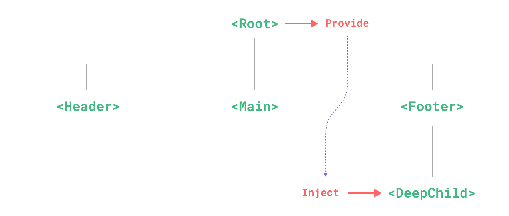

# Разработка композаблов
## `Provide/Inject`

---



---
layout: default
---

````md magic-move
```js
const colorTheme = inject('colorTheme')
```

```js
const colorTheme = inject('colorTheme')
// нет типизации
// есть вероятность конфликта ключей
// нет гарантий, что значение будет доступно
// явное использования ключа
```

```js
const colorThemeKey: InjectionKey<string> = Symbol('colorTheme')

const colorTheme = inject(colorThemeKey)
//  ̶н̶е̶т̶ ̶т̶и̶п̶и̶з̶а̶ц̶и̶и̶
//  ̶е̶с̶т̶ь̶ ̶в̶е̶р̶о̶я̶т̶н̶о̶с̶т̶ь̶ ̶к̶о̶н̶ф̶л̶и̶к̶т̶а̶ ̶к̶л̶ю̶ч̶е̶й̶
// нет гарантий, что значение будет доступно
// явное использования ключа
```

```js {*|1-2|4-6|8-15|17}
const colorThemeKey: InjectionKey<MaybeRefOrGetter<string>> =
  Symbol('colorTheme')

const useColorThemeProvider = (theme: MaybeRefOrGetter<string>) => {
  provide(colorThemeKey, theme)
}

const useColorTheme = () => {
  const colorThemeRaw = inject(colorThemeKey)
  if (!colorThemeRaw) {
    throw new Error('Color theme is not provided')
  }
  const colorTheme = computed(() => toValue(colorThemeRaw))
  return { colorTheme }
}

const { colorTheme } = useColorTheme()
```
````

---
timeline:
  - point1: 'outline outline-2 outline-[#CCCCCC88]'
    point2: '-blur-hidden outline-[#00000088]'
    point3: '-blur-hidden outline-[#00000088]'
    point4: '-blur-hidden outline-[#00000088]'
    example1: 'pos-0 fx duration-500'
    example2: '-blur-hidden absolute w-[calc(100%-24px)] h-[calc(100%-24px)] fx duration-500'
  - point1: 'outline-[#00000088]'
    point2: 'outline outline-2 outline-[#CCCCCC88]'
  - point2: 'outline-[#00000088]'
    point3: 'outline outline-2 outline-[#CCCCCC88]'
  - point3: 'outline-[#00000088]'
    point4: 'outline outline-2 outline-[#CCCCCC88]'
    example1: '-blur-hidden absolute pos-0 fx duration-500'
    example2: 'absolute w-[calc(100%-24px)] h-[calc(100%-24px)] fx duration-500'
---

<h1 class="text-center"><strong>provide/inject</strong>:</h1>

<div class="items-grid">
  <div class="item fx duration-400" :class="t.point1">
    <div class="item-icon">
      <MaterialSymbolsKeyOutline/>
    </div>
    <div>
      Используйте <strong>Symbol</strong> как ключ
    </div>
  </div>
  <div class="item fx duration-400" :class="t.point2">
    <div class="item-icon">
      <MajesticonsRestrictedLine/>
    </div>
    <div>
      Не экспортируйте ключ!
    </div>
  </div>
  <div class="item fx duration-400" :class="t.point3">
    <div class="item-icon">
      <BiBricks/>
    </div>
    <div>
      Всегда уносите в композабл
    </div>
  </div>
  <div class="item fx duration-400" :class="t.point4">
    <div class="item-icon">
      <MaterialSymbolsStateful/>
    </div>
    <div>
      Не используйте <strong>provide/inject</strong> вместо стейт менеджера
    </div>
  </div>
  <div class="item-example fx example row-span-4 no-bg" :class="t.example">

<div :class="t.example1">

````md magic-move {lines: false}
```ts
const colorThemeKey: 
  InjectionKey<number> =
  Symbol('colorTheme')
```
```ts
const colorThemeKey = Symbol('');
export const useColorTheme;
export const useColorThemeProvider;
```
```ts {*|*}
export const useColorTheme = () => {
  const colorTheme = 
    inject(colotThemeKey)
  if (!colorTheme) {
    throw new Error(
      'Color theme is not provided'
    )
  }
  return { colorTheme }
}
```
````

</div>
<div :class="t.example2">
  
</div>

  </div>
</div>

---
layout: center
---

# Разработка композаблов
## Ресурсы

---
layout: default
---

`Ресурсы` - это асинхронные реактивные данные

---
layout: default
---

````md magic-move
```js {*|1,4|5,7|6|*}
const user = ref(null)
const loading = ref(false)

watch(() => props.userId, async (newUserId) => {
  loading.value = true
  user.value = await fetch(`/api/users/${newUserId}`).then(r => r.json())
  loading.value = false
}, { immediate: true })
```

```js
// VueUse: useFetch
const { data: user, isFetching } = useFetch(() => `/api/users/${props.userId}`)
```

```js
// VueUse: useAsyncState
const { state: user, isLoading } = useAsyncState(
  (args) => axios.get(`/api/users/${props.userId}`).then(r => r.data),
  {
    userId: () => props.userId,
  }
)
```

```js
// Tanstack Query: useQuery
const { isPending, isError, data: user } = useQuery({
  queryKey: ['user', props.userId],
  queryFn: () => axios.get(`/api/users/${props.userId}`).then(r => r.data),
})
```
````

<LogosVueuse v-click="[5,7]" class="$obj pos-779_125 size-150" />


---
timeline:
  - point1: 'outline outline-2 outline-[#CCCCCC88]'
    point2: '-blur-hidden outline-[#00000088]'
    point3: '-blur-hidden outline-[#00000088]'
    point4: '-blur-hidden outline-[#00000088]'
    example1: 'pos-0 fx duration-500'
    example2: '-blur-hidden pos-0 fx duration-500'
  - point1: 'outline-[#00000088]'
    point2: 'outline outline-2 outline-[#CCCCCC88]'
  - point2: 'outline-[#00000088]'
    point3: 'outline outline-2 outline-[#CCCCCC88]'
  - point3: 'outline-[#00000088]'
    point4: 'outline outline-2 outline-[#CCCCCC88]'
    example1: '-blur-hidden absolute pos-0 fx duration-500'
    example2: 'pos-0 fx duration-500'
---

<h1 class="text-center">Ресурсы:</h1>

<div class="items-grid">
  <div class="item fx duration-400" :class="t.point1">
    <div class="item-icon">
      <MdiAtomVariant/>
    </div>
    <div>
      Асинхронные реактивные данные
    </div>
  </div>
  <div class="item fx duration-400" :class="t.point2">
    <div class="item-icon">
      <RiSparkling2Line/>
    </div>
    <div>
      Реализованные возможности
    </div>
  </div>
  <div class="item fx duration-400" :class="t.point3">
    <div class="item-icon">
      <MaterialSymbolsWarningRounded/>
    </div>
    <div>
      Возможно усложнение понимания кода
    </div>
  </div>
  <div class="item fx duration-400" :class="t.point4">
    <div class="item-icon">
      <IcBaselineAutoFixHigh/>
    </div>
    <div>
      Становится стандартом в реактивных системах
    </div>
  </div>
  <div class="item-example fx example row-span-4 no-bg" :class="t.example">

<div :class="t.example1">

````md magic-move {lines: false}
```ts
const colorThemeKey: 
  InjectionKey<number> =
  Symbol('colorTheme')
```
```md
1. Кеширование
2. Редупликация запросов
3. Параллельные запросы
4. Отложенные запросы
5. Оптимистичные апдейты
6. ...
```
```ts {*|*}
// TODO: пример сложного 
// для понимания кода
```
````

</div>
<div :class="t.example2">
  <LogosAngularIcon class="$obj pos-303_154 size-100" />
  <DeviconSolidjs class="$obj pos-96_138 size-100" />
  <LogosSvelteIcon class="$obj pos-210_54 size-100" />
</div>

  </div>
</div>

---
layout: center
---

# Разработка композаблов
## Директива против композабла

---
layout: default
---

# Директива:

```js
const vFocus = {
  mounted: (el) => el.focus()
}

// Использование
<input v-focus />
```

---
timeline:
  - point1: 'outline outline-2 outline-[#CCCCCC88]'
    point2: '-blur-hidden outline-[#00000088]'
    point3: '-blur-hidden outline-[#00000088]'
    point4: '-blur-hidden outline-[#00000088]'
    example: 'pos-0 fx duration-500'
  - point1: 'outline-[#00000088]'
    point2: 'outline outline-2 outline-[#CCCCCC88]'
  - point2: 'outline-[#00000088]'
    point3: 'outline outline-2 outline-[#CCCCCC88]'
  - point3: 'outline-[#00000088]'
    point4: 'outline outline-2 outline-[#CCCCCC88]'
---

<h1 class="text-center">Директива</h1>

<Points>
  <Point icon="i-mdi-chat-question-outline" :class="t.point1">
    Спорное API
  </Point>
  <Point icon="i-material-symbols-weight-outline" :class="t.point2">
    Низкая гибкость
  </Point>
  <Point icon="i-fluent-slow-mode-16-regular" :class="t.point3">
    Нельзя снимать/добавлять в рантайме
  </Point>
  <Point icon="i-ic-outline-palette" :class="t.point4">
    Декларативны
  </Point>
  <Point full :class="t.example">
    <Example :class="t.example">

````md magic-move {lines: false}
```js
const vFocus = {
  created(el, binding, vnode) {},
  beforeMount() {},
  mounted() {},
  beforeUpdate() {},
  updated() {},
  beforeUnmount() {},
  unmounted() {},
}
```
```ts
useLearnComposable({
  basics: 'learn'
})
```
```ts
const [
  advanced, 
  setAdvanced
] = useLearnComposable({
  basics: 'learn'
})
setAdvanced(true)
```
```ts
const { 
  advanced
} = useLearnComposable({
  basics: 'learn'
})
advanced.value = true
```
````

</Example>
</Point>
</Points>

---

## Композабл:
```vue {*|2,3|4-6|8-10,13|17,18|17,22}
<script setup lang="ts">
export function useFocus(el: MaybeRefOrGetter<HTMLElement>) {
  const target = computed(() => toValue(el))
  watch(target, (newEl) => {
    focus(newEl)
  })
  
  function focus() {
    target.value?.focus()
  }
  
  return {
    focus
  }
}

const element = templateRef('element')
const { focus } = useFocus(element)
</script>

<template>
  <input ref="element" />
</template>
```

---

# Директива или композабл?

Предпочитайте <strong>композаблы</strong> когда можете

<v-clicks>

- Гибкость
- Управление в рантайме
- Могут лучше отслеживать изменения

</v-clicks>

---
layout: center
---

# Разработка композаблов
## `onUnmounted` vs `onScopeDispose`

---
layout: default
---

# `onUnmounted` vs `onScopeDispose`

````md magic-move
```js
export function useWebsocket(url: string) {
  const ws = new WebSocket(url)

  // ...

  onUnmounted(() => {
    ws.close()
  })
}
```

```js
export function useWebsocket(url: string) {
  const ws = new WebSocket(url)

  // ...

  onScopeDispose(() => {
    ws.close()
  })
}
```
````

---

````md magic-move
```js
router.beforeEach(async () => {
  // не завершится
  const { ws } = useWebsocket('ws://localhost:8080')

  // ...
})
```

```js
router.beforeEach(async () => {
  // завершится
  const scope = effectScope()
  scope.run(() => {
    const { ws } = useWebsocket('ws://localhost:8080')
  })

  // ...
  scope.stop()
})
```
````
---

# `onUnmounted` vs `onScopeDispose`

<v-clicks>

- `onUnmounted` - только для компонентов
- `onScopeDispose` - для любого **реактивного** контекста

</v-clicks>

---
layout: center
---

# Разработка композаблов
## Неизменяемые значения

---
layout: default
---

````md magic-move
```js {*|2,7,13,14}
const useCounter = () => {
  const count = ref(0)
  const increment = () => count.value++
  const decrement = () => count.value--

  return {
    count,
    increment,
    decrement
  }
}

const { count, increment, decrement } = useCounter()
count.value++ // Нежелатльная мутация 
```

```js {7,14}
const useCounter = () => {
  const count = ref(0)
  const increment = () => count.value++
  const decrement = () => count.value--

  return {
    count: computed(() => count.value),
    increment,
    decrement
  }
}

const { count, increment, decrement } = useCounter()
count.value++ // ошибка в рантайме и в TS
```

```js {7,14}
const useCounter = () => {
  const count = ref(0)
  const increment = () => count.value++
  const decrement = () => count.value--

  return {
    count: shallowReadonly(count), // имеет цену за работу через Proxy
    increment,
    decrement
  }
}

const { count, increment, decrement } = useCounter()
count.value++ // Ошибка в рантайме
```

```js {7,14}
const useCounter = () => {
  const count = ref(0)
  const increment = () => count.value++
  const decrement = () => count.value--

  return {
    count: count as Readonly<typeof count>,
    increment,
    decrement
  }
}

const { count, increment, decrement } = useCounter()
count.value++ // Ошибка TS
```
````
