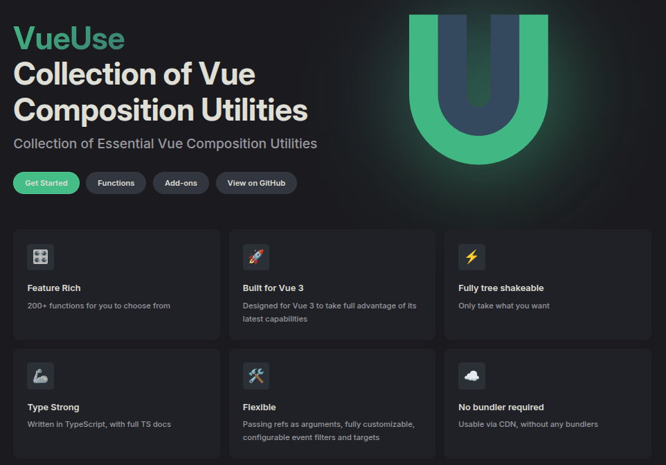

---
timeline:
  - point1: 'outline outline-2 outline-[#CCCCCC88]'
    point2: '-blur-hidden outline-[#00000088]'
    point3: '-blur-hidden outline-[#00000088]'
    point4: '-blur-hidden outline-[#00000088]'
    example: 'pos-0 fx duration-500'
  - point1: 'outline-[#00000088]'
    point2: 'outline outline-2 outline-[#CCCCCC88]'
  - point2: 'outline-[#00000088]'
    point3: 'outline outline-2 outline-[#CCCCCC88]'
  - point3: 'outline-[#00000088]'
    point4: 'outline outline-2 outline-[#CCCCCC88]'
---

<h1 class="text-center">Что мы не успели обсудить:</h1>

<div class="items-grid">
  <div class="item fx duration-400" :class="t.point1">
    <div class="item-icon">
      <MaterialSymbolsCycle/>
    </div>
    <div>
      Тестирование композаблов
    </div>
  </div>
  <div class="item fx duration-400" :class="t.point2">
    <div class="item-icon">
      <LineiconsBricks/>
    </div>
    <div>
      DI в композаблах
    </div>
  </div>
  <div class="item fx duration-400" :class="t.point3">
    <div class="item-icon">
      <MingcuteAsteriskFill/>
    </div>
    <div>
      Используйте объекты как входные параметры
    </div>
  </div>
  <div class="item fx duration-400" :class="t.point4">
    <div class="item-icon">
      <FlowbiteVueSolid/>
    </div>
    <div>
      Классы вместо композаблов
    </div>
  </div>
  <div class="item-example fx example row-span-4 no-bg" :class="t.example">

<div :class="t.example1">

````md magic-move {lines: false}
```ts
const [count, increment] = useCounter()
const [data, loading] = useFetch()
```
```ts
computed(() => toValue(url))
computed(() => unref(method))
const mutableUrl = toRef(urlValue)
const param = isReadonly(urlValue)
// ...
```
```ts
useSmokersFetch(url, method, headers)
useHealthFetch({ url, method, headers })
useNiceFetch(url, { method, headers })
// ...
```
```ts
function useFetch() {
  // ...

  return {
    data,
    isLoading,
    // ...
  }
}
// ...
```
````

</div>

</div>
</div>

---
timeline:
  - point1: 'outline outline-2 outline-[#CCCCCC88]'
    point2: '-blur-hidden outline-[#00000088]'
    point3: '-blur-hidden outline-[#00000088]'
    point4: '-blur-hidden outline-[#00000088]'
    example1: 'absolute pos-0 fx duration-500'
    example2: 'absolute -blur-hidden pos-0 fx duration-500'
    example3: 'absolute -blur-hidden pos-0 fx duration-500'
  - point1: 'outline-[#00000088]'
    point2: 'outline outline-2 outline-[#CCCCCC88]'
    example1: 'absolute -blur-hidden pos-0 fx duration-500'
    example2: 'absolute pos-0 fx duration-500'
  - point2: 'outline-[#00000088]'
    point3: 'outline outline-2 outline-[#CCCCCC88]'
    example2: 'absolute -blur-hidden pos-0 fx duration-500'
    example3: 'absolute pos-0 fx duration-500'
---

<h1 class="text-center">Что посмотреть:</h1>

<div class="items-grid">
  <div class="item fx duration-400" :class="t.point1">
    <div class="item-icon">
      <LogosVueuse/>
    </div>
    <div>
      <strong>VueUse</strong>
    </div>
  </div>
  <div class="item fx duration-400" :class="t.point2">
    <div class="item-icon">
      <svg xmlns="http://www.w3.org/2000/svg" fill="none" class="w-1rem h-1.3rem" viewBox="0 0 149 65">
  <path fill="#fff" stroke="#214B62" d="M47.0463 1.3904h20.9496c.3792 0 .6204.4056.4393.7388L35.278 63.1444c-.1893.3483-.6893.3483-.8786 0L23.9246 43.8689a.5.5 0 0 1 0-.4775L35.278 22.499 46.607 1.6517a.5.5 0 0 1 .4393-.2613Z"/>
  <path fill="#03BF7A" stroke="#214B62" d="M22.6311 1.3904H1.6815c-.3791 0-.6203.4056-.4393.7388l33.1572 61.0152c.1893.3483.6893.3483.8786 0l10.4748-19.2755a.5.5 0 0 0 0-.4775L34.3994 22.499 23.0704 1.6517a.4998.4998 0 0 0-.4393-.2613Z"/>
  <path fill="#fff" stroke="#214B62" d="M80.9173 63.6096h20.9497c.379 0 .62-.4056.439-.7388L69.149 1.8556c-.1893-.3483-.6893-.3483-.8786 0L57.7956 21.1311a.5.5 0 0 0 0 .4775L69.149 42.501l11.329 20.8473a.5.5 0 0 0 .4393.2613Z"/>
  <path fill="#214B62" stroke="#214B62" d="M56.5021 63.6096H35.5525c-.3792 0-.6204-.4056-.4393-.7388L68.2703 1.8556c.1893-.3483.6894-.3483.8787 0l10.4748 19.2755a.5.5 0 0 1 0 .4775L68.2703 42.501 56.9414 63.3483a.5.5 0 0 1-.4393.2613Z"/>
  <path fill="#fff" stroke="#214B62" d="M126.369 63.6096h20.949c.38 0 .621-.4056.44-.7388L114.601 1.8556c-.19-.3483-.69-.3483-.879 0l-10.475 19.2755a.4995.4995 0 0 0 0 .4775l11.354 20.8924 11.329 20.8473c.087.161.256.2613.439.2613Z"/>
  <path fill="#214B62" stroke="#214B62" d="M101.954 63.6096H81.0041c-.3792 0-.6204-.4056-.4393-.7388L113.722 1.8556c.189-.3483.689-.3483.879 0l10.474 19.2755a.4995.4995 0 0 1 0 .4775L113.722 42.501l-11.329 20.8473a.5004.5004 0 0 1-.439.2613Z"/>
</svg>
    </div>
    <div>
      <strong>vue-final-modal</strong>
    </div>
  </div>
  <div class="item fx duration-400" :class="t.point3">
    <div class="item-icon">
      <DeviconVeevalidate/>
    </div>
    <div>
      <strong>vee-validate</strong>
    </div>
  </div>
  <div class="item-example fx example row-span-4 no-bg" :class="t.example">

<div :class="t.example1">
  
</div>
<div :class="t.example2">
  
</div>
<div :class="t.example3">
  
</div>

</div>
</div>

---
layout: center
---

# `Композаблы` - мощный инструмент

---
layout: center
---

# Следуйте лучшим практикам

---
layout: center
---

# Смотрите на решения других разработчиков

---
layout: center
---

# `Не бойтесь экспериментировать!` {.animate-pulse-alt .text-center .$obj .left-0 .w-full}

---
layout: center
class: text-center
---

<script setup>
import current from '../img/current.svg?raw'
</script>

<div v-html="current" class="$obj c-white pos-866_124 size-200" />
<div class="text-2xl text-left $obj pos-869_243">
  презентация
</div>
<div class="text-2xl text-left $obj pos-113_500">
  <FileIconsTelegram /> @vueist <br/>
  <FileIconsTelegram /> @zede_code
</div>

# Спасибо за внимание!

## Вопросы? 