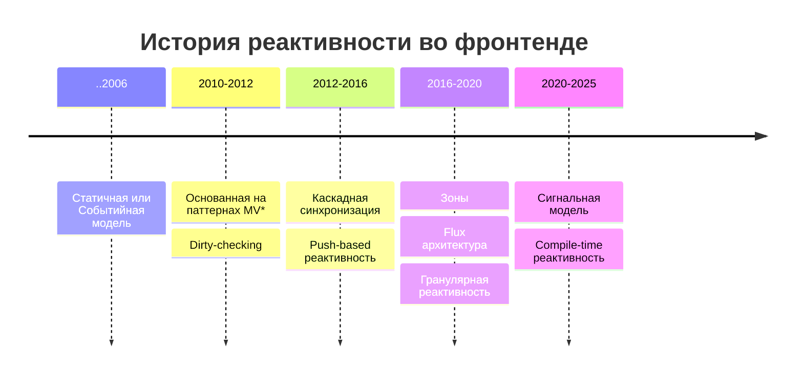

  

    
  

  

    <ZedeIcon class="size-full" />
  

Денис Чернов

  <FileIconsTelegram /> @zede_code
  <FileIconsTelegram /> @vueist
  <IonLogoTwitch /> @izede
  <IonLogoGithub /> @Sdju

<QrCodeIntro class="sp-r80_200_200_200 absolute" />

---

# О чем пойдет речь?

<v-clicks>

- ⌛ Краткая история реактивности во фронтенде
- 📚 Существующие подходы к реактивности
- 📊 Спектр решаемых задач
- 🚀 Куда все движется
- 🔍 Разобраться с реактивностью с разных сторон

</v-clicks>

---
layout: center
---

---
layout: center
---

# Что такое реактивность?

---
timeline:
  - block1:
      class: 'pos-484_274'
      color: 'green'
      form: 'rect'
    block2:
      class: 'pos-482_274 -blur-hidden'
      color: 'blue'
      form: 'rect'
    block3:
      class: '-blur-hidden'
      color: 'red'
      form: 'rect'
    arrow1To2:
      coords: '51%:245 51%:188'
      class: 'fx duration-500 opacity-0'
      power: 0.1
    arrow1To3:
      coords: '569:156 637:245'
      class: 'fx duration-500 opacity-0'
      power: 0.5
    arrow3To1:
      coords: '568:272 51%:188'
      class: 'fx duration-500 opacity-0'
      power: 0.5
    arrow3To2:
      coords: '568:272 427:272'
      class: 'fx duration-500 opacity-0'
      power: 0.05
      dashed: true
  - block1:
      class: 'pos-492_159'
    block2:
      class: 'pos-482_274'
    arrow1To2:
      class: 'fx duration-500 animate'
  - block2:
      class: 'pos-328_274'
    block3:
      class: 'pos-637_274'
    arrow1To2:
      coords: '324:245 425:158'
      power: 0.5
    arrow1To3:
      class: 'fx duration-500 animate'
  - arrow3To1:
      class: 'fx duration-500 animate'
  - arrow3To2:
      class: 'fx duration-500 animate'
---

<Node v-bind="t.block1">Система</Node>
<Node v-bind="t.block2">Раздражитель</Node>
<Node v-bind="t.block3">Реакция</Node>

<SvgLayer>
  <SvgArrow v-bind="t.arrow1To2" />
  <SvgArrow v-bind="t.arrow1To3" />
  <SvgArrow v-bind="t.arrow3To1" />
  <SvgArrow v-bind="t.arrow3To2" />
</SvgLayer>

<!-- Начнем с самого понятия реактивности. В природе это способность систем автоматически реагировать на внешние раздражители. -->

---

# Определение реактивности во фронтенде

**Реактивность** — способность системы автоматически обновлять пользовательский интерфейс при изменении состояния приложения

<v-click>

**Ключевые характеристики:**

</v-click>
<v-clicks>

- Автоматичность
- Согласованность данных и UI
- Отслеживание зависимостей

</v-clicks>

---

# Зачем нужна реактивность?

<v-clicks>

- 🤷‍♂️ Пользователю реактивность не нужна
- 💖 Упростить себе жизнь
- 📦 Сократить количество кода
- 🚀 Производительность
- 🛠️ Поддерживаемость

</v-clicks>

---

---
timeline:
  - block2: -blur-hidden fx
    block3: -blur-hidden fx
    block4: -blur-hidden fx
  - block2: fx
  - block3: fx
  - block4: fx
---

Формат анализа каждого подхода

  
🎯 Контекст

  
📖 Теория

  
💻 Практика

  
⚖️ Оценка

