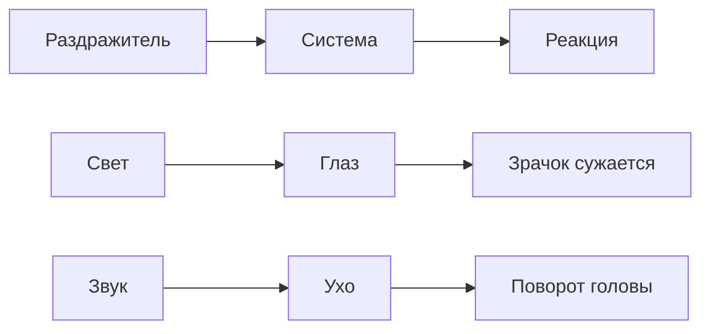
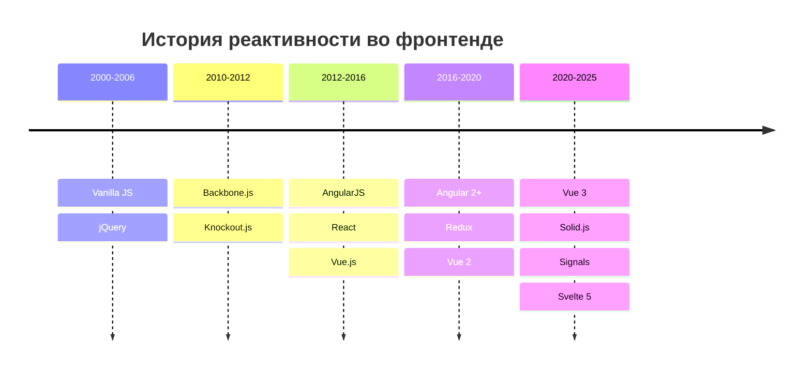

<h1 class="text-4xl">История реактивности во фронтенде</h1>
<h2 class="text-2xl opacity-80">От спагетти-кода до signals: 24 года эволюции</h2>

---
layout: center
---

# Что такое реактивность?

---

<h3>Реактивность в природе</h3>

<!-- Начнем с самого понятия реактивности. В природе это способность систем автоматически реагировать на внешние раздражители. -->

---

# Определение реактивности во фронтенде

**Реактивность** — способность системы автоматически обновлять пользовательский интерфейс при изменении состояния приложения

**Ключевые характеристики:**
- Автоматичность
- Синхронизация данных и UI
- Отслеживание зависимостей

---

# Зачем нужна реактивность?

## 🎯 Пользовательский опыт
Мгновенный отклик интерфейса на действия

## 🏗️ Сложность приложений  
Тысячи компонентов требуют синхронизации

## ⚡ Производительность
Обновлять только измененные части

## 🛠️ Поддерживаемость
Меньше ручного кода синхронизации

---

# Наше путешествие: 2000-2025

## 🗓️ 11 ключевых этапов
## 📈 От 0 до современных решений  
## 💡 Практические примеры
## 🎯 Актуальность в 2025

---

# Хронология реактивности

---

# Формат анализа каждого подхода

## 📖 Теория
- Концепция и принципы
- Схемы работы

## 💻 Практика  
- Синтаксис и примеры
- Реальные кейсы

## 🎯 Контекст
- Проблемы, которые решал
- Историческая ситуация

## ⚖️ Оценка
- Сильные стороны
- Ограничения
- Актуальность сегодня

