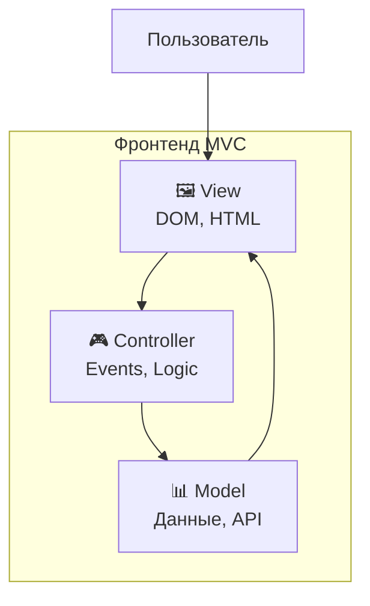
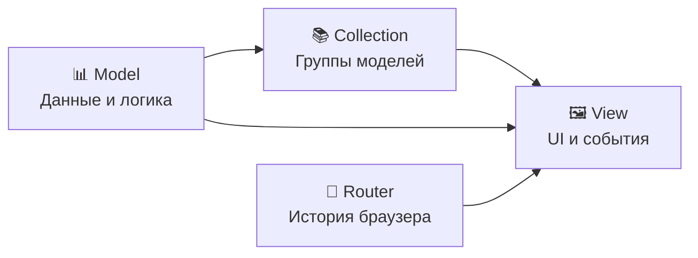
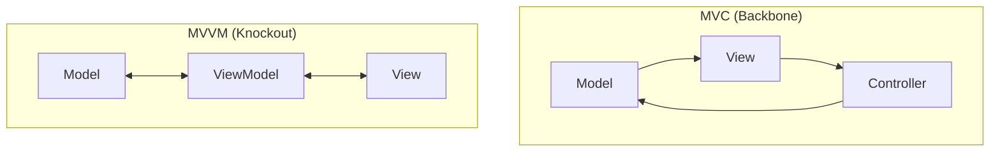

# До реактивная эпоха
<h2 class="text-xl opacity-80">2000-2010: Ручное управление DOM</h2>

---
layout: center
---

# Контекст эпохи (2000-2010)

---

# Как выглядел веб в 2000-е?

## 📄 Статичные сайты
- HTML + CSS + минимум JavaScript
- Перезагрузка страниц для изменений

## 🔧 JavaScript только для:
- Простых анимаций  
- Валидации форм
- Всплывающих окон

## 🌐 Браузерные войны
- IE vs Netscape
- Разные API для одних задач

---

# Проблемы того времени

```javascript
// Кроссбраузерные костыли
function addEvent(element, event, handler) {
  if (element.addEventListener) {
    element.addEventListener(event, handler, false);
  } else if (element.attachEvent) {
    element.attachEvent('on' + event, handler);
  } else {
    element['on' + event] = handler;
  }
}

// Поиск элементов
function getElementById(id) {
  return document.getElementById ? 
    document.getElementById(id) : 
    document.all[id];
}
```

---
layout: center
---

# Vanilla JavaScript подход

---

# Vanilla JS: основы интерактивности

```javascript
// Простейший пример - кнопка счетчика
var count = 0;

document.getElementById('button').onclick = function() {
  count++;
  document.getElementById('counter').innerHTML = count;
};
```

**Принцип работы:**
1. Событие происходит
2. Обработчик вызывается  
3. Вручную обновляем DOM

---

# Реальный пример: форма регистрации

```javascript
function validateForm() {
  var email = document.getElementById('email').value;
  var password = document.getElementById('password').value;
  var errorDiv = document.getElementById('errors');
  
  errorDiv.innerHTML = ''; // Очищаем ошибки
  
  if (!email.includes('@')) {
    errorDiv.innerHTML += '<p>Неверный email</p>';
    return false;
  }
  
  if (password.length < 6) {
    errorDiv.innerHTML += '<p>Пароль слишком короткий</p>';
    return false;
  }
  
  return true;
}
```

---

# Проблемы Vanilla JS

## 🍝 Спагетти-код
По мере роста проекта код становился неуправляемым

## 🔄 Дублирование логики
Одинаковые проверки в разных местах

## 🐛 Сложная отладка
Трудно понять последовательность изменений

## 💾 Проблемы с состоянием
Данные разбросаны по всему коду

---
layout: center
---

# jQuery революция (2006)

---

# jQuery: упрощение DOM манипуляций

<div class="definition-box">

**jQuery** — библиотека, которая упростила работу с DOM и решила проблемы кроссбраузерности

</div>

**Ключевая идея:** "Write less, do more"

---

# Было vs Стало

<div class="grid grid-cols-2 gap-4">

<div>

**Vanilla JS:**
```javascript
// Поиск элементов
var elements = document.getElementsByClassName('button');
for (var i = 0; i < elements.length; i++) {
  elements[i].onclick = function() {
    this.style.color = 'red';
  };
}

// AJAX запрос
var xhr = new XMLHttpRequest();
xhr.open('GET', '/api/data');
xhr.onreadystatechange = function() {
  if (xhr.readyState === 4 && xhr.status === 200) {
    document.getElementById('result').innerHTML = xhr.responseText;
  }
};
xhr.send();
```

</div>

<div>

**jQuery:**
```javascript
// Поиск элементов
$('.button').click(function() {
  $(this).css('color', 'red');
});

// AJAX запрос
$.get('/api/data', function(data) {
  $('#result').html(data);
});
```

</div>

</div>

---

# Достижения jQuery

## ✅ Решенные проблемы:
- Кроссбраузерность
- Простота синтаксиса
- Цепочки вызовов (chaining)
- Богатая экосистема плагинов

## ❌ Нерешенные проблемы:
- Ручная синхронизация состояния
- Спагетти-код в больших проектах
- Отсутствие структуры

---

# Итоги до реактивной эпохи

## 📈 Прогресс:
- От статичных сайтов к интерактивным
- Упрощение DOM манипуляций
- Решение кроссбраузерных проблем

## 🚫 Ограничения:
- Все еще ручное управление
- Нет автоматической синхронизации
- Сложность поддержки больших проектов

---
layout: center
---

# Осознание проблемы

---

# К 2010 году стало ясно:

## 📈 Веб-приложения усложняются
- Больше логики на клиенте
- Сложное взаимодействие с сервером

## 🏗️ Нужна архитектура
- Переиспользование кода
- Тестируемость

## 🔄 Проблема синхронизации
- Данные изменяются в одном месте
- UI нужно обновить в другом

---

# MVC приходит во фронтенд

<div class="definition-box">

**MVC Pattern** — архитектурный шаблон, разделяющий приложение на три компонента:
- **Model** — данные и бизнес-логика
- **View** — пользовательский интерфейс  
- **Controller** — связующее звено

</div>

---

# Схема MVC во фронтенде



---
layout: center
---

# Backbone.js (2010)

---

# Backbone.js: структура без реактивности

<div class="definition-box">

**Backbone.js** — минималистичная библиотека, предоставляющая структуру для организации JavaScript приложений через модели, коллекции, представления и роутеры

</div>

**Автор:** Jeremy Ashkenas (создатель CoffeeScript)

---

# Основные компоненты Backbone



---

# Backbone: простой пример

```javascript
// Модель книги
const Book = Backbone.Model.extend({
  defaults: {
    title: '',
    author: '',
    published: false
  },
  
  toggle: function() {
    this.set('published', !this.get('published'));
  }
});

// Представление книги
const BookView = Backbone.View.extend({
  tagName: 'li',
  
  events: {
    'click .toggle': 'togglePublished'
  },
  
  initialize: function() {
    // Подписка на изменения модели
    this.listenTo(this.model, 'change', this.render);
  },
  
  togglePublished: function() {
    this.model.toggle();
  }
});
```

---

# Backbone: система событий

```javascript
// Автоматическая синхронизация через события
const book = new Book({ title: 'Война и мир' });
const view = new BookView({ model: book });

// При изменении модели...
book.set('title', 'Анна Каренина');
// ...автоматически вызывается view.render()

// События в коллекциях
const library = new Backbone.Collection([book]);
library.on('add', function(model) {
  console.log('Добавлена книга:', model.get('title'));
});
```

**Первая реактивность!** Модель уведомляет представление об изменениях

---

# Backbone: достижения и проблемы

## ✅ Достижения:
- Четкое разделение ответственности
- События для синхронизации
- RESTful взаимодействие
- Легковесность (~8KB)

## ❌ Проблемы:
- Много boilerplate кода
- Ручное управление DOM
- Нет автоматического data binding
- Сложно управлять сложным состоянием

---
layout: center
---

# Knockout.js (2010)

---

# Knockout.js: первый настоящий data binding

<div class="definition-box">

**Knockout.js** — библиотека, реализующая паттерн MVVM с автоматическим двусторонним data binding через observables

</div>

**Автор:** Steve Sanderson (Microsoft)

---

# MVVM vs MVC



**Ключевая идея:** ViewModel автоматически синхронизирует Model и View

---

# Knockout: Observables

```javascript
// Создание observable
function PersonViewModel() {
  this.firstName = ko.observable('John');
  this.lastName = ko.observable('Doe');
  
  // Computed observable (производные данные)
  this.fullName = ko.computed(function() {
    return this.firstName() + ' ' + this.lastName();
  }, this);
  
  // Observable массив
  this.hobbies = ko.observableArray(['Reading', 'Swimming']);
}

// Применение к DOM
const person = new PersonViewModel();
ko.applyBindings(person);
```

---

# Knockout: HTML биндинги

```html
<div>
  <!-- Двусторонний binding -->
  <input data-bind="value: firstName" placeholder="Имя" />
  <input data-bind="value: lastName" placeholder="Фамилия" />
  
  <!-- Односторонний binding -->
  <h2 data-bind="text: fullName"></h2>
  
  <!-- Условное отображение -->
  <div data-bind="visible: hobbies().length > 0">
    <h3>Хобби:</h3>
    <ul data-bind="foreach: hobbies">
      <li data-bind="text: $data"></li>
    </ul>
  </div>
  
  <!-- Обработка событий -->
  <button data-bind="click: addHobby">Добавить хобби</button>
</div>
```

**Революция:** изменил observable → UI обновился автоматически!

---

# Knockout: автоматическое отслеживание

```javascript
function ShoppingCartViewModel() {
  const self = this;
  
  // Observable массив товаров
  self.items = ko.observableArray([]);
  
  // Computed - автоматически пересчитывается
  self.totalPrice = ko.computed(function() {
    let total = 0;
    self.items().forEach(function(item) {
      total += item.price() * item.quantity();
    });
    return total;
  });
  
  // Computed с зависимостями
  self.shipping = ko.computed(function() {
    return self.totalPrice() > 100 ? 0 : 10;
  });
  
  self.grandTotal = ko.computed(function() {
    return self.totalPrice() + self.shipping();
  });
}
```

**Магия:** Knockout автоматически отслеживает зависимости!

---

# Knockout: инновации

## 🎯 Автоматический data binding
Изменил observable → UI обновился

## 🔍 Отслеживание зависимостей  
Computed свойства пересчитываются автоматически

## 📝 Декларативный синтаксис
HTML описывает связи с данными

## 🔄 Двусторонний binding
UI изменения влияют на данные

---

# Knockout: ограничения

## ❌ Загрязнение HTML
data-bind атрибуты везде

## 🏗️ Нет компонентной модели
Сложно строить большие приложения  

## 🌐 Слабая экосистема
Не стал стандартом

## 📱 Проблемы с производительностью
При большом количестве биндингов

---

# Сравнение подходов 2010-2012

| Аспект | Backbone.js | Knockout.js |
|--------|-------------|-------------|
| **Реактивность** | Событийная | Автоматическая |
| **Data Binding** | Ручной | Двусторонний |
| **Архитектура** | MVC | MVVM |
| **Размер** | ~8KB | ~15KB |
| **Отслеживание** | Manual | Автоматическое |
| **Популярность** | Высокая | Средняя |

---

# Итоги эпохи зарождения (2010-2012)

## 🎯 Ключевые достижения:
- MVC/MVVM паттерны во фронтенде
- Структурирование JavaScript приложений

## 🚀 Заложенные основы:
- Концепция observables (Knockout → Vue, Angular)
- Событийная архитектура (Backbone → всё остальное)
- Разделение данных и представления

## 🔮 Направление развития:
- Нужны полноценные фреймворки
- Компонентная архитектура