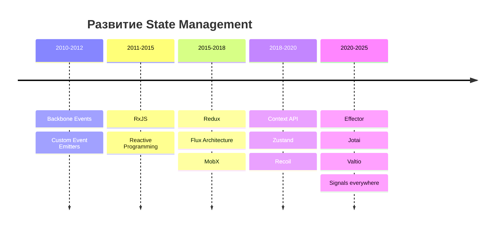
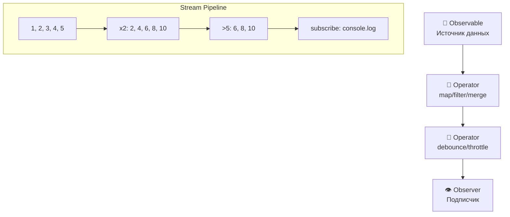
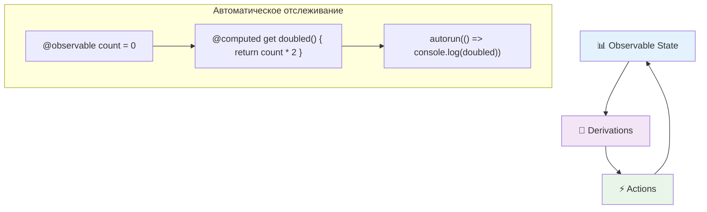

# Альтернативные подходы к состоянию
<h2 class="text-xl opacity-80">2011-2020: RxJS и MobX как альтернативы</h2>

---
layout: center
---

# Реактивность как парадигма

---

# Реактивность ≠ только UI фреймворки

## 🧠 Реактивное программирование — это:
- Парадигма работы с асинхронными потоками данных
- Автоматическое распространение изменений
- Декларативный подход к управлению состоянием

## 📊 Области применения:
- Управление глобальным состоянием приложения
- Обработка асинхронных операций
- Бизнес-логика и data flow
- Event-driven архитектура

---

# Эволюция подходов к состоянию



---
layout: center
---

# RxJS: Reactive Extensions

---

# RxJS (2011): поток как первоклассный объект

<div class="definition-box">

**RxJS** — библиотека для реактивного программирования, представляющая асинхронные данные как observables потоки

</div>

**Создатели:** Microsoft (портирование Rx.NET)  
**Философия:** "Everything is a stream"

---

# RxJS: основные концепции



---

# RxJS: концепция потоков

## 💡 "Everything is a stream"

```javascript
import { fromEvent, map, filter, debounceTime } from 'rxjs';

// Клики мышки как поток
const clicks$ = fromEvent(document, 'click');

// Поток значений
const numbers$ = of(1, 2, 3, 4, 5);

// Подписка и обработка
numbers$
  .pipe(
    map(x => x * 2),        // Трансформация
    filter(x => x > 5)      // Фильтрация
  )
  .subscribe(x => console.log(x)); // 6, 8, 10
```

**Ключевая идея:** асинхронные данные как функциональные потоки

---

# RxJS: практический пример

```javascript
// Поиск с автодополнением - классический кейс
const searchInput = document.getElementById('search');

const searchResults$ = fromEvent(searchInput, 'input').pipe(
  map(event => event.target.value),    // Извлекаем текст
  filter(text => text.length > 2),     // Фильтруем короткие
  distinctUntilChanged(),              // Убираем дубли
  debounceTime(300),                   // Задержка ввода
  switchMap(query =>                   // Переключение запросов
    fetch(`/api/search?q=${query}`)
      .then(r => r.json())
      .catch(() => of([]))
  )
);

searchResults$.subscribe(displaySearchResults);
```

**Сила RxJS:** сложная асинхронная логика в нескольких строках

---

# RxJS: оценка подхода

## ✅ Сильные стороны:
- Унифицированный API для async операций
- Мощная композиция операторов  
- Функциональный подход к потокам данных

## ❌ Сложности:
- Высокий порог входа
- Сложность отладки
- Memory leaks при неправильном использовании

## 🎯 Где применяется:
- Angular (встроен в framework)
- Redux-Observable middleware  
- Сложные асинхронные потоки данных

---
layout: center
---

# MobX (2015): противоположность Redux

## 🎯 Философские различия

**Redux:** явные действия, immutable updates, много кода  
**MobX:** автоматическое отслеживание, мутации OK, минимум кода

```javascript
// MobX Store
class TodoStore {
  @observable todos = [];
  
  @action addTodo(text) {
    this.todos.push({ // Прямая мутация!
      id: Date.now(),
      text,
      completed: false
    });
  }
  
  @computed get completedCount() {
    return this.todos.filter(todo => todo.completed).length;
  }
}
```

---

# MobX: концептуальная модель

<div class="definition-box">

**MobX** — библиотека для простого и масштабируемого управления состоянием через реактивное программирование

</div>

**Создатель:** Michel Weststrate  
**Философия:** "Anything that can be derived from the application state, should be derived automatically"

---

# MobX: концептуальная модель



**Принцип:** состояние автоматически синхронизируется с UI

---

# MobX: автоматические реакции

```javascript
import { observable, computed, action, autorun } from 'mobx';

class TodoStore {
  @observable todos = [];
  
  @computed get completedCount() {
    return this.todos.filter(todo => todo.completed).length;
  }
  
  @action addTodo(text) {
    this.todos.push({
      id: Date.now(),
      text,
      completed: false
    });
  }
}

const store = new TodoStore();

// Автоматически выполняется при изменении todos
autorun(() => {
  console.log(`Todos: ${store.todos.length}, Completed: ${store.completedCount}`);
});
```

---

# MobX с React

```javascript
import { observer } from 'mobx-react';

// Компонент автоматически перерендеривается при изменении observables
const TodoList = observer(() => {
  return (
    <div>
      <h2>Todos ({store.todos.length})</h2>
      
      {store.todos.map(todo => (
        <TodoItem key={todo.id} todo={todo} />
      ))}
      
      <p>Completed: {store.completedCount}</p>
    </div>
  );
});
```

**Ключевое преимущество:** минимум boilerplate кода


---

# MobX vs Redux: два подхода

## ⚖️ Сравнение философий

| Аспект | Redux | MobX |
|--------|-------|------|
| **Предсказуемость** | Высокая | Средняя |
| **Boilerplate** | Много | Минимум |
| **Отладка** | Отличная | Хорошая |
| **Изучение** | Сложно | Легко |
| **Производительность** | Хорошая | Отличная |

## 🎯 Выбор подхода:
- **Redux:** для больших команд, сложной логики
- **MobX:** для быстрой разработки, простых случаев

**Результат:** рынок разделился между явной и автоматической реактивностью

---

# Effector (2020): событийно-ориентированный подход

<div class="definition-box">

**Effector** — библиотека для реактивного управления состоянием, основанная на событиях, сторах и эффектах

</div>

**Создатель:** Дмитрий Болдырев (Россия)  
**Философия:** "State as a directed graph"

---

# Effector: core концепции

```javascript
import { createEvent, createStore, createEffect } from 'effector';

// События
const increment = createEvent();
const decrement = createEvent();
const reset = createEvent();

// Асинхронные эффекты
const fetchUserFx = createEffect(async (id) => {
  const response = await fetch(`/api/users/${id}`);
  return response.json();
});

// Сторы
const counter = createStore(0)
  .on(increment, (state) => state + 1)
  .on(decrement, (state) => state - 1)
  .reset(reset);

const user = createStore(null)
  .on(fetchUserFx.doneData, (_, user) => user);

// Подписки
counter.watch((state) => console.log('Counter:', state));

// Использование
increment(); // Counter: 1
decrement(); // Counter: 0
fetchUserFx(123);
```

**Особенность:** декларативные связи между данными

---

# Итоги параллельного развития (2011-2020)

## 🚀 Ключевые достижения:
- **RxJS:** функциональные потоки данных
- **Redux:** предсказуемое управление состоянием  
- **MobX:** автоматическая реактивность
- **Effector:** событийно-ориентированное управление

## 💡 Разделение экосистемы:
- **UI реактивность:** Angular, React, Vue
- **State management:** Redux, MobX, RxJS, Effector
- **Архитектурные паттерны:** Flux, MVVM, Reactive
