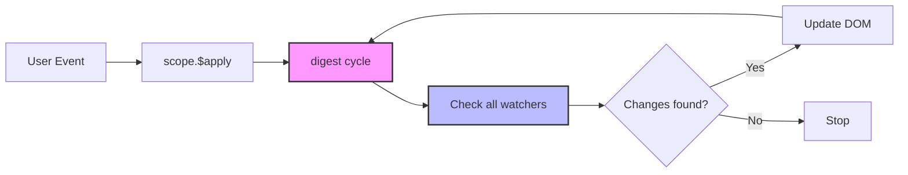
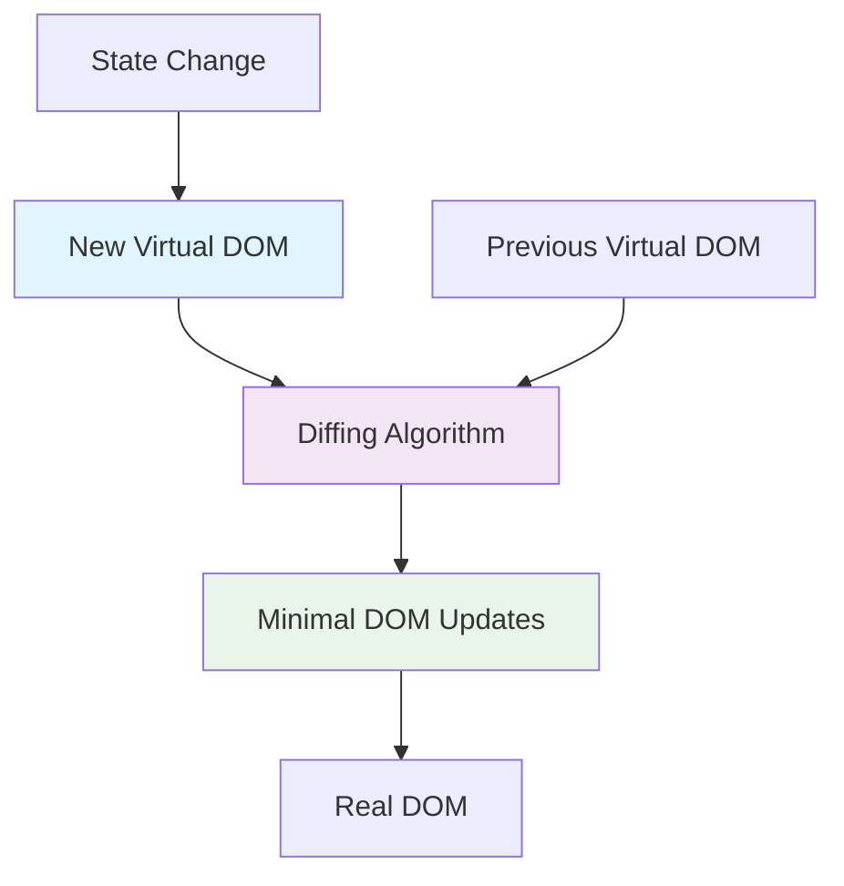
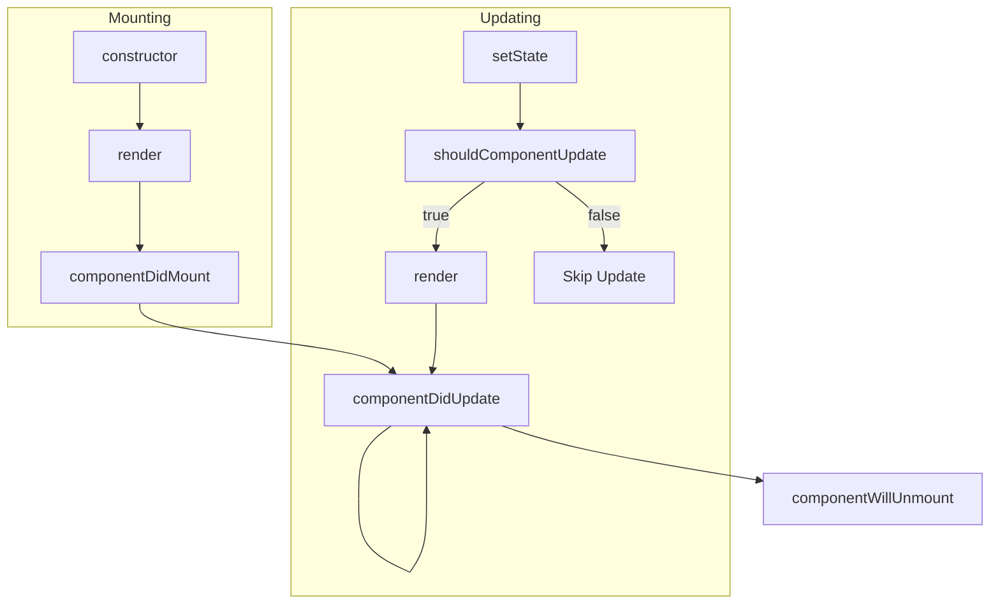
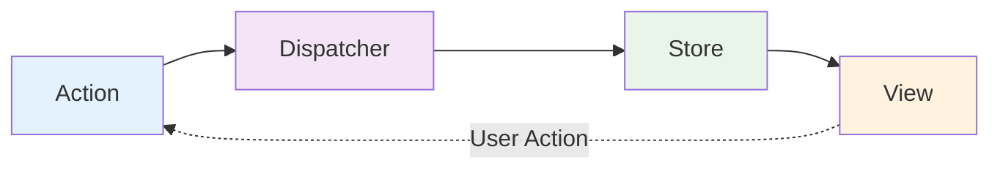

# Эра фреймворков
<h2 class="text-xl opacity-80">2012-2016: Рождение современного фронтенда</h2>

---
layout: center
---

# Контекст эпохи

---

# Изменения в веб-разработке (2012)

## 📱 Мобильная революция
- Взрывной рост мобильного интернета
- Responsive design
- Touch-интерфейсы меняют UX

## 🚀 SPA становятся мейнстримом
- Пользователи ожидают app-like опыт
- SEO и производительность - новые вызовы

## ⚡ Требования растут
- Миллисекундные отклики
- Offline-first подходы
- Real-time обновления

---

# Технологические предпосылки

## 🌐 HTML5 & CSS3
- Новые возможности платформы
- LocalStorage, WebSockets
- Canvas, SVG для богатой графики

## 🔧 Инструменты разработки
- Grunt, Gulp для автоматизации
- Package managers (npm, bower)
- Sourcemaps для отладки

---
layout: center
---

# AngularJS: первый полноценный фреймворк

---

# AngularJS (2012): революция Google

<div class="definition-box">

**AngularJS** — первый полноценный фреймворк для создания динамических веб-приложений с автоматическим двусторонним data binding

</div>

**Создатель:** Miško Hevery (Google)  
**Первый релиз:** октябрь 2010, стабильная версия 2012

---

# Ключевые инновации AngularJS

## 🔄 Двусторонний data binding
Автоматическая синхронизация модели и представления

## 📝 Декларативные шаблоны  
HTML расширяется директивами

## 💉 Dependency Injection
Инверсия управления во фронтенде

## 🧩 Директивы
Переиспользуемые компоненты

---

# Dirty Checking: как работает реактивность



**Принцип:** проверяем ВСЕ привязки после каждого потенциального изменения

---

# AngularJS: простой пример

```javascript
// Controller
app.controller('TodoController', function($scope) {
  $scope.todos = [];
  $scope.newTodo = '';
  
  $scope.addTodo = function() {
    if ($scope.newTodo.trim()) {
      $scope.todos.push({
        text: $scope.newTodo,
        completed: false
      });
      $scope.newTodo = '';
    }
  };
  
  // Computed свойство через функцию
  $scope.completedCount = function() {
    return $scope.todos.filter(todo => todo.completed).length;
  };
});
```

---

# AngularJS: HTML шаблон

```html
<div ng-controller="TodoController">
  <!-- Двусторонний binding -->
  <input ng-model="newTodo" 
         ng-keyup="$event.keyCode == 13 && addTodo()" 
         placeholder="Новая задача" />
  <button ng-click="addTodo()">Добавить</button>
  
  <!-- Повторение и интерполяция -->
  <ul>
    <li ng-repeat="todo in todos track by $index">
      <input type="checkbox" ng-model="todo.completed" />
      <span ng-class="{ completed: todo.completed }">
        {{ todo.text }}
      </span>
    </li>
  </ul>
  
  <p>Выполнено: {{ completedCount() }}</p>
</div>
```

---

# Dirty Checking: концепция

## 🔍 Как Angular знает об изменениях?

**Проблема:** JavaScript не уведомляет об изменениях переменных
```javascript
let count = 0;
count = 5; // Никто не знает об изменении
```

**Решение Angular:** проверяем все привязки периодически
```javascript
// После каждого события проверяем ВСЕ watchers
watchers.forEach(watcher => {
  if (watcher.newValue !== watcher.oldValue) {
    updateDOM(watcher);
  }
});
```

---

# $digest cycle: упрощенный алгоритм

```javascript
// Упрощенная версия $digest цикла
function digestCycle() {
  $scope.addTodo(); // 1. Выполняем код
  
  let dirty = true;
  let iterations = 0;
  
  while (dirty && iterations < 10) {
    dirty = false;
    
    // 2. Проверяем все watchers
    watchers.forEach(watcher => {
      const newValue = watcher.getValue();
      if (newValue !== watcher.oldValue) {
        watcher.oldValue = newValue;
        updateDOM(watcher.element, newValue);
        dirty = true; // Нужна еще итерация
      }
    });
    
    iterations++;
  }
}
```

**Проблема:** при большом количестве watchers становится медленно

---

# AngularJS: достижения

## ✅ Революционные идеи:
- Полный фреймворк "из коробки"
- Автоматический data binding
- Тестируемость как приоритет
- Мощная экосистема директив

## 🎯 Решенные проблемы:
- Структура больших приложений
- Роутинг в SPA
- Управление формами
- HTTP взаимодействие

---

# AngularJS: проблемы

## ⚡ Производительность
- Dirty checking медленный на больших списках
- Множественные digest циклы

## 🐛 Отладка
- Сложно понять порядок выполнения
- $apply уже в процессе ошибки

## 📚 Сложность изучения
- Много концепций одновременно
- $scope магия

---
layout: center
---

# React: парадигмальный сдвиг

---

# React (2013): революция от Facebook

<div class="definition-box">

**React** — библиотека для создания пользовательских интерфейсов, основанная на компонентном подходе и виртуальном DOM

</div>

**Создатели:** Jordan Walke, команда Facebook  
**Первый релиз:** май 2013

---

# Философия React

## 🔄 Однонаправленный поток данных
```
State → Render → Virtual DOM → Real DOM
```

## 🧩 Всё — компонент
Переиспользуемые, изолированные части UI

## 🎯 "Just the View"
Библиотека, а не фреймворк

## ⚡ Виртуальный DOM
Оптимизированные обновления

---

# Виртуальный DOM: концепция



**Идея:** изменения в памяти дешевле, чем в DOM

---

# React: компонентный подход

````md magic-move
```javascript
// Классовый компонент (React ≤15)
class TodoItem extends React.Component {
  render() {
    const { todo, onToggle } = this.props;
    
    return (
      <li className={todo.completed ? 'completed' : ''}>
        <input
          type="checkbox"
          checked={todo.completed}
          onChange={() => onToggle(todo.id)}
        />
        <span>{todo.text}</span>
      </li>
    );
  }
}
```
```javascript
// Функциональный компонент (современный)
function TodoItem({ todo, onToggle }) {
  return (
    <li className={todo.completed ? 'completed' : ''}>
      <input type="checkbox" checked={todo.completed}
             onChange={() => onToggle(todo.id)} />
    </li>
  );
}
```
````

---

# React: управление состоянием

```javascript
class TodoApp extends React.Component {
  state = {
    todos: [],
    newTodo: ''
  };
  
  addTodo = () => {
    if (this.state.newTodo.trim()) {
      this.setState(prevState => ({
        todos: [...prevState.todos, {
          id: Date.now(),
          text: this.state.newTodo,
          completed: false
        }],
        newTodo: ''
      }));
    }
  }
  
  toggleTodo = (id) => {
    this.setState(prevState => ({
      todos: prevState.todos.map(todo =>
        todo.id === id ? { ...todo, completed: !todo.completed } : todo
      )
    }));
  }
}
```

---

# JSX: JavaScript + XML

```jsx
// JSX - синтаксический сахар
const TodoList = ({ todos, onToggle }) => (
  <ul className="todo-list">
    {todos.map(todo => (
      <TodoItem key={todo.id} todo={todo} onToggle={onToggle} />
    ))}
    {todos.length === 0 && <li>Нет задач</li>}
  </ul>
);

// Компилируется в React.createElement вызовы:
const TodoList = ({ todos, onToggle }) =>
  React.createElement('ul', { className: 'todo-list' },
    todos.map(todo =>
      React.createElement(TodoItem, { 
        key: todo.id, todo, onToggle 
      })
    ),
    // ...
  );
```

**Преимущество:** привычный HTML-like синтаксис

---

# React: жизненный цикл



---

# React: достижения

## ✅ Революционные концепции:
- Компонентная архитектура
- Виртуальный DOM
- Однонаправленный поток данных
- JSX синтаксис

## 🎯 Решенные проблемы:
- Производительность больших списков
- Переиспользование компонентов
- Предсказуемые обновления
- Простое тестирование

---

# React: проблемы раннего периода

## 🔧 "Только View"
- Нужны дополнительные библиотеки
- Выбор инструментов усложняется

## 📚 Кривая обучения
- JSX отпугивает новичков
- Новые концепции (props, state)

## 🔄 Управление состоянием
- setState может быть сложным
- Prop drilling в глубоких компонентах

---
layout: center
---

# Redux: управление состоянием (2015)

---

# Проблема: компоненты связаны состоянием

## 🕸️ "Prop drilling" и сложность
```javascript
// Состояние в корневом компоненте
function App() {
  const [user, setUser] = useState(null);
  
  return (
    <Header user={user} setUser={setUser} />
    <Main user={user} />
    <Footer user={user} />
  );
}

// Нужно передавать через много уровней
function Header({ user, setUser }) {
  return <UserMenu user={user} setUser={setUser} />;
}
```

**Проблема:** состояние разбросано, сложно отследить изменения

---

# Flux: архитектурный паттерн

<div class="definition-box">

**Flux** — архитектурный паттерн для управления состоянием с однонаправленным потоком данных

</div>



**Принцип:** данные текут только в одном направлении

---

# Redux: три принципа

## 📊 Single Source of Truth
Все состояние приложения в одном store

## 🔒 State is Read-Only  
Изменения только через actions

## 🔧 Pure Functions
Reducers — чистые функции

```javascript
// Action
const addTodo = (text) => ({
  type: 'ADD_TODO',
  payload: { text, id: Date.now() }
});

// Reducer - чистая функция
function todoReducer(state = { todos: [] }, action) {
  switch (action.type) {
    case 'ADD_TODO':
      return {
        ...state,
        todos: [...state.todos, action.payload]
      };
    default:
      return state;
  }
}
```

---

# Redux DevTools: революция в отладке

## ⏰ Time Travel Debugging
- Все действия записываются
- Можно "откатиться" к любому состоянию  
- Воспроизведение последовательности действий
- Hot reloading без потери состояния

```javascript
// Все actions сохраняются
const history = [
  { type: 'ADD_TODO', payload: { text: 'Learn Redux' } },
  { type: 'TOGGLE_TODO', payload: { id: 1 } },
  { type: 'ADD_TODO', payload: { text: 'Build app' } }
];

// Можно восстановить состояние на любом шаге
const stateAtStep2 = history.slice(0, 2)
  .reduce(todoReducer, initialState);
```

---

# Итоги React + Redux эпохи

## ✅ Революционные достижения:
- Компонентная архитектура стала стандартом
- Предсказуемое управление состоянием
- Time-travel debugging

## 🎯 Влияние на экосистему:
- Все фреймворки заимствовали компонентный подход
- Иммутабельные обновления стали нормой
- DevTools стали неотъемлемой частью разработки

## 🚀 Заложенные основы:
- JSX как декларативный синтаксис
- Функциональное программирование во фронтенде
- Ecosystem thinking


