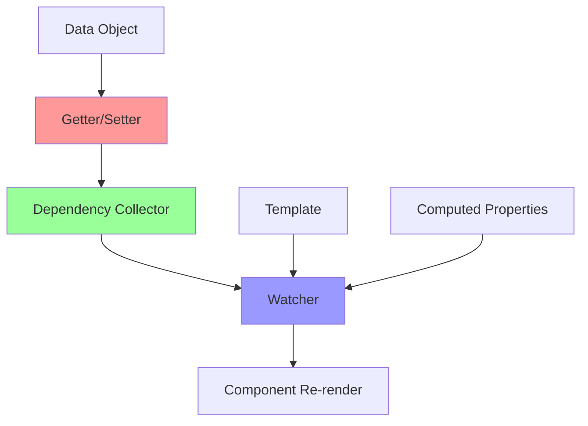
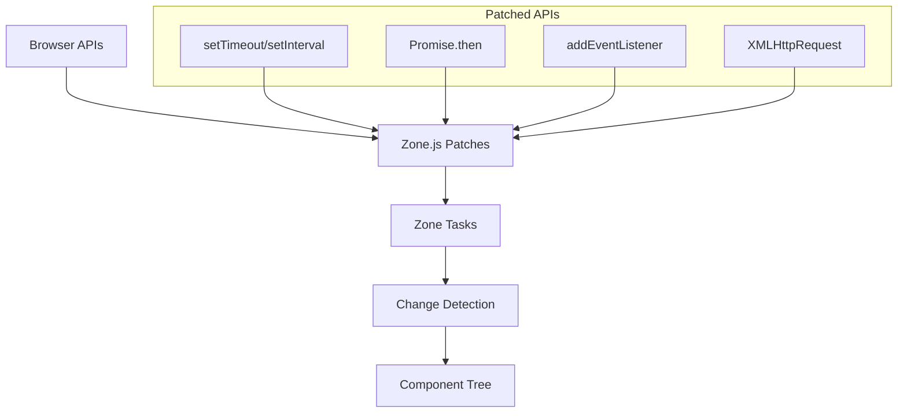

# Современные подходы
<h2 class="text-xl opacity-80">2016-2020: Зрелость экосистемы</h2>

---
layout: center
---

# Переосмысление реактивности

---

# Контекст 2016-2020

## 📱 Mobile-first
- Производительность критична
- Bundle size имеет значение
- Offline capabilities

## 🎯 Developer Experience
- Лучшие инструменты разработки
- TypeScript становится мейнстримом
- Hot reloading, DevTools

## ⚡ Производительность
- 60 FPS как стандарт
- Core Web Vitals
- Progressive Enhancement

---

# Проблемы решенные к 2016

## ✅ Что работает:
- Компонентная архитектура
- Управление состоянием
- Виртуальный DOM концепция
- Однонаправленный поток данных

## ❌ Что нужно улучшить:
- Размер бандлов
- Время первой загрузки
- Сложность настройки
- TypeScript интеграция

---
layout: center
---

# Vue.js: прогрессивный фреймворк

---

# Vue.js (2014): баланс и простота

<div class="definition-box">

**Vue.js** — прогрессивный фреймворк для создания пользовательских интерфейсов, сочетающий лучшее от Angular и React

</div>

**Создатель:** Evan You (ex-Google)  
**Философия:** прогрессивное внедрение

---

# Vue: архитектура реактивности



**Принцип:** автоматическое отслеживание зависимостей через геттеры

---

# Vue 2: Object.defineProperty

```javascript
// Как Vue делает данные реактивными
function defineReactive(obj, key, val) {
  const dep = new Dep(); // Коллектор зависимостей
  
  Object.defineProperty(obj, key, {
    get() {
      // Если есть активный watcher, добавляем зависимость
      if (Dep.target) {
        dep.depend();
      }
      return val;
    },
    
    set(newVal) {
      if (newVal === val) return;
      val = newVal;
      // Уведомляем всех подписчиков
      dep.notify();
    }
  });
}

// Пример использования
const data = { count: 0 };
defineReactive(data, 'count', 0);

// Теперь доступ к data.count отслеживается
```

---

# Vue: Single File Components

```vue
<template>
  <div class="todo-app">
    <input v-model="newTodo" @keyup.enter="addTodo" 
           placeholder="Новая задача" />
    <button @click="addTodo">Добавить</button>
    
    <ul>
      <li v-for="todo in todos" :key="todo.id"
          :class="{ completed: todo.completed }">
        <input type="checkbox" v-model="todo.completed" />
        <span>{{ todo.text }}</span>
        <button @click="removeTodo(todo.id)">×</button>
      </li>
    </ul>
    
    <p>Выполнено: {{ completedCount }}</p>
  </div>
</template>

<script>
export default {
  data: () => ({ todos: [], newTodo: '', nextId: 1 }),
  
  computed: {
    completedCount() {
      return this.todos.filter(todo => todo.completed).length;
    }
  },
  
  methods: {
    addTodo() {
      if (this.newTodo.trim()) {
        this.todos.push({
          id: this.nextId++,
          text: this.newTodo,
          completed: false
        });
        this.newTodo = '';
      }
    }
  }
};
</script>
```

**Инновация:** template, script, style в одном файле

---

# Vue: достижения

## ✅ Сильные стороны:
- Простота изучения
- Автоматическое отслеживание зависимостей
- Отличная производительность
- Гибкость внедрения

## 🎯 Инновации:
- Template синтаксис как у Angular
- Компонентность как у React  
- Реактивность лучше чем у обоих
- Single File Components

---

# Vue 2: ограничения

## ❌ Object.defineProperty проблемы:
```javascript
// Не работает
vm.items[indexOfItem] = newValue; // ❌
vm.items.length = newLength; // ❌

// Workarounds
Vue.set(vm.items, indexOfItem, newValue); // ✅
vm.items.splice(newLength); // ✅

// Новые свойства не реактивны
vm.newProperty = 'value'; // ❌
Vue.set(vm, 'newProperty', 'value'); // ✅
```

## 🚫 Другие ограничения:
- IE8+ только
- TypeScript поддержка неполная
- Некоторая "магичность"

---
layout: center
---

# Angular 2+: полная перепись

---

# Angular 2+ (2016): новая эра

<div class="definition-box">

**Angular 2+** — полная перепись AngularJS с TypeScript, компонентной архитектурой и zone-based change detection

</div>

**Команда:** Google Angular Team  
**Кардинальные изменения:** полная несовместимость с AngularJS

---

# Zone.js: автоматическое отслеживание



**Идея:** патчим все асинхронные API для автоматического запуска проверок

---

# Angular: компонентная архитектура

```typescript
import { Component } from '@angular/core';

interface Todo {
  id: number;
  text: string;
  completed: boolean;
}

@Component({
  selector: 'todo-app',
  template: `
    <div class="todo-app">
      <input [(ngModel)]="newTodo" (keyup.enter)="addTodo()" 
             placeholder="Новая задача" />
      <button (click)="addTodo()">Добавить</button>
      
      <ul>
        <li *ngFor="let todo of todos; trackBy: trackByFn"
            [class.completed]="todo.completed">
          <input type="checkbox" [(ngModel)]="todo.completed" />
          <span>{{ todo.text }}</span>
          <button (click)="removeTodo(todo.id)">×</button>
        </li>
      </ul>
      
      <p>Выполнено: {{ completedCount }}</p>
    </div>
  `
})
export class TodoComponent {
  todos: Todo[] = [];
  newTodo = '';
  private nextId = 1;
  
  get completedCount(): number {
    return this.todos.filter(todo => todo.completed).length;
  }
  
  addTodo(): void {
    if (this.newTodo.trim()) {
      this.todos.push({
        id: this.nextId++,
        text: this.newTodo,
        completed: false
      });
      this.newTodo = '';
    }
  }
}
```

**Особенности:** TypeScript-first, декораторы, двусторонний binding

---

# Change Detection стратегии

```typescript
import { Component, ChangeDetectionStrategy } from '@angular/core';

@Component({
  selector: 'optimized-component',
  changeDetection: ChangeDetectionStrategy.OnPush, // Оптимизация
  template: `
    <div>{{ data.value }}</div>
    <child-component [input]="data"></child-component>
  `
})
export class OptimizedComponent {
  data = { value: 'test' };
  
  updateData() {
    // Мутация - не сработает с OnPush
    this.data.value = 'new value'; // ❌
    
    // Иммутабельное обновление - сработает
    this.data = { ...this.data, value: 'new value' }; // ✅
  }
}
```

**OnPush:** проверяем изменения только при изменении input'ов

---

# Angular: экосистема

## 🏗️ Полная платформа:
- Angular CLI для генерации
- Angular Router для SPA
- Angular Forms для валидации
- Angular HTTP для API

## 🎯 TypeScript первым классом:
- Декораторы для метаданных
- Строгая типизация
- Отличная IDE поддержка

## 📱 Кроссплатформенность:
- Angular Universal (SSR)
- Ionic (мобильные)
- Electron (десктоп)

---

# Angular: достижения и проблемы

## ✅ Достижения:
- Полная экосистема
- Отличная типизация
- Автоматическое отслеживание
- Enterprise-ready

## ❌ Проблемы:
- Zone.js может быть непредсказуемым
- Сложность изучения
- Большой bundle size
- Vendor lock-in

---
layout: center
---

# React эволюция: Hooks

---

# React Hooks (2018): новая эра

<div class="definition-box">

**React Hooks** — функции, позволяющие использовать состояние и другие возможности React без написания классов

</div>

**Проблема:** сложность переиспользования логики между компонентами

---

# До Hooks: классы и HOC

```javascript
// Классовый компонент
class TodoApp extends React.Component {
  constructor(props) {
    super(props);
    this.state = { todos: [], newTodo: '' };
  }
  
  componentDidMount() {
    // Загрузка данных
    this.loadTodos();
  }
  
  componentDidUpdate(prevProps) {
    if (prevProps.userId !== this.props.userId) {
      this.loadTodos();
    }
  }
  
  // Higher-Order Component для переиспользования
  function withTodos(WrappedComponent) {
    return class extends React.Component {
      state = { todos: [] };
      
      componentDidMount() {
        this.loadTodos();
      }
      
      render() {
        return <WrappedComponent {...this.props} todos={this.state.todos} />;
      }
    };
  }
}
```

**Проблемы:** дублирование логики, wrapper hell, сложность

---

# React Hooks: переиспользование логики

```javascript
// Кастомный Hook для переиспользования логики
function useTodos(userId) {
  const [todos, setTodos] = useState([]);
  const [loading, setLoading] = useState(true);
  
  useEffect(() => {
    async function loadTodos() {
      setLoading(true);
      try {
        const data = await api.getTodos(userId);
        setTodos(data);
      } finally {
        setLoading(false);
      }
    }
    loadTodos();
  }, [userId]); // Перезагрузка при изменении userId
  
  const addTodo = useCallback((text) => {
    setTodos(prev => [...prev, { id: Date.now(), text, completed: false }]);
  }, []);
  
  return { todos, loading, addTodo };
}

// Использование в любом компоненте
function TodoApp({ userId }) {
  const { todos, loading, addTodo } = useTodos(userId);
  
  if (loading) return <div>Загрузка...</div>;
  
  return (
    <div>
      {todos.map(todo => (
        <TodoItem key={todo.id} todo={todo} />
      ))}
    </div>
  );
}
```

**Преимущество:** логика отделена от компонентов

---

# Основные Hooks

## 🔄 useState
```javascript
const [count, setCount] = useState(0);
```

## ⚡ useEffect
```javascript
useEffect(() => {
  // Побочные эффекты
  return () => {
    // Cleanup
  };
}, [dependencies]);
```

## 💡 useMemo & useCallback
```javascript
const expensiveValue = useMemo(() => heavyCalculation(a, b), [a, b]);
const stableCallback = useCallback(() => doSomething(a), [a]);
```

## 🎯 useContext
```javascript
const theme = useContext(ThemeContext);
```

---

# Hooks: правила и ограничения

## 📏 Правила Hooks:
1. Только в функциональных компонентах
2. Только на верхнем уровне (не в циклах/условиях)
3. Только в React функциях

```javascript
// ❌ Неправильно
function Component({ condition }) {
  if (condition) {
    const [state, setState] = useState(0); // Нарушение правила 2
  }
  
  for (let i = 0; i < 5; i++) {
    useEffect(() => {}); // Нарушение правила 2
  }
}

// ✅ Правильно  
function Component({ condition }) {
  const [state, setState] = useState(0);
  
  useEffect(() => {
    if (condition) {
      // Условие внутри Hook
    }
  }, [condition]);
}
```

---

# React: современные возможности

## ⚡ Concurrent Mode (2021)
- Прерывание рендеринга
- Приоритизация обновлений
- Лучшая производительность

## 🎯 Suspense
```javascript
function UserProfile({ userId }) {
  return (
    <Suspense fallback={<Loading />}>
      <UserData userId={userId} />
      <UserPosts userId={userId} />
    </Suspense>
  );
}
```

## 🔄 Server Components (2023)
- Рендеринг на сервере
- Уменьшение bundle size
- Прямой доступ к БД

---

---
layout: center
---

# Современные state managers (2018-2020)

---

# Zustand (2019): простота прежде всего

<div class="definition-box">

**Zustand** — маленькая, быстрая и масштабируемая библиотека для управления состоянием

</div>

**Создатель:** Daishi Kato  
**Размер:** ~2KB  
**Философия:** простота без компромиссов

```javascript
import create from 'zustand';

const useStore = create((set) => ({
  count: 0,
  increment: () => set(state => ({ count: state.count + 1 })),
  decrement: () => set(state => ({ count: state.count - 1 })),
}));

// Использование
function Counter() {
  const { count, increment, decrement } = useStore();
  return (
    <div>
      <span>{count}</span>
      <button onClick={increment}>+</button>
      <button onClick={decrement}>-</button>
    </div>
  );
}
```

---

# Context API: встроенное решение React

```javascript
// Создание контекста
const TodoContext = createContext();

// Provider
function TodoProvider({ children }) {
  const [todos, setTodos] = useState([]);
  
  const addTodo = (text) => {
    setTodos(prev => [...prev, { id: Date.now(), text, completed: false }]);
  };
  
  return (
    <TodoContext.Provider value={{ todos, addTodo }}>
      {children}
    </TodoContext.Provider>
  );
}

// Потребление
function TodoList() {
  const { todos, addTodo } = useContext(TodoContext);
  
  return (
    <div>
      {todos.map(todo => (
        <TodoItem key={todo.id} todo={todo} />
      ))}
    </div>
  );
}
```

**Преимущество:** встроено в React, не нужны дополнительные библиотеки

---

# Итоги современной эпохи (2016-2020)

## 🚀 Достижения:
- TypeScript стал стандартом
- Hooks революционизировали React
- Zone.js решил автоматизацию в Angular
- Vue показал баланс простоты и мощности
- Появились lightweight state managers

---

# Итоги современной эпохи (2016-2020)

## 💡 Тренды:
- Функциональное программирование
- Переиспользование логики
- Лучшая типизация
- Минимизация boilerplate кода

---

# Итоги современной эпохи (2016-2020)

## 🔮 К чему пришли:
- Зрелые экосистемы
- Стабильные API
- Хорошая документация
- Разнообразие подходов для разных задач