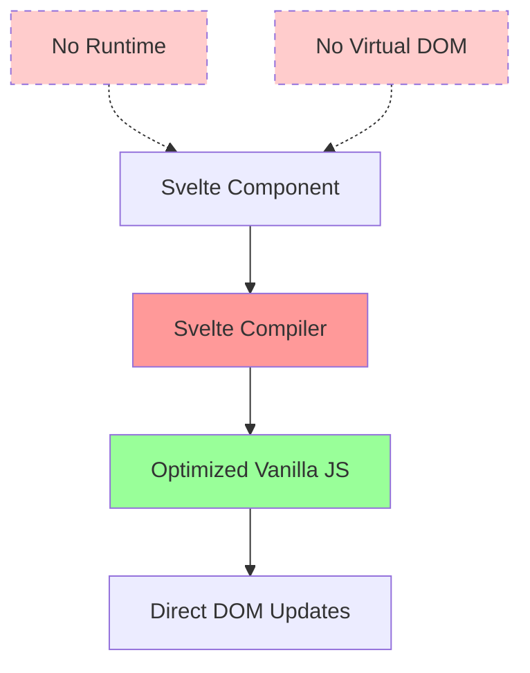
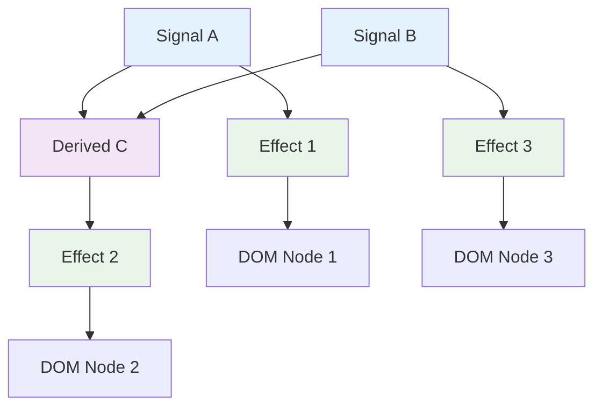

# Эра Signals
<h2 class="text-xl opacity-80">2019-2025: Конвергенция к fine-grained реактивности</h2>

---
layout: center
---

# Новая волна инноваций

---

# Контекст 2019-2025

## 📱 Производительность критична
- Core Web Vitals от Google
- Mobile-first подход
- Bundle size влияет на SEO

## 🔬 Зрелость экосистемы
- Лучшее понимание проблем
- Стабильные решения
- Возможность экспериментировать

## 🚀 Новые возможности платформы
- ES Modules нативно
- Web Components стандарт
- Advanced JavaScript features

---

# Проблемы требующие решения

## ⚡ Производительность
- Виртуальный DOM overhead
- Излишние re-renders
- Bundle size растет

## 🎯 Точность обновлений
- Грубые обновления компонентов
- Отсутствие fine-grained контроля

## 🧠 Ментальная модель
- Сложность отладки
- Непредсказуемое поведение

---
layout: center
---

# Svelte: compile-time революция

---

# Svelte (2019): радикальный подход

<div class="definition-box">

**Svelte** — фреймворк, который компилирует декларативные компоненты в эффективный ванильный JavaScript

</div>

**Создатель:** Rich Harris (The Guardian, NYTimes)  
**Философия:** "исчезающий фреймворк"

---

# Svelte: концепция



**Ключевая идея:** runtime в продакшене не нужен

---

# Svelte: реактивные statements

```svelte
<script>
  let count = 0;
  
  // Reactive statement - автоматически пересчитывается
  $: doubled = count * 2;
  
  // Условная реактивность
  $: if (count > 10) {
    alert('Count is too high!');
  }
  
  function increment() {
    count += 1; // Триггерит все реактивные statements
  }
</script>

<button on:click={increment}>
  Count: {count}
</button>
<p>Doubled: {doubled}</p>
```

**Магия `$:`** — любое выражение после `$:` становится реактивным

---

# Svelte: компиляция в ванильный JS

## 🔧 Статический анализ

```javascript
// Исходный Svelte код
let count = 0;
$: doubled = count * 2;

// Компилируется в оптимизированный JS:
let count = 0;
let doubled;

function updateCount(newValue) {
  count = newValue;
  doubled = count * 2; // Автоматически вычисляется
  updateDOM();         // Обновляем только нужные части
}
```

**Преимущество:** компилятор знает все зависимости заранее

---

# Svelte: глобальное состояние через stores

```javascript
// stores.js - реактивные stores
import { writable, derived } from 'svelte/store';

// Writable store
export const count = writable(0);

// Derived store - автоматически обновляется
export const doubled = derived(count, $count => $count * 2);

// Custom store с методами
function createCounter() {
  const { subscribe, set, update } = writable(0);
  
  return {
    subscribe,
    increment: () => update(n => n + 1),
    decrement: () => update(n => n - 1),
    reset: () => set(0)
  };
}

export const counter = createCounter();
```

---

# Svelte: автоматическая подписка

```svelte
<script>
  import { count, doubled, counter } from './stores.js';
  
  // $ автоматически подписывается и отписывается
</script>

<h1>Count: {$count}</h1>
<h2>Doubled: {$doubled}</h2>

<button on:click={() => count.update(n => n + 1)}>
  Increment
</button>

<button on:click={counter.reset}>
  Reset
</button>

{#if $count > 10}
  <p>Count is getting high!</p>
{/if}
```

**Особенность:** префикс `$` означает автоматическую подписку на store

---

# Svelte: производительность

```javascript
// Bundle size сравнение (Hello World)
const bundleSizes = {
  'Vanilla JS': '0 KB',
  'Svelte': '1.6 KB',
  'Vue': '34 KB',  
  'React': '42 KB',
  'Angular': '130 KB'
};

// Runtime performance
const updatePerformance = {
  'Vanilla JS': '1.0x',
  'Svelte': '1.1x',
  'Vue': '1.3x',
  'React': '1.8x', 
  'Angular': '2.1x'
};
```

**Преимущество:** нет runtime overhead

---

# Svelte: достижения и ограничения

## ✅ Достижения:
- Минимальный bundle size
- Отличная производительность
- Простой синтаксис
- Нет runtime overhead

## ❌ Ограничения:
- Меньшая экосистема
- Compile-time ограничения
- Сложность debugging
- Менее предсказуемое поведение

---
layout: center
---

# Vue 3: Composition API и Proxy

---

# Vue 3 (2020): новая реактивная система

<div class="definition-box">

**Vue 3** — переписанная версия Vue с Composition API, реактивностью на Proxy и улучшенной производительностью

</div>

**Ключевые изменения:**
- Proxy вместо Object.defineProperty
- Composition API для логики
- Tree-shaking поддержка

---

# Vue 3: реактивность на Proxy

```javascript
// Vue 3 под капотом
function reactive(target) {
  return new Proxy(target, {
    get(target, key, receiver) {
      const result = Reflect.get(target, key, receiver);
      
      // Отслеживаем доступ к свойству
      track(target, key);
      
      // Если свойство - объект, делаем его тоже реактивным
      if (isObject(result)) {
        return reactive(result);
      }
      
      return result;
    },
    
    set(target, key, value, receiver) {
      const oldValue = target[key];
      const result = Reflect.set(target, key, value, receiver);
      
      // Уведомляем о изменении
      if (value !== oldValue) {
        trigger(target, key);
      }
      
      return result;
    }
  });
}

// Использование
const state = reactive({
  count: 0,
  nested: { value: 'hello' }
});

state.count++; // Триггерит обновления
state.nested.value = 'world'; // Тоже работает!
state.newProperty = 'dynamic'; // И это тоже!
```

---

# Vue 3: Composition API

```vue
<script setup>
import { ref, computed, watch, onMounted } from 'vue';

// Реактивные переменные
const todos = ref([]);
const newTodo = ref('');

// Computed свойства
const completedCount = computed(() => 
  todos.value.filter(todo => todo.completed).length
);

// Watchers
watch(todos, (newTodos) => {
  localStorage.setItem('todos', JSON.stringify(newTodos));
}, { deep: true });

// Methods
function addTodo() {
  if (newTodo.value.trim()) {
    todos.value.push({
      id: Date.now(),
      text: newTodo.value,
      completed: false
    });
    newTodo.value = '';
  }
}
</script>

<template>
  <div class="todo-app">
    <input v-model="newTodo" @keyup.enter="addTodo" 
           placeholder="Add a todo" />
    
    <ul>
      <li v-for="todo in todos" :key="todo.id"
          :class="{ completed: todo.completed }">
        <input type="checkbox" v-model="todo.completed" />
        <span>{{ todo.text }}</span>
      </li>
    </ul>
    
    <p>{{ completedCount }} completed</p>
  </div>
</template>
```

**Ключевая особенность:** `ref()` для создания реактивных переменных

---

# Vue 3: composables

```javascript
// composables/useTodos.js
import { ref, computed } from 'vue';

export function useTodos() {
  const todos = ref([]);
  
  const completedCount = computed(() =>
    todos.value.filter(todo => todo.completed).length
  );
  
  function addTodo(text) {
    todos.value.push({
      id: Date.now(),
      text: text.trim(),
      completed: false
    });
  }
  
  function toggleTodo(todo) {
    todo.completed = !todo.completed;
  }
  
  return {
    todos,
    completedCount,
    addTodo,
    toggleTodo
  };
}

// Использование в компоненте
const { todos, completedCount, addTodo, toggleTodo } = useTodos();
```

**Преимущество:** переиспользуемая логика между компонентами

---

# Vue 3: достижения

## ✅ Решенные проблемы Vue 2:
- Proxy вместо Object.defineProperty
- Динамические свойства работают
- Лучшая производительность
- Tree-shaking

## 🚀 Новые возможности:
- Composition API для переиспользования
- TypeScript из коробки
- Множественные root элементы
- Teleport для портальных компонентов

---
layout: center
---

# Solid.js: fine-grained реактивность

---

# Solid.js (2021): реактивность без компромиссов

<div class="definition-box">

**Solid.js** — библиотека с fine-grained реактивностью, которая обновляет DOM точечно без виртуального DOM

</div>

**Создатель:** Ryan Carniato  
**Философия:** производительность как у ванильного JS с удобством фреймворка

---

# Solid: архитектура signals



**Принцип:** каждый DOM узел обновляется независимо

---

# Solid: signals и effects

```javascript
import { createSignal, createMemo, createEffect } from 'solid-js';

// Создание signals
const [count, setCount] = createSignal(0);
const [name, setName] = createSignal('John');

// Memos (computed values)
const doubled = createMemo(() => count() * 2);

const greeting = createMemo(() => `Hello, ${name()}!`);

// Effects (побочные эффекты)
createEffect(() => {
  console.log('Count changed to:', count());
});

createEffect(() => {
  document.title = `Count: ${count()}`;
});

// Conditional effects
createEffect(() => {
  if (count() > 10) {
    console.log('Count is high!');
  }
});

// Effects с зависимостями от memos
createEffect(() => {
  console.log('Doubled value:', doubled());
});
```

---

# Solid: signals в компонентах

```jsx
import { createSignal, createMemo } from 'solid-js';

function TodoApp() {
  const [todos, setTodos] = createSignal([]);
  const [newTodo, setNewTodo] = createSignal('');
  
  // Memos автоматически пересчитываются
  const completedCount = createMemo(() =>
    todos().filter(todo => todo.completed).length
  );
  
  const addTodo = () => {
    if (newTodo().trim()) {
      setTodos([...todos(), {
        id: Date.now(),
        text: newTodo(),
        completed: false
      }]);
      setNewTodo('');
    }
  };
  
  return (
    <div class="todo-app">
      <input value={newTodo()} 
             onInput={(e) => setNewTodo(e.target.value)}
             placeholder="Add a todo" />
      <button onClick={addTodo}>Add</button>
      
      <ul>
        {todos().map(todo => (
          <li class={todo.completed ? 'completed' : ''}>
            <span>{todo.text}</span>
          </li>
        ))}
      </ul>
      
      <div>Completed: {completedCount()}</div>
    </div>
  );
}
```

**Особенность:** функции-геттеры `count()` для доступа к signals

---

# Solid: отличия от React

| Аспект | React | Solid |
|--------|-------|-------|
| **Перерендеры** | Весь компонент | Только изменившиеся DOM узлы |
| **Мемоизация** | useMemo, useCallback | Автоматическая |
| **Зависимости** | Массив deps | Автоматическое отслеживание |
| **DOM** | Виртуальный | Прямые обновления |
| **Bundle size** | ~42KB | ~7KB |

```javascript
// React - компонент перерендеривается целиком
function Counter() {
  const [count, setCount] = useState(0);
  console.log('Component re-rendered'); // Вызывается каждый раз
  
  return <div>{count}</div>;
}

// Solid - компонент выполняется только один раз
function Counter() {
  const [count, setCount] = createSignal(0);
  console.log('Component created'); // Вызывается только один раз
  
  return <div>{count()}</div>; // Только этот текстовый узел обновляется
}
```

---

# Solid: производительность

```javascript
// Бенчмарк: обновление 1000 строк таблицы
const benchmarkResults = {
  'Vanilla JS': '16.2ms',
  'Solid': '17.1ms',      // +5%
  'Svelte': '19.8ms',     // +22%
  'Vue 3': '24.3ms',      // +50%
  'React': '32.7ms',      // +102%
  'Angular': '41.2ms'     // +154%
};

// Bundle size (TodoMVC)
const bundleSizes = {
  'Solid': '7.2KB',
  'Svelte': '9.8KB',
  'Vue 3': '38.1KB',
  'React': '42.4KB',
  'Angular': '127KB'
};
```

**Результат:** производительность близкая к vanilla JS

---
layout: center
---

# Angular Signals

---

# Angular Signals (2025): эволюция продолжается

<div class="definition-box">

**Angular Signals** — новая система реактивности в Angular, основанная на signals для более точных и производительных обновлений

</div>

**Статус:** стабильно с Angular 17  
**Цель:** замена Zone.js в будущем

---

# Angular Signals: API

```typescript
import { Component, signal, computed, effect } from '@angular/core';

@Component({
  selector: 'todo-app',
  template: `
    <div class="todo-app">
      <input [value]="newTodo()" 
             (input)="newTodo.set($any($event.target).value)"
             (keyup.enter)="addTodo()" 
             placeholder="Add a todo" />
      <button (click)="addTodo()">Add</button>
      
      <ul>
        @for (todo of todos(); track todo.id) {
          <li [class.completed]="todo.completed">
            <input type="checkbox" [checked]="todo.completed"
                   (change)="toggleTodo(todo.id)" />
            <span>{{ todo.text }}</span>
          </li>
        }
      </ul>
      
      <div>Completed: {{ completedCount() }}</div>
    </div>
  `
})
export class TodoComponent {
  // Signals для состояния
  todos = signal([]);
  newTodo = signal('');
  
  // Computed signals
  completedCount = computed(() =>
    this.todos().filter(todo => todo.completed).length
  );
  
  // Effects - побочные эффекты
  constructor() {
    effect(() => {
      localStorage.setItem('todos', JSON.stringify(this.todos()));
    });
  }
  
  addTodo() {
    if (this.newTodo().trim()) {
      this.todos.update(todos => [...todos, {
        id: Date.now(),
        text: this.newTodo(),
        completed: false
      }]);
      this.newTodo.set('');
    }
  }
}
```

**Ключевое отличие:** `signal()`, `computed()`, `effect()` как встроенные примитивы

---

# Angular: постепенная миграция

```typescript
// Старый подход с Zone.js
@Component({
  template: `<div>{{ count }}</div>`
})
export class OldComponent {
  count = 0;
  increment() {
    this.count++; // Zone.js запустит change detection
  }
}

// Новый подход с Signals
@Component({
  template: `<div>{{ count() }}</div>`
})
export class NewComponent {
  count = signal(0);
  increment() {
    this.count.update(c => c + 1); // Точечное обновление
  }
}

// Гибридный подход
@Component({
  template: `
    <div>Old: {{ oldCount }}</div>
    <div>New: {{ newCount() }}</div>
  `
})
export class HybridComponent {
  oldCount = 0;           // Zone.js
  newCount = signal(0);   // Signals
}
```

**Преимущество:** можно мигрировать постепенно

---

# Svelte 5 Runes (2025)

```javascript
// Svelte 5 - новая система реактивности
<script>
  // State rune
  let count = $state(0);
  let todos = $state([]);
  
  // Derived rune  
  let doubled = $derived(count * 2);
  let completedCount = $derived(
    todos.filter(todo => todo.completed).length
  );
  
  // Effect rune
  $effect(() => {
    console.log('Count changed to:', count);
  });
  
  function increment() {
    count++; // Прямое изменение работает!
  }
  
  function addTodo(text) {
    todos.push({ // Мутация массива работает!
      id: Date.now(),
      text,
      completed: false
    });
  }
</script>

<button onclick={increment}>
  Count: {count} (doubled: {doubled})
</button>

{#each todos as todo}
  <div>
    <input bind:checked={todo.completed} type="checkbox" />
    {todo.text}
  </div>
{/each}

<p>Completed: {completedCount}</p>
```

**Революция:** runes заменяют `$:` синтаксис на более явный

---

# Конвергенция к Signals

| Framework | Signals API | Status | Key Features |
|-----------|-------------|---------|--------------|
| **Vue 3** | `ref()`, `computed()` | Stable | Proxy-based, Composition API |
| **Solid** | `createSignal()` | Stable | Fine-grained, no virtual DOM |
| **Angular** | `signal()` | Stable | TypeScript-first, zone coexistence |
| **Svelte 5** | `$state()`, `$derived()` | Preview | Compile-time optimization |

## 🎯 Общие принципы:
- Автоматическое отслеживание зависимостей
- Fine-grained обновления
- Лучшая производительность
- Более простая ментальная модель

---

# Reatom (2023): атомарная архитектура

<div class="definition-box">

**Reatom** — современный стейт-менеджер с атомарным подходом и встроенной реактивностью

</div>

**Создатель:** Артём Кобзарь (Россия)  
**Философия:** "Declarative reactive state"

---

# Reatom v1000: современный API

```javascript
import { atom, action } from '@reatom/core';

// Атомы - базовые единицы состояния
export const countAtom = atom(0, 'countAtom');

// Экшены для изменения состояния
export const increment = action((ctx) => {
  countAtom(ctx, (prev) => prev + 1);
}, 'increment');

export const decrement = action((ctx) => {
  countAtom(ctx, (prev) => prev - 1);  
}, 'decrement');

// Computed атомы
export const doubledAtom = atom((ctx) => {
  return countAtom(ctx) * 2;
}, 'doubledAtom');

// Использование в React
import { useAtom } from '@reatom/npm-react';

function Counter() {
  const [count, { increment, decrement }] = useAtom(countAtom);
  const doubled = useAtom(doubledAtom);
  
  return (
    <div>
      <p>Count: {count} (doubled: {doubled})</p>
      <button onClick={increment}>+</button>
      <button onClick={decrement}>-</button>
    </div>
  );
}
```

**Особенности:** TypeScript-first, DevTools, SSR

---

# Итоги эры Signals

## 🚀 Ключевые достижения:
- Fine-grained реактивность стала стандартом
- Производительность близкая к vanilla JS
- Упрощение ментальной модели
- Конвергенция подходов
- Российские инновации (Reatom, Effector)

## 💡 Технологические прорывы:
- Proxy для глубокой реактивности
- Compile-time анализ зависимостей
- Автоматическое отслеживание без wrappers
- Точечные DOM обновления
- Атомарная архитектура состояния

## 🔮 Направление развития:
- Унификация API между фреймворками
- Лучшая интеграция с TypeScript
- Server-side signals
- Cross-framework composables
