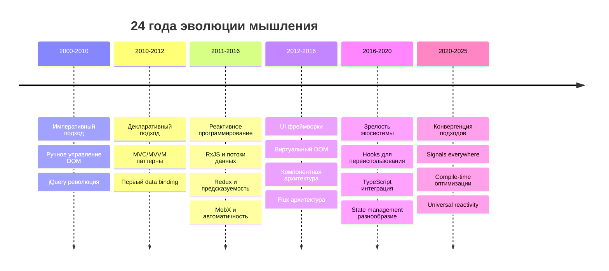
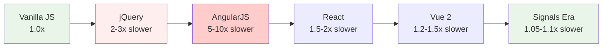
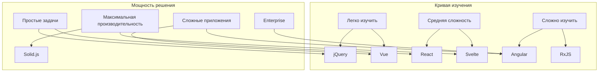
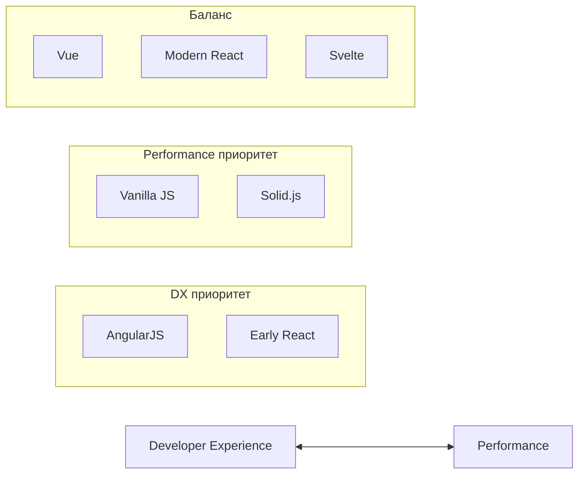

# Заключение
<h2 class="text-xl opacity-80">Уроки 24 лет эволюции реактивности</h2>

---
layout: center
---

# Эволюция мышления

---

# Путь развития реактивности



---

# Смена парадигм

## 🔧 Императивный → Декларативный
```javascript
// Было: как делать
document.getElementById('counter').textContent = count;

// Стало: что должно быть
<div>{count}</div>
```

## 🎯 Грубый → Точечный
```javascript
// Было: обновляем весь компонент
component.render();

// Стало: обновляем только изменившиеся узлы
updateTextNode(count);
```

## ⚡ Runtime → Compile-time
```javascript
// Было: вычисления во время выполнения
if (framework.hasChanges()) framework.update();

// Стало: анализ на этапе компиляции
// Компилятор генерирует оптимальный код
```

---

# Производительность: от хорошо к отлично



**Тренд:** возвращение к производительности vanilla JS

---

# Размер бандлов: меньше значит лучше

| Период | Подход | Типичный размер | Тренд |
|--------|--------|----------------|--------|
| 2000-2010 | jQuery | ~30KB | 📈 |
| 2010-2012 | Backbone + deps | ~50KB | 📈 |
| 2012-2016 | Angular/React | 100-150KB | 📈📈 |
| 2016-2020 | Оптимизации | 50-100KB | 📉 |
| 2020-2025 | Signals/Compile | 5-40KB | 📉📉 |

**Lesson learned:** производительность снова стала важна

---

# Сложность vs Возможности



---
layout: center
---

# Ключевые уроки

---

# Урок 1: Простота важнее магии

## ✅ Хорошо:
- Явные зависимости
- Предсказуемое поведение
- Легкая отладка

## ❌ Плохо:
- Неявная магия
- Сложная отладка
- Неочевидные побочные эффекты

```javascript
// Магия может обернуться проблемами
Vue.set(vm.items, indexOfItem, newValue); // Почему нужен Vue.set?

// Явность лучше
const [items, setItems] = useState([]); // Понятно как работает
```

---

# Урок 2: Производительность vs Developer Experience

## ⚖️ Постоянный баланс:



**Тренд:** инструменты стремятся к балансу

---

# Урок 3: Экосистема решает

## 📊 Технические преимущества ≠ Успех

### Knockout.js vs AngularJS (2012)
- **Knockout:** лучшая реактивность, проще изучить
- **Angular:** полная экосистема, Google поддержка
- **Результат:** Angular победил

### Svelte vs React (2025)  
- **Svelte:** меньше bundle, лучше производительность
- **React:** огромная экосистема, больше джобов
- **Результат:** React все еще доминирует

**Вывод:** community и tooling важнее технического совершенства

---

# Урок 4: Реактивность шире UI фреймворков

## 🌐 Параллельное развитие:

### UI Реактивность:
```
jQuery → Backbone → Angular → React → Vue → Signals
```

### State Management:
```
Events → RxJS → Redux → MobX → Zustand → Effector
```

## 💡 Конвергенция подходов:
- **UI фреймворки** заимствуют идеи state managers
- **State managers** интегрируются с UI реактивностью
- **Signals** становятся universal primitive

# Урок 5: Эволюция, а не революция

## 🔄 Лучшие решения берут идеи предшественников:

- **Vue Composition API** ← React Hooks
- **Angular Signals** ← Solid.js концепции  
- **Effector** ← RxJS + Redux паттерны
- **Zustand** ← Redux простота без boilerplate

## 📚 Кросс-опыление идей:
- RxJS операторы → Vue computed
- Redux immutability → все остальное
- MobX observables → Signals концепция

**Принцип:** революционные идеи часто оказываются эволюцией предыдущих

---
layout: center
---

# Современное состояние (2025)

---

# Экосистема сегодня

## 🏆 Лидеры по популярности:
1. **React** — 40% разработчиков
2. **Vue** — 18% разработчиков  
3. **Angular** — 15% разработчиков
4. **Svelte** — 8% разработчиков

## 📈 Растущие тренды:
- **Signals** во всех фреймворках (кроме React)
- **TypeScript** как стандарт
- **Edge computing** интеграция

## 🔧 Зрелые инструменты:
- Стабильные API
- Отличная документация
- Большие сообщества
- Rich ecosystems

---
layout: center
---

# Будущее реактивности

---

# Тренды 2025-...

## 🔮 Signals Everywhere
- Унификация подходов
- Кроссплатформенные primitives
- Better interoperability

## ⚡ Compile-time оптимизации
- Статический анализ зависимостей
- Автоматическая генерация оптимального кода
- Zero-runtime overhead

## 🌐 Edge Computing интеграция  
- Server-side реактивность
- Streaming SSR
- Partial hydration

---

# Emerging технологии

## 🧬 Reactive Server Components
```javascript
// Реактивность на сервере
function ServerComponent({ userId }) {
  const user = useServerSignal(() => db.users.find(userId));
  const posts = useServerSignal(() => db.posts.where({ userId }));
  
  return (
    <div>
      <h1>{user().name}</h1>
      <PostList posts={posts()} />
    </div>
  );
}
```

---

# Предсказания на 5 лет

## 🎯 Вероятные сценарии:

### 2025-2026: Signals стандартизация
- Все major фреймворки поддерживают signals (кроме React)
- Web Platform API для реактивности
- Cross-framework composables

### 2029-2030: WebAssembly реактивность
- WASM модули для тяжелых вычислений
- Rust/Go signals интеграция
- Native performance в браузере

---

# Главные выводы

## 💡 24 года эволюции научили нас:

### 1. **Реактивность — это мышление**
Не просто технология, а способ думать о синхронизации данных и UI

### 2. **Нет универсального решения**
Каждая задача требует своего подхода

### 3. **Простота и производительность связаны**
Лучшие решения делают сложные вещи простыми

### 4. **Сообщество важнее технических преимуществ**
Adoption решает экосистема, не только качество кода

### 5. **Изучайте принципы, а не только инструменты**
Технологии меняются, фундаментальные концепции остаются

---

# Заключительная мысль

> **"The best tool is the one your team can use effectively to solve real problems."**

## 🎯 Помните:
- Пользователям важен результат, не технологии
- Команде важна продуктивность, не хайп
- Бизнесу важно время на рынок, не совершенство

## 🚀 Двигайтесь вперед:
- Изучайте новое, но не забывайте основы
- Экспериментируйте, но измеряйте результаты  
- Следите за трендами, но не гонитесь за каждым

**Будущее реактивности будет еще интереснее!**

---
layout: center
---

# Спасибо за внимание!

---

## 🔗 Полезные ссылки:
- **Telegram канал:** @zede_code

## 📊 Материалы:
- Все слайды и код доступны
- Дополнительные материалы для изучения
- Сравнительные бенчмарки

## 🤝 Что дальше:
- Углубленные воркшопы по современным подходам
- Серия статей о практическом применении signals
- Открытое обсуждение в Telegram

**Вопросы?**
