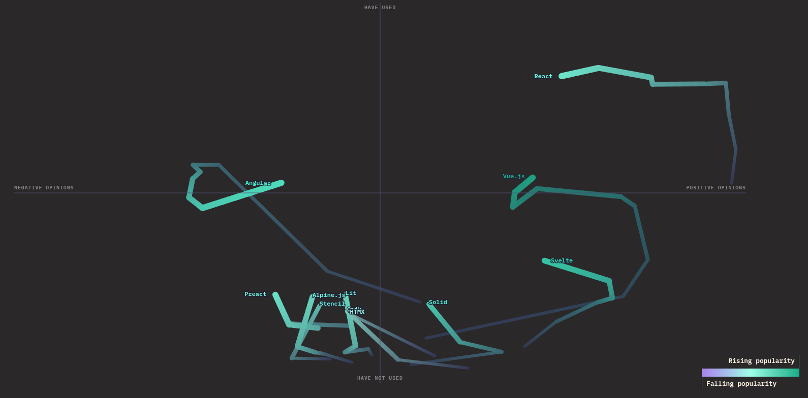

<AnimatedText
  :class="t.q1"
  :mode="t.q1Mode"
  words="Современный стек и тенденции"
/>

---

  🥇
  
  Золотой стандарт
  

  🐘
  
  Достойный выбор
  

  🌱
  
  Амбициозный новичок
  

  🍫
  
  Особые вкусы
  

  💣
  
  Легендарный техдолг
  

---

# Фреймворки

  🥇 
  
  <DeviconReact v-click="2" />
  <DeviconVuejs v-click="3" />
  <LogosAngularIcon v-click="4" />
  

  🐘
  
  <DeviconSvelte v-click="6" />
  <DeviconSolidjs v-click="7" />
  <LogosPreact v-click="8" />
  

  🍫
  
  <SkillIconsHtmxDark/>
  <SkillIconsAlpinejsLight/>
  

---

---
layout: center
timeline:
  - q1: '$obj fx text-1.3em pos-50% w-full text-center px-10 '
    q1Mode: false
  - q1Mode: true
  - q1: '$obj fx text-1.3em pos-50%_30% w-full text-center px-10 '
---

<AnimatedText
  :class="t.q1"
  :mode="t.q1Mode"
  words="Гонка фреймворков ушла"
/>

<v-clicks at="2">

- Фреймворки уже не появляются каждый день
- Большая тройка твердо доминирует
- TypeScript неоспоримый стандарт

</v-clicks>

---

# Веб-компоненты

<v-clicks>

- Крайне специфичное решение
- Неудобны для использования напрямую
- Дождались Declarative Shadow DOM
- Все фреймворки отчасти умеют работать с веб-компонентами

</v-clicks>

---

# Мета-фреймворки

  🥇 
  
  <LogosNextjsIcon v-click="2" />
  <MaterialIconThemeNuxt v-click="3" />
  

  🐘
  
  <MaterialIconThemeAstro v-click="5" />
  <DeviconSvelte v-click="6" />
  <DeviconRemix v-click="7" />
  

  🌱
  
  
  <DeviconSolidjs v-click="10" />
  

  🍫
  
  <MaterialIconThemeQwik v-click="12" />
  <LogosAnalog v-click="13" />
  

  💣
  
  <VscodeIconsFileTypeGatsby v-click="15" />
  

---
layout: center
---

# Сложные изоморфные режимы

<v-clicks>

- Мир больше не ограничен CSR, SSR, SSG
- ISR, Streaming SSR, Partial Hydration, Islands Architecture
- Edge Runtime

</v-clicks>

---
layout: center
timeline:
  - q1: '$obj fx text-1.3em pos-50% w-full text-center px-10 '
    q1Mode: false
  - q1Mode: true
  - q1: '$obj fx text-1.3em pos-50%_30% w-full text-center px-10 '
---

<AnimatedText
  :class="t.q1"
  :mode="t.q1Mode"
  words="Фронтендеры стали фуллстаками"
/>

<v-clicks at="2">

- Код фронтендера это не код для браузера
- BFF больше не пустой звук
- Понимание масштабируемости и производительности

</v-clicks>

---
timeline:
  - q1: '$obj fx text-1.3em pos-50% w-full text-center px-10 '
    q1Mode: false
  - q1Mode: true
  - q1: '$obj fx text-1.3em pos-50%_30% w-full text-center px-10 '
---

<AnimatedText
  :class="t.q1"
  :mode="t.q1Mode"
  words="Все смешалось"
/>

<v-clicks at="2">

- Server Components: React
- Server Actions: React, Vue, Svelte
- Метафреймворки расширяют возможности написания серверов

</v-clicks>

---

# Сборщики

  🥇 
  
  <DeviconVitejs v-click="2" />
  

  🐘
  
  <VscodeIconsFileTypeEsbuild v-click="4" />
  
  

  🌱
  
  <VscodeIconsFileTypeRolldown v-click="7" />
  

  🍫
  
  <LogosParcelIcon v-click="9" />
  <LogosBun v-click="10" />
  <LogosTurbopackIcon v-click="11" />
  

  💣
  
  <SkillIconsWebpackDark v-click="13" />
  <VscodeIconsFileTypeRollup v-click="14" />
  

---

# Война экосистем

  <LogosUnjs/>
  <VscodeIconsFileTypeOxc />
  
  <VscodeIconsFileTypeBiome/>
  
  <LogosBun />

---
timeline:
  - box1: '-blur-hidden'
    box2: '-blur-hidden'
    box3: '-blur-hidden'
    box4: '-blur-hidden'
  - box1: ''
  - box2: ''
  - box3: ''
  - box4: ''
---

  

    <LogosUnjs class="text-8xl" />
  

  

    <h2 class="text-4xl font-bold text-white">UnJS</h2>
  

  

    

      <h4 class="text-2xl font-semibold mb-4 text-blue-300">Разработчик</h4>
      
UnJS Team (nuxt community)

    

  

  

    

      <h4 class="text-2xl font-semibold mb-3 text-orange-300">Ключевые проекты</h4>
      

        <UnjsNitro/> nitro
        <UnjsH3/> h3
        <UnjsOfetch/> ofetch
        <UnjsUnplugin/> unplugin
        <UnjsUnstorage/> unstorage
        <UnjsConsola/> consola
      

    

  

  

    <h4 class="text-2xl font-semibold mb-3 text-green-300">Особенности</h4>
    <ul class="text-white text-xl space">
      <li>✨ Универсальные инструменты для любых JS сред</li>
      <li>🚀 Минималистичные и производительные решения</li>
      <li>🔧 Unix в мире фронтенда</li>
    </ul>
  

---
timeline:
  - box1: '-blur-hidden'
    box2: '-blur-hidden'
    box3: '-blur-hidden'
    box4: '-blur-hidden'
  - box1: ''
  - box2: ''
  - box3: ''
  - box4: ''
---

  

    <VscodeIconsFileTypeOxc class="text-8xl" />
  

  

    <h2 class="text-4xl font-bold text-white">OXC</h2>
  

  

    

      <h4 class="text-2xl font-semibold mb-4 text-green-300">Разработчик</h4>
      
Boshen & OXC Team

    

  

  

    

      <h4 class="text-2xl font-semibold mb-3 text-orange-300">Компоненты экосистемы</h4>
      

        Parser
        Linter (oxlint)
        Formatter
        Resolver
        Transformer
        Minifier
      

    

  

  

    <h4 class="text-2xl font-semibold mb-3 text-purple-300">Особенности</h4>
    <ul class="text-white text-xl">
      <li>⚡ Написан на Rust - невероятная скорость</li>
      <li>🎯 Полная экосистема инструментов для JS/TS</li>
      <li>🔥 Производительность в 50-100 раз быстрее существующих решений</li>
    </ul>
  

---
timeline:
  - box1: '-blur-hidden'
    box2: '-blur-hidden'
    box3: '-blur-hidden'
    box4: '-blur-hidden'
  - box1: ''
  - box2: ''
  - box3: ''
  - box4: ''
---

  

    
  

  

    <h2 class="text-4xl font-bold text-white">Void</h2>
  

  

    

      <h4 class="text-2xl font-semibold mb-4 text-green-300">Разработчик</h4>
      
Evan You (Vue & Vite)

    

  

  

    

      <h4 class="text-2xl font-semibold mb-3 text-purple-300">Ключевые инструменты</h4>
      

        <DeviconVitejs/> Vite
        <DeviconVitest/> Vitest
        <VscodeIconsFileTypeRolldown/> Rolldown
        <VscodeIconsFileTypeOxc/> Oxc
         Vite+
      

    

  

  

    <h4 class="text-2xl font-semibold mb-3 text-blue-300">Особенности</h4>
    <ul class="text-white text-xl">
      <li>🌟 Единая high-performance экосистема инструментов</li>
      <li>🚀 Замена медленным JS-инструментам на Rust-альтернативы</li>
      <li>💎 Интеграция лучших практик в единое целое</li>
    </ul>
  

---
timeline:
  - box1: '-blur-hidden'
    box2: '-blur-hidden'
    box3: '-blur-hidden'
    box4: '-blur-hidden'
  - box1: ''
  - box2: ''
  - box3: ''
  - box4: ''
---

  

    <VscodeIconsFileTypeBiome class="text-8xl" />
  

  

    <h2 class="text-4xl font-bold text-white">Biome</h2>
  

  

    

      <h4 class="text-2xl font-semibold mb-4 text-orange-300">Разработчик</h4>
      
Biome Team (бывший Rome Tools)

    

  

  

    

      <h4 class="text-2xl font-semibold mb-3 text-blue-300">Возможности</h4>
      

        Linter
        Formatter
      

    

  

  

    <h4 class="text-2xl font-semibold mb-3 text-green-300">Особенности</h4>
    <ul class="text-white text-xl">
      <li>⚡ Все в одном инструменте - заменяет ESLint + Prettier</li>
      <li>🦀 Написан на Rust - мгновенная работа</li>
      <li>🎯 Zero-config - работает из коробки</li>
    </ul>
  

---
timeline:
  - box1: '-blur-hidden'
    box2: '-blur-hidden'
    box3: '-blur-hidden'
    box4: '-blur-hidden'
  - box1: ''
  - box2: ''
  - box3: ''
  - box4: ''
---

  

    
  

  

    <h2 class="text-4xl font-bold text-white">Rspack</h2>
  

  

    

      <h4 class="text-2xl font-semibold mb-4 text-purple-300">Разработчик</h4>
      
ByteDance (TikTok)

    

  

  

    

      <h4 class="text-2xl font-semibold mb-3 text-green-300">Экосистема</h4>
      

        Rspack
        Rsbuild
        Rspress
        Rsdoctor
        Rstest
        Rslint
      

    

  

  

    <h4 class="text-2xl font-semibold mb-3 text-orange-300">Особенности</h4>
    <ul class="text-white text-xl">
      <li>🔥 Совместимость с Webpack - легкая миграция</li>
      <li>⚡ В 5-10 раз быстрее благодаря Rust</li>
      <li>🏢 Production-ready - используется в ByteDance</li>
    </ul>
  

---
timeline:
  - box1: '-blur-hidden'
    box2: '-blur-hidden'
    box3: '-blur-hidden'
    box4: '-blur-hidden'
  - box1: ''
  - box2: ''
  - box3: ''
  - box4: ''
---

  

    <LogosBun class="text-8xl" />
  

  

    <h2 class="text-4xl font-bold text-white">Bun</h2>
  

  

    

      <h4 class="text-2xl font-semibold mb-4 text-orange-300">Разработчик</h4>
      
Jarred Sumner & Bun Team

    

  

  

    

      <h4 class="text-2xl font-semibold mb-3 text-purple-300">Возможности</h4>
      

        Рантайм
        Бандлер
        Пакетный менеджер
        Тест раннер
        Dev Server
      

    

  

  

    <h4 class="text-2xl font-semibold mb-3 text-blue-300">Особенности</h4>
    <ul class="text-white text-xl">
      <li>🚀 JavaScriptCore + Zig - экстремальная производительность</li>
      <li>🎁 Все инструменты в одном пакете</li>
      <li>🔌 Drop-in замена для Node.js</li>
    </ul>
  

---

# Тестирование

  🥇 
  
  <LogosVitest v-click="2" />
  <VscodeIconsFileTypeStorybook v-click="3" />
  <LogosPlaywright v-click="4" />
  

  🐘
  
  <VscodeIconsFileTypeNode v-click="6" />
  

  🍫
  
  <VscodeIconsFileTypeHistoire v-click="9" />
  

  💣
  
  <LogosJest v-click="11" />
  <LogosJasmine v-click="12" />
  <LogosCypress v-click="13" />
  

---

# Стилизация

  🥇 
  
  <MaterialIconThemeTailwindcss v-click="2" />
  <VscodeIconsFileTypeCss v-click="3"/>
  

  🐘
  
  <VscodeIconsFileTypeUnocss v-click="5"/>
  <EmojioneV1LightningMood v-click="12"/>
  

  🍫
  
  <DeviconStyledcomponents v-click="7"/>
  

  💣
  
  <DeviconSass v-click="9"/>
  <VscodeIconsFileTypePostcss v-click="10"/>
  

---
timeline:
  - q1: '$obj fx text-1.3em pos-50% w-full text-center px-10 '
    q1Mode: false
  - q1Mode: true
  - q1: '$obj fx text-1.3em pos-50%_30% w-full text-center px-10 '
---

<AnimatedText
  :class="t.q1"
  :mode="t.q1Mode"
  words="UI тоже развиваются"
/>

<v-clicks at="2">

- От полноценных до безголовых
- Shadcn революция: теперь вы управляете исходниками

</v-clicks>

---

# Линтеры и форматтеры

  🥇 
  
  <MaterialIconThemePrettier v-click="2" />
  <DeviconEslint v-click="3" />
  

  🐘
  
  <VscodeIconsFileTypeBiome v-click="5"/>
  <FileIconsStylelint v-click="6" />
  

  🌱
  
  <VscodeIconsFileTypeOxc v-click="8" />
  

  🍫
  
  
  

---

# Рантаймы

  🥇 
  
  <VscodeIconsFileTypeNode v-click="2" />
  

  🐘
  
  <LogosBun v-click="4" />
  

  🍫
  
  <VscodeIconsFileTypeDeno v-click="5" />
  

---
timeline:
  - q1: '$obj fx text-1.3em pos-50% w-full text-center px-10 '
    q1Mode: false
  - q1Mode: true
  - q1: '$obj fx text-1.3em pos-50%_30% w-full text-center px-10 '
---

<AnimatedText
  :class="t.q1"
  :mode="t.q1Mode"
  words="Рантаймов больше не 2"
/>

<v-clicks at="2">

- Большы мы не ограничены Node.js и браузером
- <logos-bun /> bun, <logos-deno /> deno, {.img-icon} edge-light, <logos-fastly /> fastly, {.img-icon} LLRT, <logos-netlify /> netlify, {class="img-icon"} wasmer, {.img-icon} workerd
- WinterTC это новый стандарт

</v-clicks>

---

# Менеджмент зависимостей

  🥇 
  
  <DeviconPnpm v-click="2" />
  <VscodeIconsFileTypeLightTurbo v-click="3" />
  

  🐘
  
  <VscodeIconsFileTypeNpm v-click="5" />
  <SimpleIconsNx v-click="6" />
  

  🌱
  
  <VscodeIconsFileTypeJsr v-click="8" />
  

  💣
  
  <LogosYarn v-click="10" />
  <VscodeIconsFileTypeLightLerna v-click="11" />
  

---
timeline:
  - q1: '$obj fx text-1.3em pos-50% w-full text-center px-10 '
    q1Mode: false
  - q1Mode: true
  - q1: '$obj fx text-1.3em pos-50%_30% w-full text-center px-10 '
---

<AnimatedText
  :class="t.q1"
  :mode="t.q1Mode"
  words="Микрофронтенды - наигрались и хватит"
/>

<v-clicks at="2">

- Микрофронтенды - не серебряная пуля
- Они решают сложные задачи, но не всегда это необходимо
- Порой есть более дешевые и простые решения
</v-clicks>

---
layout: center
timeline:
  - q1: '$obj fx text-1.3em pos-50% w-full text-center px-10 '
    q1Mode: false
  - q1Mode: true
---

<AnimatedText
  :class="t.q1"
  :mode="t.q1Mode"
  words="В 2025 мы не стоим на месте"
/>

---
layout: center
timeline:
  - q1: '$obj fx text-1.3em pos-50% w-full text-center px-10 '
    q1Mode: false
  - q1Mode: true
---

<AnimatedText
  :class="t.q1"
  :mode="t.q1Mode"
  words="AI меняет ландшафт"
/>

---
layout: center
timeline:
  - q1: '$obj fx text-1.3em pos-50% w-full text-center px-10 '
    q1Mode: false
  - q1Mode: true
---

  Эксперементируйте, пробуйте, говорите!

<DeviconReact class="$obj pos-712_51 size-150 swinging" />
<VscodeIconsFileTypeAngular class="$obj pos-492_444 size-150 drift" />
<LogosPinia class="$obj pos-85_70 size-150 pinia" />

---
layout: center
---

# Спасибо за внимание!

---

  

    
    

      
Тяжелое утро

    

  

  

    <QrCodeIntro class="size-180" />
    
@zede_code

  

  

    

      <ZedeIcon class="size-full" />
    

    

      <h4 class="text-xl font-semibold text-orange-300 mb-1">Zede</h4>
      
@zede_code

    

  

  

    

      
    

    

      <h4 class="text-xl font-semibold text-green-300 mb-1">Vueist</h4>
      
@vueist

    

  

  

    <ImgExample src="../img/ufaqr.png" />
  

  

    

      
    

    

      <h4 class="text-xl font-semibold text-yellow-300 mb-1">UfaJS</h4>
      
@ufajs

    

  

