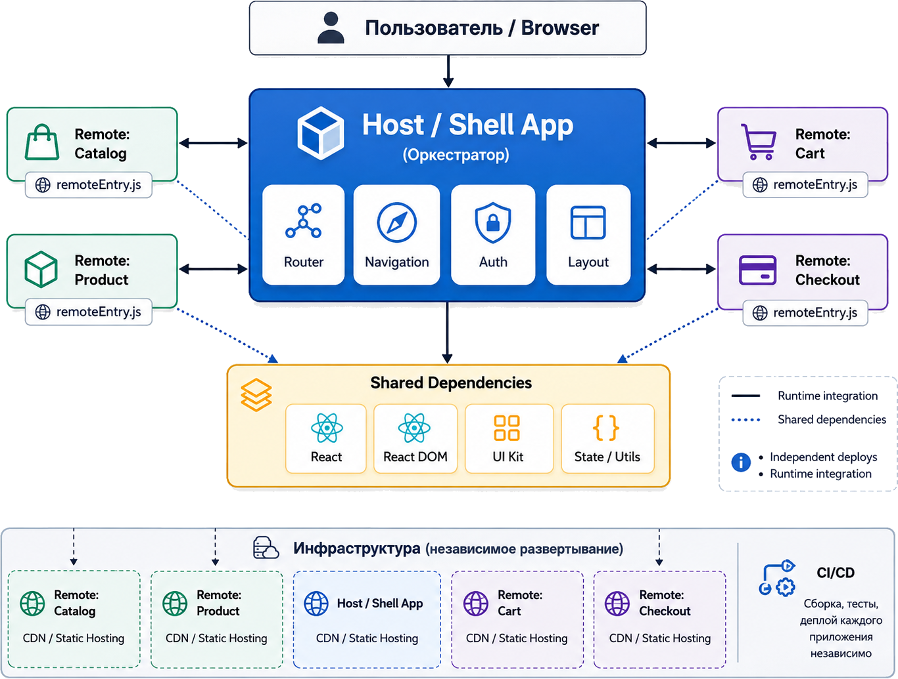

# Четкие границы ответственности

---
layout: center
---


---

<v-clicks>

- Людей на проекте все больше и больше
- Количество кода растет все быстрее
- Становится сложнее понять зоны ответственности
- Связи в проекте становятся комплексными

</v-clicks>

---
layout: center
---

# Пришло время **микрофронтендов**?

<v-click>

# НЕТ!

</v-click>

---
layout: center
---

# А можно ли решить проблему проще?

---
layout: center
---

# Модульная структура проекта

---



---

````md magic-move
```md
src/
├── components/
|   ├── Map/
|   ├── ProfileCard/
|   └── ...
├── pages/
├── utils/
├── App.vue
└── main.js


⠀
```

```md {2-10|2-5|4-5,11-12,15-16|2,7-9,11,13,15,17|19}
src/
├── components/
|   ├── Map/
|   |   ├── MapComponent/
|   |   ├── MapCard/
|   |   └─── ...
|   ├── Profile/
|   |   ├── UserProfile/
|   |   └── ProfileCard/
|   └── ...
├── pages/
|   |   ├── MapPage/
|   |   └── ProfilePage/
|   └─── ...
├── stores/
|   ├── MapStore/
|   ├── ProfileStore/
|   └─── ...
├── utils/
├── App.vue
└── main.js
⠀
```

```md {19}
src/
├── components/
|   ├── Map/
|   |   ├── MapComponent/
|   |   ├── MapCard/
|   |   └─── ...
|   ├── Profile/
|   |   ├── UserProfile/
|   |   └── ProfileCard/
|   └── ...
├── pages/
|   |   ├── MapPage/
|   |   └── ProfilePage/
|   └─── ...
├── stores/
|   ├── MapStore/
|   ├── ProfileStore/
|   └─── ...
├── modules/
├── utils/
├── App.vue
└── main.js
```

```md {*|4-13|5-8|9-12|*}
src/
├── app/
├── pages/
├── modules/
|   ├── Map/
|   |   ├── stores/
|   |   ├── components/
|   |   └── pages/
|   ├── Profile/
|   |   ├── stores/
|   |   ├── components/
|   |   └── pages/
|   └── ...
├── shared/
├── utils/
├── App.vue
└── main.js


⠀
```

```md {*|4-13|5-8|9-12|*}
src/
├── app/
├── pages/
├── modules/
|   ├── Map/
|   |   ├── stores/
|   |   ├── components/
|   |   ├── pages/
|   |   ├── tests/
|   |   ├── index.ts
|   |   └── README.md
|   └── ...
├── shared/
├── utils/
├── App.vue
└── main.js


⠀
```
````

---

# Модульная структура проекта

<v-clicks>

- Модули могут разрабатываться независимо
- Связи между модулями могут быть ограничены
- Конкретные люди могут отвечать за конкретные модули
- Отдельные модули проще документировать и тестировать

</v-clicks>

---

# Минусы?

<v-clicks>

- Уметь выделять модули - **сложно**!
- Требуется навык соблюдения границ
- Деплой все еще не независим

</v-clicks>

---

# С другой стороны

<v-clicks>

- Мы все еще в рамках одного проекта
- Никакой настройки со стороны инструментов не требуется
- Относительно легко гарантировать работоспособность

</v-clicks>

---

# А есть ли что-то готовое?

<v-clicks>

- Nuxt Modules
- Nuxt Layers
- FEOD
- FDA
- FSD

</v-clicks>

---

Что нам решат микрофронтенды?

- <span v-mark.strike-through.green={at:1}>Четкие границы ответственности</span> <v-click>✅ Модули</v-click>
- Свои пайплайны в репозитории
- Независимый деплой
- <span class="blur"> Динамическая подгрузка </span>
