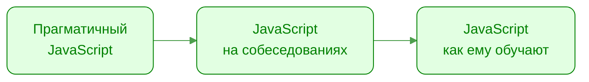
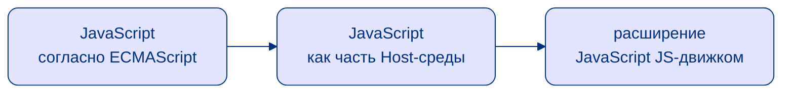
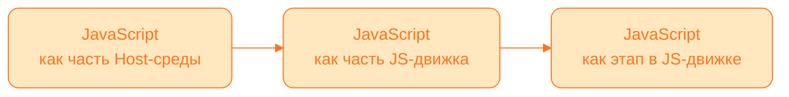
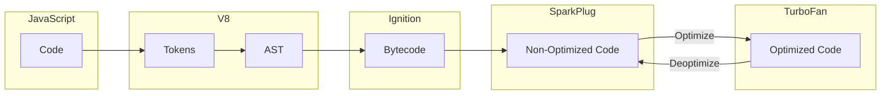

---
layout: statement
variant: first
---

# Цели

<v-clicks>

- Узнать о разных сторонах JavaScript
- Осознать разницу подходов к восприятию JavaScript
- Задать очень много вопросов себе

</v-clicks>

---
layout: quote
variant: second
---

Самый неправильно понятый язык программирования в мире стал самым популярным в мире языком программирования

_Дуглас Крокфорд_

---
layout: quote
variant: first
---

<p>Я подчеркиваю слово <span v-mark.orange>Путешествие</span>, потому что знание JS не является пунктом назначения, это направление</p>

_Кайл Симпсон_

---
layout: fact
variant: second
---

JavaScript **не** существует в единственной форме!

---
layout: fact
variant: second
---

<div class="absolute top-0 left-0 w-full h-full backdrop-blur-[30px]" />


<div class="absolute center w-full h-full text-lg">
  <div class="absolute absolute top-[65px] left-1/2 transform -translate-x-1/2 -translate-y-1/2 pr-[50px]">JS на практике</div>
  <div class="absolute absolute top-[125px] left-1/2 transform -translate-x-1/2 -translate-y-1/2 pr-[50px]"><span class="bg-[#00000025]">JS на собеседованиях</span></div>
  <div class="absolute absolute top-[185px] left-1/2 transform -translate-x-1/2 -translate-y-1/2 pr-[50px]">JS на MDN</div>
  <div class="absolute absolute top-[245px] left-1/2 transform -translate-x-1/2 -translate-y-1/2 pr-[50px]">JS в спеке HTML</div>
  <div class="absolute absolute top-[305px] left-1/2 transform -translate-x-1/2 -translate-y-1/2 pr-[50px]">JS в спеке ECMA-262</div>
  <div class="absolute absolute top-[365px] left-1/2 transform -translate-x-1/2 -translate-y-1/2 pr-[50px]">реализация JS в джвижках</div>
  <div class="absolute absolute top-[425px] left-1/2 transform -translate-x-1/2 -translate-y-1/2 pr-[60px]">оптимизации JS под движки</div>
  <div class="absolute absolute top-[485px] left-1/2 transform -translate-x-1/2 -translate-y-1/2 pr-[50px]">JS на практике</div>
</div>

---
layout: section
variant: third
---

# Мифический JS



---
layout: section
variant: second
---

# Задокументированный JS



---
layout: section
variant: first
---

# JS в действии



---
layout: statement
variant: third
---

# Прагматичный JavaScript

<v-clicks>

- Удобство важнее написания _идеального кода_
- TypeScript
- _Вера в магию_ движков JS
- Работает — не трогай!

</v-clicks>

---
layout: statement
variant: one
---

# Что-то тут не так...

````md magic-move
```ts
// [['a', 1], ['b', 2]] => { a: 2, b: 4 }
array.reduce((a,[b,c])=>{
  return {...a,[b]:c*2}
},
{})
```

```ts
// [['a', 1], ['b', 2]] => { a: 2, b: 4 }
array.reduce((a, [b, c]) => {
  return { ...a, [b]: c * 2 }
}, {})
⠀
```

```ts
// [['a', 1], ['b', 2]] => { a: 2, b: 4 }
pairs.reduce((acc, [key, value]) => {
  return { ...acc, [key]: value * 2 }
}, {})
⠀
```

```ts
// [['a', 1], ['b', 2]] => { a: 2, b: 4 }
pairs.reduce((acc, [key, value]) => {
  acc[key] = value * 2
  return acc
}, {})
```
````

---
layout: statement
variant: second
---

# JavaScript мира собеседований

<v-clicks>

- Больший уровень погружения
- Основная зона для _мифов_
- Сами придумываем правила по которым собеседуем

</v-clicks>

---
layout: statement
variant: second
---

# Типичный вопрос
Что в JS передается по ссылке, а что по значению?

<v-clicks>

- Объекты передаются по ссылке
- Примитивы по значению

</v-clicks>

---
layout: fact
variant: second
---

````md magic-move
```ts {*|1|3-5|7|9}
let num = 10

function changeStuff(a) {
  a = a * 10
}

changeStuff(num)

console.log(num)
⠀
⠀
⠀
⠀
⠀
⠀
```

```ts
let num = 10

function changeStuff(a) {
  a = a * 10
}

changeStuff(num)

console.log(num) // 10 - Ничего не поменялось
⠀
⠀
⠀
⠀
⠀
⠀
```

```ts {*|2,6,9,12}
let num = 10
let obj = { item: 'initial' }

function changeStuff(a, b) {
  a = a * 10
  b.item = 'changed'
}

changeStuff(num, obj)

console.log(num) // 10
console.log(obj)
⠀
⠀
⠀
```

```ts
let num = 10
let obj = { item: 'initial' }

function changeStuff(a, b) {
  a = a * 10
  b.item = 'changed'
}

changeStuff(num, obj)

console.log(num) // 10
console.log(obj) // { item: 'changed' }
⠀
⠀
⠀
```

```ts {*|3,8,11,15}
let num = 10
let obj = { item: 'initial' }
let obj2 = { item: 'initial' }

function changeStuff(a, b, c) {
  a = a * 10
  b.item = 'changed'
  c = { item: 'changed' }
}

changeStuff(num, obj, obj2)

console.log(num) // 10
console.log(obj) // { item: 'changed' }
console.log(obj2)
```

```ts
let num = 10
let obj = { item: 'initial' }
let obj2 = { item: 'initial' }

function changeStuff(a, b, c) {
  a = a * 10
  b.item = 'changed'
  c = { item: 'changed' }
}

changeStuff(num, obj, obj2)

console.log(num) // 10
console.log(obj) // { item: 'changed' }
console.log(obj2) // { item: 'initial' }
```

```
function f(b) { ... }

f(a)
```
````

---
layout: statement
variant: second
clicks: 7
---

# Передача по значению

<demo-value />

---
layout: statement
variant: second
clicks: 8
---

# Передача по ссылке

<demo-refrerence />

---
layout: fact
variant: second
---

```ts {*|1,6,11,13|2,7,11,14|3,8,11,15}
let num = 10
let obj = { item: 'initial' }
let obj2 = { item: 'initial' }

function changeStuff(a, b, c) {
  a = a * 10
  b.item = 'changed'
  c = { item: 'changed' }
}

changeStuff(num, obj, obj2)

console.log(num) // 10
console.log(obj) // { item: 'changed' }
console.log(obj2) // { item: 'initial' }
```

---
layout: statement
variant: second
clicks: 8
---

# Call-by-Sharing

<demo-sharing />

---
layout: statement
variant: second
---

# Что в итоге?

<v-clicks>

- Pass-by-Sharing
- Зависит от контекста
- Спецификация не оговаривает точный способ
- Движки для JS могут менять поведение для оптимизации
- На разных этапах рантайма движки могут менять поведение

</v-clicks>

---
layout: statement
variant: third
---

# Как учим JavaScript?

<v-clicks>

- Изучение по принципу "народных сказаний"
- Описание может противоречить тому — как это работает
- По рекомендациям коллег

</v-clicks>

---
layout: statement
variant: third
---

<div flex="~ col items-center gap-2" class="font-size-[10rem] mt-[-5rem]" p4>
  <div relative :class="$clicks >= 1 ? 'op40 duration-800 scale-70 pb-[10px]' : ''" transition v-mark.red.strike-through="{at: 2, strokeWidth: 10}"><pre>var</pre></div>
  <div v-click="2" text-7xl class="mt-[-6rem]"><strong>Устарел!</strong></div>
</div>

---
layout: statement
variant: third
---

# _Устаревшее_ ключевое слово `var`

<v-clicks>

- В спецификации даже намека на устаревание `var` — нет
- Производительность `var` может быть значительно выше
- Огромный объем кода использует `var`

</v-clicks>

---
layout: fact
variant: third
---


---
layout: statement
variant: third
---

# Так что всё-таки с `var`?

<v-clicks>

- На практике его можно частично считать устаревшим
- Сборщики / Транспайлеры приводят `let` / `const` к `var`
- `var` бывает крайне важен для производительности
- По спецификации — устаревания нет

</v-clicks>

---
layout: statement
variant: first
---

# А что там по спецификации?

<v-clicks>

- ECMAScript (ECMA-262)
- JS в _вакууме_
- Созданы свои языки для спецификации
- Единственный источник истины про JS
- Достаточно не противоречить спецификации​

</v-clicks>

---
layout: statement
variant: first
---

# _Заклинания_ из спецификации

<v-clicks>

- Свои типы данных
- Свои абстрактные методы
- Созданы свои языки для спецификации
- Свои уникальные языки для описания алгоритмов
- Есть концепты, которые еще предстоит реализовать Host-среде

</v-clicks>

---
layout: statement
variant: first
---

# Примеры:

- Environment Records
- Abstract Closure
- VariableEnvironment
- Agent
- Job
- Host Environment

---
layout: fact
variant: first
clicks: 5
---

<SpecExmaple1 />

---
layout: fact
variant: first
clicks: 5
---

<SpecExample2 />

---
layout: statement
variant: second
---

# Итого

<v-clicks>

- Не рассчитана на JS-программистов
- Требует очень много времени и усилий
- Полученные знания сложно применить на практике

</v-clicks>

---
layout: statement
variant: second
---

# JavaScript в среде обитания

Host-среда - оболочка в рамках которых JavaScript может функционировать

<v-clicks>

- Браузер (HTML)
- Node.js
- bun
- QML в Qt
- PostgreSQL (plv8)

</v-clicks>

---
layout: statement
variant: second
---

# Спецификация в HTML

<v-clicks>

- Дружелюбная к начинающим
- Содержит в себе описание Host-среды для работы браузера

</v-clicks>

---
layout: fact
variant: second
---

<SpecExmaple3 />

---
layout: fact
variant: second
---

<SpecExmaple4 />

---
layout: statement
variant: first
---

# Предупреждение

Будем рассматривать преимущественно v8

<v-clicks>

- Самый популярный
- Больше всего открытой информации
- Самый навороченный
- Многое справедливо и для других движков

</v-clicks>

---
layout: statement
variant: first
---

# JavaScript в v8

<v-clicks>

- Непредсказуемый
- Значительно оптимизирующий
- Имеет несколько этапов жизни скрипта
- При работе с ним, нужно понимать, что делаешь

</v-clicks>

---
layout: statement
variant: first
---

# Cвои термины

- регистры
- SMI
- Fast Object
- Object Shape
- Hidden Classes
- Transition Map
- Bytecode Cache

---
layout: fact
variant: first
---



---
layout: fact
variant: first
---

<div class="w-full grid grid-cols-[300px_1fr] gap-2">

````md magic-move
```js {*|*}
function sum(a, b, c) {
  return a + b + c;
}

sum(1, 6, 9)
```
```js
const c = 9
function sum(a, b) {
  return a + b + c;
}

sum(1, 6)
```
```js
const myConstantC = 9
function sum(a, b) {
  return a + b + myConstantC;
}

sum(1, 6)
```
````

````md magic-move {at:1}
```text {*|5-10|*|*}
Bytecode length: 12
Parameter count 4
Register count 1
Frame size 8
  Ldar a1
  Add a0, [0]
  Star0
  Ldar a2
  Add r0, [1]
  Return
Constant pool (size = 0)


⠀
```
```text {*|5-11|12-100|16|8-9|*}
Bytecode length: 14
Parameter count 3
Register count 1
Frame size 8
  Ldar a1
  Add a0, [0]
  Star0
  LdaImmutableCurrentContextSlot [2]
  ThrowReferenceErrorIfHole [0]
  Add r0, [1]
  Return
Constant pool (size = 1)
0000023D00119591: [FixedArray] in OldSpace
 - map: 0x023d00000565 <Map(FIXED_ARRAY_TYPE)>
 - length: 1
           0: 0x023d001193a1 <String[11]: #myConstantC>
```
````

</div>

<style>
:deep(.slidev-code) { height: 100%; }
</style>

---
layout: statement
variant: first
---

# Что стоит учитывать о v8?

<v-clicks>

- Регистровый движок
- Ленивый
- Выжидает момент
- Крайне конфигурируемый
- Очень изменчивая среда
- Оптимизации v8 могут сменить даже сложность алгоритма

</v-clicks>

---
layout: statement
variant: fourth
---

# Выводы:

<v-clicks>

- JS-код нельзя оценивать лишь по одному уровню
- К JS малоприменимы классические подходы оценки
- Развиваться в изучении JS можно бесконечно
- Задавайтесь вопросами при изучении

</v-clicks>

---
layout: intro
name: 'Спасибо за внимание'
twitch: '@izede'
discord: '@izede'
telegram: '@zede1697'
variant: first
---
