Test

---
layout: intro
author: Денис Чернов
name: 'JS, которого нет'
twitch: '@izede'
discord: '@izede'
telegram: '@zede1697'
---

---
layout: statements
variant: one
---

# Предупреждение

Будем рассматривать преимущественно v8
- Самый популярный
- Самый продвинутый
- Больше всего открытой информации
- Все остальные движки +/- стремятся или повторяют v8

---
layout: statements
variant: one
---

# Цели

- Узнать о разных сторонах JavaScript
- Осознать разницу подходов к восприятию JavaScript​
- Задать очень много вопросов себе

---
layout: quote
variant: second
---

# А в чем проблема?

> Самый неправильно понятый язык программирования в мире стал самым популярным в мире языком программирования © - Дуглас Крокфорд

---
layout: quote
variant: second
---

# А в чем проблема?

>  Я подчеркиваю слово «Путешествие», потому что знание JS не является пунктом назначения, это направление © - Кайл Симпсон

---
layout: fact
variant: third
---

JavaScript **не** существует в единственной форме!

---
layout: section
variant: third
---

# Мифический JS

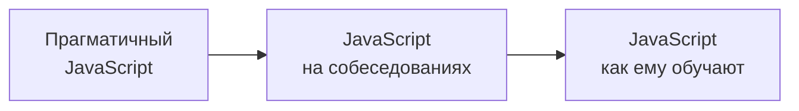

---
layout: section
variant: third
---

# Задокументированный JS

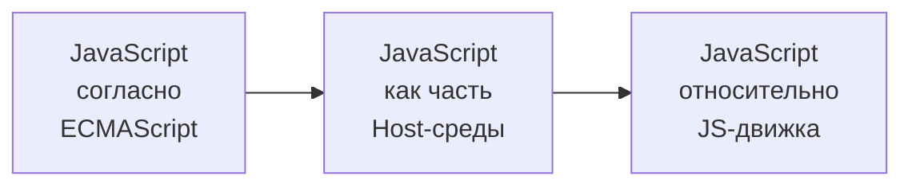

---
layout: section
variant: third
---

# JS в действии


---
layout: fact
variant: third
---

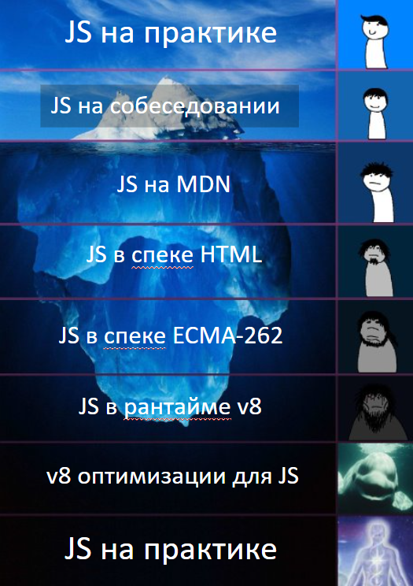

---
layout: statements
variant: one
---

# Прагматичный JavaScript

- Читабельность / поддерживаемость важнее написания "идеального кода"
- TypeScript
- "Вера в магию" движков JS
- Работает — не трогай!

---
layout: statements
variant: one
---

# Что-то тут не так...

````md magic-move
```ts
// [['a', 1], ['b', 2]] => { a: 2, b: 4 }
array.reduce((a, [b, c]) => {
  return { ...a, [b]: c * 2 }
}, {})
```

```ts
// [['a', 1], ['b', 2]] => { a: 2, b: 4 }
pairs.reduce((acc, [key, value]) => {
  return { ...acc, [key]: value * 2 }
}, {})
```

```ts
// [['a', 1], ['b', 2]] => { a: 2, b: 4 }
pairs.reduce((acc, [key, value]) => {
  acc[key] = value * 2
  return acc
}, {})
```
````

---
layout: statements
variant: second
---

# JavaScript мира собеседований

- Основная зона для мифов
- Сами придумываем правила по которым собеседуем

---
layout: statements
variant: second
---

# Передача по ссылке или по значению?

<v-clicks>

- Объекты передаются по ссылке
- Примитивы по значению

</v-clicks>

---
layout: fact
variant: second
---

````md magic-move
```ts {1|3-6|8|10}
let num = 10

function changeStuff(a) {
  a = a * 10
}

changeStuff(num)

console.log(num)
```

```ts
let num = 10

function changeStuff(a) {
  a = a * 10
}

changeStuff(num)

console.log(num) // 10 - Ничего не поменялось
```

```ts {*|2,6,9,12}
let num = 10
let obj = { item: 'initial' }

function changeStuff(a, b) {
  a = a * 10
  b.item = 'changed'
}

changeStuff(num, obj)

console.log(num) // 10
console.log(obj)
```

```ts
let num = 10
let obj = { item: 'initial' }

function changeStuff(a, b) {
  a = a * 10
  b.item = 'changed'
}

changeStuff(num, obj)

console.log(num) // 10
console.log(obj) // { item: 'changed' }
```

```ts {*|3,8,11,15}
let num = 10
let obj = { item: 'initial' }
let obj2 = { item: 'initial' }

function changeStuff(a, b, c) {
  a = a * 10
  b.item = 'changed'
  c = { item: 'changed' }
}

changeStuff(num, obj, obj2)

console.log(num) // 10
console.log(obj) // { item: 'changed' }
console.log(obj2)
```

```ts
let num = 10
let obj = { item: 'initial' }
let obj2 = { item: 'initial' }

function changeStuff(a, b, c) {
  a = a * 10
  b.item = 'changed'
  c = { item: 'changed' }
}

changeStuff(num, obj, obj2)

console.log(num) // 10
console.log(obj) // { item: 'changed' }
console.log(obj2) // { item: 'initial' }
```

```
function f(b) { ... }

f(a)
```
````

---
layout: statement
variant: second
---

# Передача по значению

<demo-value />

---
layout: statement
variant: second
---

# Передача по значению

<demo-refrerence />

---
layout: fact
variant: second
---

```ts {*|1,6,11,13|2,7,11,14|3,8,11,15}
let num = 10
let obj = { item: 'initial' }
let obj2 = { item: 'initial' }

function changeStuff(a, b, c) {
  a = a * 10
  b.item = 'changed'
  c = { item: 'changed' }
}

changeStuff(num, obj, obj2)

console.log(num) // 10
console.log(obj) // { item: 'changed' }
console.log(obj2) // { item: 'initial' }
```

---
layout: statement
variant: second
---

# Call-by-Sharing

<demo-sharing />

---
layout: statement
variant: second
---

<v-clicks>

- Pass-by-Sharing
- Зависит от контекста
- Спецификация не оговаривает точный способ
- Движки для JS могут менять поведение для оптимизации
- На разных этапах рантайма движки могут менять поведение

</v-clicks>

---
layout: statement
variant: third
---

# Как учим JavaScript?

<v-clicks>

- Изучение по принципу "народных сказаний"
- Описание может противоречить тому — как это работает
- По рекомендациям коллег

</v-clicks>

---
layout: statement
variant: third
---

# Устаревшее ключевое слово var


---
layout: statement
variant: third
---

# Устаревшее ключевое слово var

<v-clicks>

- В спецификации даже намека на устаревание var — нет
- Производительность var может быть значительно выше
- Огромный объем кода использует var

</v-clicks>

---
layout: statement
variant: third
---

# Действительно медленнее?


---
layout: statement
variant: third
---

# Так что всё-таки с var?

<v-clicks>

- На практике его можно частично считать устаревшим
- Сборщики / Транспайлеры приводят let / const к var
- var бывает крайне важен для производительности
- По спецификации — устаревания нет

</v-clicks>

---
layout: statement
variant: first
---

# А что там по спецификации?

<v-clicks>

- ECMAScript (ECMA-262)
- JS в "вакууме"
- Созданы свои языки для спецификации
- Единственный источник истины про JS
- Достаточно не противоречить спецификации​

</v-clicks>

---
layout: statement
variant: first
---

# "Заклинания" из спецификации

<v-clicks>

- Свои типы данных
- Свои абстрактные методы
- Созданы свои языки для спецификации
- Свои уникальные языки для описания алгоритмов
- Описывает концепты, которые еще предстоит дореализовать Host-среде

</v-clicks>

<v-click>

> Не пытайтесь искать аналогий в JS!

</v-click>

---
layout: statement
variant: first
---

# Примеры:

- Environment Records
- Abstract Closure
- VariableEnvironment
- Agent
- Job
- Host Environment

---
layout: fact
variant: first
---

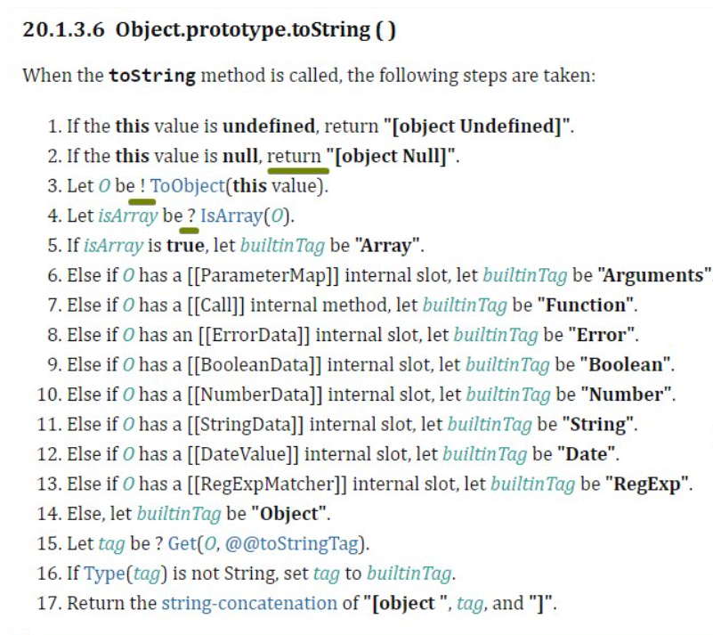

---
layout: fact
variant: first
---

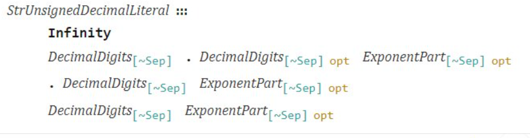
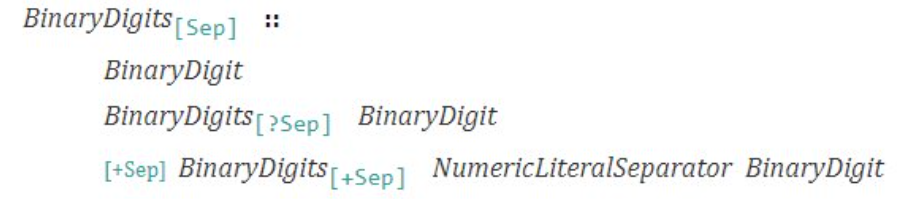

---
layout: fact
variant: first
---

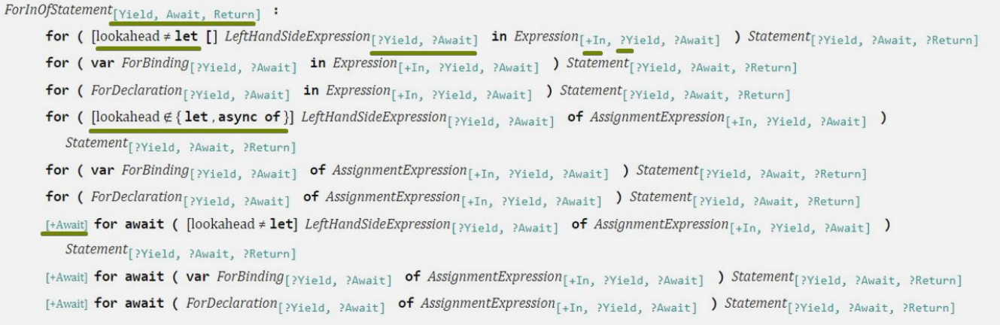

---
layout: statement
variant: second
---

# JavaScript относительно Host-среды

Host-среда - оболочка в рамках которых JavaScript может функционировать

<v-clicks>

- Браузер (HTML)
- Node.js
- bun
- QML в Qt
- PostgreSQL (plv8)

</v-clicks>

---
layout: statement
variant: second
---

# Спецификация в HTML

Host-среда - оболочка в рамках которых JavaScript может функционировать

<v-clicks>

- Дружелюбная к начинающим
- Содержит в себе описание Host-среды для работы браузера

</v-clicks>

---
layout: fact
variant: second
---

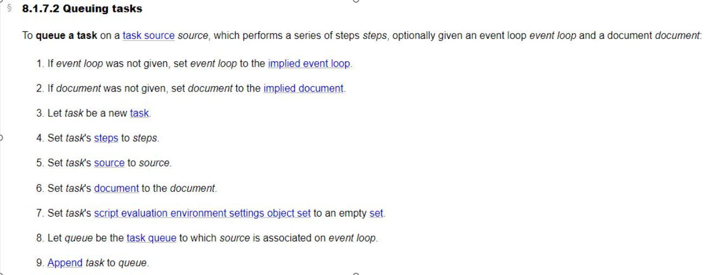

---
layout: fact
variant: second
---

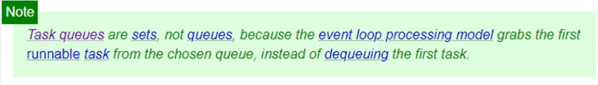

- Очередь задач это набор, а не очередь.

Так как модель выполнения Event Loop-а забирает первую возможную для запуска задачу из выбранной очереди, а не снимает первую задачу

---
layout: statement
variant: second
---

# JavaScript в v8

<v-clicks>

- Непредсказуемый
- Значительно оптимизирующий
- Имеет несколько этапов жизни скрипта
- При работе с ним, нужно понимать, что делаешь

</v-clicks>

---
layout: statement
variant: third
---

# Cвои термины

- регистры
- SMI
- Fast Object
- Object Shape
- Hidden Classes
- Transition Map
- Bytecode Cache

---
layout: fact
variant: third
---

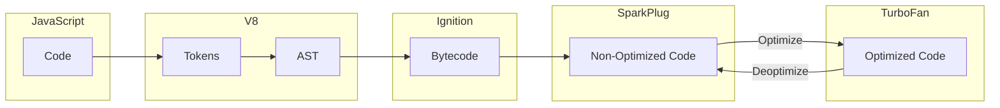

---
layout: fact
variant: third
---

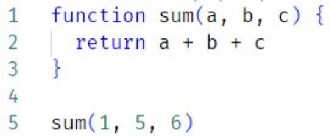

---
layout: fact
variant: third
---

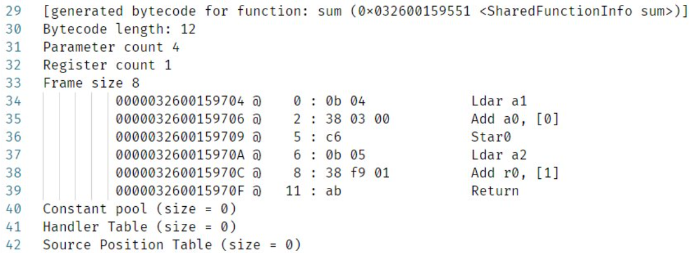

---
layout: fact
variant: third
---

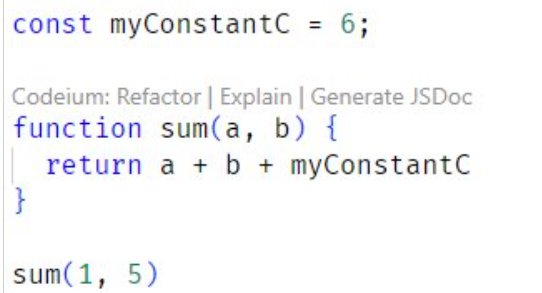

---
layout: fact
variant: third
---

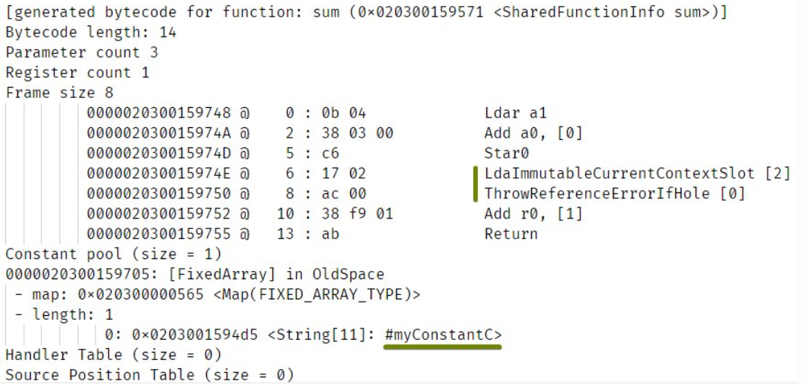

---
layout: statement
variant: third
---

# Что стоит учитывать о v8?

<v-clicks>

- Регистровый движок
- Ленивый
- Выжидает момент
- Крайне конфигурируемый
- Очень изменчивая среда
- Оптимизации v8 могут сменить даже сложность алгоритма

</v-clicks>

---
layout: statement
variant: fourth
---

# Выводы:

<v-clicks>

- JS-код нельзя оценивать лишь по одному уровню
- К JS малоприменимы классические подходы оценки
- Развиваться в изучении JS можно бесконечно
- Задавайтесь вопросами при изучении

</v-clicks>

---
layout: final
author: Денис Чернов
twitch: '@izede'
discord: '@izede'
telegram: '@zede1697'
---