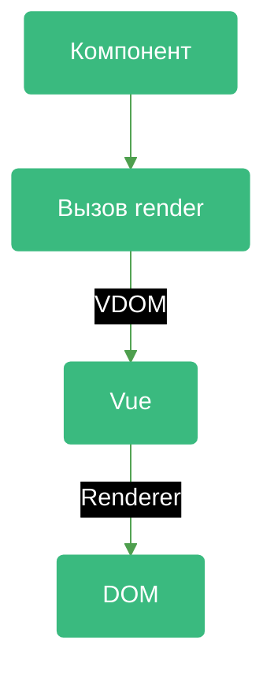
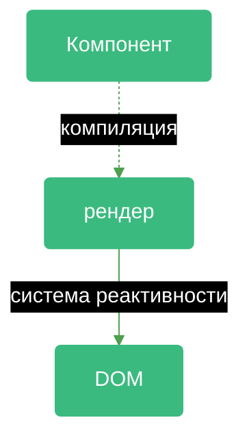

# Vue Vapor

<v-clicks depth="2">

</v-clicks>

---
layout: cover
---

# Итого

<v-clicks>

- **Vue Vapor** нет **VDOM**
- манипуляции c DOM происходят напрямую через **систему реактивности**
- На момент презентации не вышел официально и **все может поменяться**

</v-clicks>

---
layout: intro
class: pt-[100px] pl-[100px]
bg.green: 308 359 280 277
bg.black: 285 320 235 232
bg.accent: 287 344 182 192
bg.green.trans: rotate(-20.8609 308.673 359.341)
bg.black.trans: rotate(-20.8609 285.307 320.668)
bg.accent.trans: rotate(-20.8609 287.186 344.356)
---

  

    
  

  

    <zede-icon class="w-full h-full" />
  

Спасибо за внимание!

<file-icons-telegram /> @zede_code

<ion-logo-twitch /> @izede

<ion-logo-github /> @Sdju

<QrCodeIntro class="w-[200px] h-[200px] absolute top-[200px] right-[80px]" />

