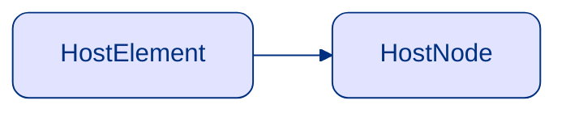

<!--
Знакомая всем картинка. Для тех кто не знаком: это у нас жизненный цикл компонента.
И вроде здесь нет ничего сложного, но давайте немного упростим эту схему оставив самое важное
-->

---
layout: center
clicks: 2
---

<div class="flex flex-col justify-center items-center relative">
  <VueGraph label="Компонент" class="mb-14" />
  <ZedeArrow x1="65" y1="33" x2="65" y2="87" color="#DADADA" />
  <VueGraph label="Вызов render" class="mb-14"  />
  <ZedeArrow x1="65" y1="123" x2="65" y2="175" color="#DADADA" />
  <VueGraph label="Vue" class="mb-14" :color="$clicks > 0 ? '#10655B' : undefined" />
  <ZedeArrow x1="65" y1="210" x2="65" y2="262" color="#DADADA" />
  <VueGraph label="DOM" :color="$clicks > 0 ? '#10655B' : undefined" />
  <VueLabel label="VDOM" class="absolute top-[134px]" />
  <VueLabel v-if="$clicks > 0" :label="$clicks === 1 ? 'Магия' : 'renderer'" class="absolute top-[220px]" />
</div>

<v-click at="2">

## Никакой магии нет!

</v-click>

<!--
У нас есть экземпляр компонента, который в какой-то момент рендерится. 

Результатом рендера является некоторый VDOM.

Мы отдаем его Vue...
Дальше что-то происходит и мы радостные видим рендер на страничке

Но что же за магия происходит в момент между этапом отдачи VDOM до его отобажения в реальный DOM?

Конечно же никакой магии нет. И эту магию можно называть: рендерером
-->

---
layout: cover
---

# Vue renderer

**Renderer** - Механизм связи между VDOM и внешним миром (хост-средой)

<v-click>

**Host-среда** - окружение в рамках которого работает приложение

Может выступать:

</v-click>

<v-clicks at="2">

- DOM
- строка (SSR)
- canvas
- pdf
- и тп

</v-clicks>

<!--
По своей сути Vue Renderer это то самое соединительное звено, которые превращают виртуальный дом в полне себе реальный.

Но только лишь домом возможности рендерера не ограничиваются. Это может быть любая Host-среда. Соответственно, Host-среда - это окружения в рамках которого может работать приложение.

И как мы понимаем это может быть как DOM-ом, так и, например, строкой для SSR, каким-то рендером в canvas, рендером pdf-документа и вообще чем угодно на что только хватит нашей фантазии
-->

---
layout: cover
---

# Vue custom renderer

Создать Custom Renderer, значит описать, как взаимодействовать Vue приложениям с Host-средой.

<v-click>

````md magic-move
```vue {*|7|4}
<script setup lang="ts">
import { ref } from 'vue'
  
const myRef = ref<unknown>()
</script>
<template>
  <div ref="myRef" />
</template>
```

```vue
<script setup lang="ts">
import { ref } from 'vue'
  
const myRef = ref<HTMLDivElement>()
</script>
<template>
  <div ref="myRef" />
</template>
```

```vue
<script setup lang="ts">
import { ref } from 'vue'
  
const myRef = ref<CanvasElement>()
</script>
<template>
  <div ref="myRef" />
</template>
```

```vue
<script setup lang="ts">
import { ref } from 'vue'
  
const myRef = ref<HostElement>()
</script>
<template>
  <div ref="myRef" />
</template>
```
````

</v-click>

<!--
Но чтобы научить наше Vue приложение общаться не только с DOM, то нужно его научить работать с этим окружением. Именно этим и занимается рендерер. А custom renderer, это возможность создавать свои рендереры для связи с различными окружениями

Еще один важный момент связан с тем, что то что мы получаем в template ref это и есть тот самый элемент внешнего мира, те Host-среды.

Именно поэтому, когда мы используем Vue приложение в DOM, то ref получают значения типа Element

Но если бы мы рендерились например в canvas то сюда мог бы прийти CanvasElement и тому подобное

Поэтому можно сказать, что ref получает значение типа HostElement
-->

---
layout: cover
---

# Небольшой пример

````md magic-move
```html {*|1,2,4,5,8,9}
<article>
    <h1>
        Простой пример верстки
    </h1>
    <div>
        <!-- тут могут быть комментарии -->
        Текст статьи про верстку
    </div>
</article>
```

```html {1,2,4,5,8,9|3,7|6}
<article> <- HostElement
    <h1> <- HostElement
        Простой пример верстки
    </h1>
    <div> <- HostElement
        <!-- тут могут быть комментарии -->
        Текст статьи про верстку
    </div>
</article>
```

```html {3,7,6|*}
<article> <- HostElement
    <h1> <- HostElement
        Простой пример верстки <- Node
    </h1>
    <div> <- HostElement
        <!-- тут могут быть комментарии --> <- Node
        Текст статьи про верстку <- Node
    </div>
</article>
```

```html {3,7|6}
<article> <- HostElement
    <h1> <- HostElement
        Простой пример верстки <- TextNode
    </h1>
    <div> <- HostElement
        <!-- тут могут быть комментарии --> <- CommentNode
        Текст статьи про верстку <- TextNode
    </div>
</article>
```

```html {3,7,6|1,2,4,5,8,9}
<article> <- HostElement
    <h1> <- HostElement
        Простой пример верстки <- HostNode
    </h1>
    <div> <- HostElement
        <!-- тут могут быть комментарии --> <- HostNode
        Текст статьи про верстку <- HostNode
    </div>
</article>
```
````

<v-click>



</v-click>

<!--
Давайте еще разберем небольшой примерчик

Мы уже с вами поняли, что это элементы, а именно HostElement-ы

Но что же тогда это? А это?

Если мы вспомним DOM, то там еще кроме понятия Element, есть еще понятия Node

Если мы же помним DOM очень хорошо, то вспомним что это не просто Node, а TextNode и CommentNode

Таким образом Node для рендерера это HostNode. И еще важный момент, что каждый HostElement это еще и HostNode, прямо как в HTML Element это Node с типом Element
-->

---
layout: cover
---

# Renderer Params

```html
<article> <- HostElement
    <h1> <- HostElement
        Простой пример верстки <- HostNode
    </h1>
    <div> <- HostElement
        <!-- тут могут быть комментарии --> <- HostNode
        Текст статьи про верстку <- HostNode
    </div>
</article>
```

<v-clicks depth="2">

- `HostElement` - это Element реального мира
- `HostNode` - это Node реального мира
  - может быть текстовой нодой
  - может быть комментарием

</v-clicks>

<!--
Таким образом, для рендерера важно 2 типа: HostNode и HostElement

Причем стоит учитывать, что HostNode может быть еще как текстовой, так и комментарием
-->

---
layout: cover
---

# Renderer Example

````md magic-move
```ts
import { createRenderer } from '@vue/runtime-core'


⠀

⠀
```

```ts
import { createRenderer } from '@vue/runtime-core'


const renderer = createRenderer<HostNode, HostElement>( ... )

⠀
```

```ts
import { createRenderer } from '@vue/runtime-core'
import { nodeOps } from './nodeOps'

const renderer = createRenderer<HostNode, HostElement>(nodeOps)

⠀
```

```ts
import { createRenderer } from '@vue/runtime-core'
import { nodeOps } from './nodeOps'

const renderer = createRenderer<Node, Element>(nodeOps)

⠀
```

```ts
import { createRenderer } from '@vue/runtime-core'
import { nodeOps } from './nodeOps'

const renderer = createRenderer<Node, Element>(nodeOps)

export const createApp = renderer.createApp
```
````

<!--
Теперь давайте посмотрим что нам нужно, чтобы реализовать свой собственный простейший рендерер

Здесь мы видим, что мы импортируем createRenderer из пакета @vue/runtime-core

Далее мы создаем инстанс рендерера вызвав эту функцию и передав в нее 2 типа это HostNode и HostElement

Ну и самая важная часть: это передать список методов, которые может вызывать рендерер для общения с Host-средой

Так как их много, то обычно все его выносят в файл nodeOps

Мы с вами попробуем написать простейший рендерер на основе DOM, так как это среда под которую рендерер лучше всего заточен. Поэтому в качестве типов подставляем Node и Element

Теперь нам остается лишь отдать из рендерера функцию создания приложения createApp. И на этом все
-->

---
layout: cover
---

# Подключаем рендерер

### main.ts
````md magic-move
```ts
import { createApp } from 'vue'
import App from './App.vue'

const app = createApp(App)
app.mount('#app')
```

```ts
import { createApp } from './renderer'
import App from './App.vue'

const app = createApp(App)
app.mount('#app')
```

```ts
import { createApp } from './renderer'
import App from './App.vue'

const app = createApp(App)
app.mount(document.querySelector('#app'))
```
````

<!--
Теперь мы хотим использовать наш супер-пупер рендерер, вместо дефолтного вьюшного

Поэтому меняем импорт с vue на на наш файл renderer

И еще один важный момент: возможность монтирования не берется с воздуха и мы ее не реализовали, поэтому пока передадим корневой элемент самостоятельно

Вот и все
-->

---
layout: cover
---

# Подготовка

### nodeOps.ts
````md magic-move
```ts
function noop(fn: string): any {
  throw Error(`no-op: ${fn}`)
}


⠀
```

```ts
function noop(fn: string): any {
  throw Error(`no-op: ${fn}`)
}

const nodeOps = {
  patchProp: () => noop('patchProp'),
  insert: () => noop('insert'),
  remove: () => noop('remove'),
  createElement: () => noop('createElement'),
  createText: () => noop('createText'),
  createComment: () => noop('createComment'),
  setText: () => noop('setText'),
  setElementText: () => noop('setElementText'),
  parentNode: () => noop('parentNode'),
  nextSibling: () => noop('nextSibling'),
  querySelector: () => noop('querySelector'),
  setScopeId: () => noop('setScopeId'),
  cloneNode: () => noop('setScopeId'),
  insertStaticContent: () => noop('insertStaticContent'),
}
```

````

<!--
Теперь осталось лишь самое важное:
описать все возможные методы для нашего с вами рендерера. 

Но для начала полезно завести вот такой метод noop. Он будет нам подсвечивать, когда какой-то из методов рендерера еще не реализован. Таким образом мы можем с этим справиться постепенно.

А вот и весь список всех возможных методов рендерера во Vue. По началу этот список может напгугать своим количеством. Но мы с вами последовательно изучим эти методы

Поэтому не особо откладыва начинаем их изучение
-->

---
layout: cover
---

# Запуск

```
// [!code word:createComment]
renderer-temp.ts:8 Uncaught (in promise) Error: no-op: createElement
  ...
```

<!--
Правда если мы сейчас запустим проект, то будет пустая страничка и примерно вот такая ошибка.

Это знгачи, что все хорошо и наш рендерер подцепился и уже пытается брать методы рендерера. Но так как они еще не реализованы, то выкидывается лишь наша заглушка.
-->
