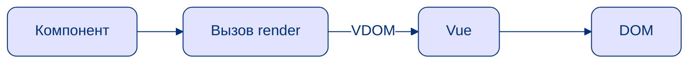
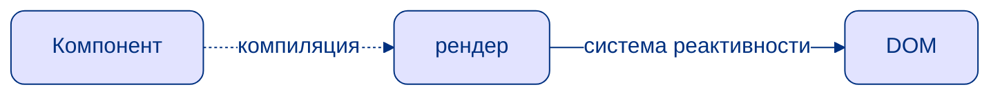

# Vue Vapor

<v-clicks depth="2">

</v-clicks>

<v-clicks>

- Vue Vapor Mode нет VDOM
- манипуляции c DOM происходят напрямую через систему реактивности
- На момент презентации не вышел официально и все может поменяться

</v-clicks>

---
layout: cover
---

# Vue Vapor

> На момент презентации не вышел официально и все может поменяться
 

На данный момент в способа использования Custom Renderer с Vue Vapor - **нет**!

---
layout: intro
---
# Спасибо за внимание

> TODO! Контакты и ссылки репозитории
